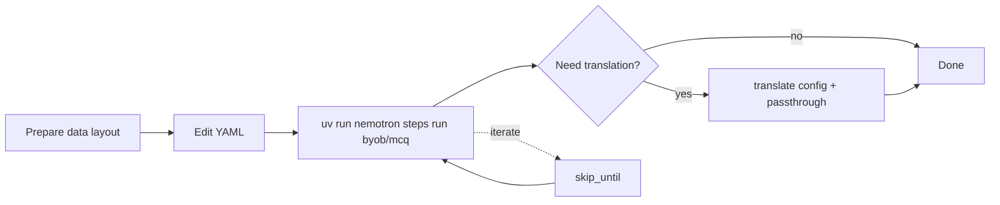

Task-focused guides for `nemotron steps run byob/mcq` with the `mcq` family.

Start with [Getting Started with Building MCQ Benchmarks](/build-benchmarks/getting-started) if you have not produced `benchmark.parquet` yet.

## Setup and configuration

<CardGroup cols={2}>
<Card href="/build-benchmarks/how-to/prepare-data" icon="regular folder" iconSize={8} title="Prepare your data">
Lay out `input_dir`, text or Parquet inputs, and `target_source_mapping`.

---

<Badge intent="info">input_dir</Badge>

</Card>

<Card href="/build-benchmarks/how-to/domain-data" icon="solid database" iconSize={8} title="Domain corpus files">
Create per-target directories of `.txt` files and match them to YAML.

---

<Badge intent="info">corpus</Badge>

</Card>

<Card href="/build-benchmarks/how-to/custom-model-endpoints" icon="solid gear" iconSize={8} title="Model endpoints">
Configure OpenAI-compatible providers for generation, judgement, expansion, validity, and filters.

---

<Badge intent="info">yaml</Badge>

</Card>

</CardGroup>

## Advanced workflows

<CardGroup cols={2}>
<Card href="/build-benchmarks/how-to/prompt-tuning" icon="regular comment" iconSize={8} title="Prompt tuning">
Point `prompt_config` at a YAML file that defines stage templates.

---

<Badge intent="info">prompt</Badge>

</Card>

<Card href="/build-benchmarks/how-to/skip-stages" icon="solid rotate" iconSize={8} title="Skip stages">
Resume with `skip_until` and cached Parquet files.

---

<Badge intent="info">iteration</Badge>

</Card>

</CardGroup>

## Workflow overview

## Related documentation

- [Concepts](/build-benchmarks/explanation) — how each stage behaves.

- [Reference](/build-benchmarks/reference) — full field lists and allowed datasets.
