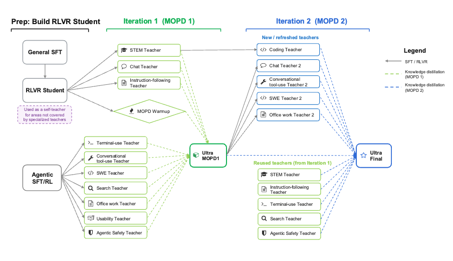
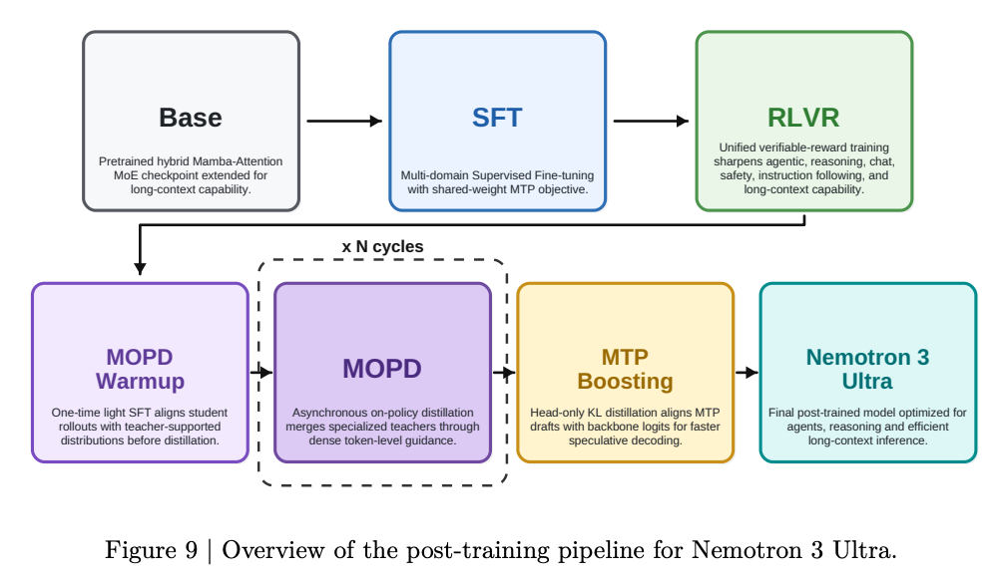

**Technical Report:** *TBD — link to the Nemotron 3 Ultra technical report once published.*

This guide explains how to post-train the Nemotron 3 Ultra model with NeMo RL on
**GB200 NVL72** (ARM64 / aarch64) hardware. All commands, configs (`examples/configs/ultra/`),
launcher (`ultra_launch.sh`), and converter/build scripts below come from the
[`ultra-v3` branch of NVIDIA-NeMo/RL](https://github.com/NVIDIA-NeMo/RL/tree/ultra-v3).

> **Scope: this is not a full replication of the Ultra RL pipeline.**
> The full post-training program in the technical report is substantially larger
> than what is shown here — it runs **two MOPD iterations** over an evolving panel
> of specialised teachers (STEM, chat, instruction-following, terminal/tool use,
> SWE, search, office work, usability, agentic safety, coding, …), with new and
> refreshed teachers introduced in the second iteration and a subset reused from
> the first (see the diagram below).
>
> The reason we show a single pass rather than the whole chain is that **the
> intermediate checkpoints it depends on have not been open-sourced.** Every MOPD
> iteration distills from specialised teacher checkpoints produced by separate RL
> runs, and those per-teacher checkpoints — along with the Iteration-1 MOPD
> checkpoint that Iteration 2 builds on — are not part of the public release, so
> the full two-iteration pipeline cannot be reconstructed end-to-end from open
> artifacts alone.
>
> This guide therefore reproduces a **representative single pass** — Student RLVR
> → a small teacher panel → one MOPD stage — to show *how* each step is wired and
> launched, not the complete multi-iteration recipe. Treat it as a runnable
> reference for the mechanics, not a 1:1 reproduction of the report’s results.



The diagram above is the full reported pipeline: a prep stage that builds the
RLVR student, then MOPD Iteration 1 (general/agentic teachers → Ultra MOPD1) and
MOPD Iteration 2 (new/refreshed teachers plus reused Iteration-1 teachers → Ultra
Final). The stages documented below correspond to the **prep + Iteration 1**
portion.

## Overview



Nemotron 3 Ultra is post-trained with a multi-stage pipeline that mixes
Reinforcement Learning with Verifiable Rewards (RLVR), RLHF, and Multi-Teacher
On-Policy Distillation (MOPD) from a panel of specialised teacher models. The
main stages are:

1. **Student RLVR** — produces the student policy from the supervised
fine-tuning (SFT) checkpoint using GRPO with verifiable rewards.

2. **Teacher training** — trains a panel of teachers (the Student RLVR policy
itself serves as the general teacher, alongside specialised teachers such as
reasoning, instruction-following/abstention, RLHF chat, and SWE).

3. **MOPD** — on-policy distillation from the student into the teacher panel.

Every stage shares the same launcher (`ultra_launch.sh`) and a per-stage YAML
config under `examples/configs/ultra/`.

### Checkpoint flow

The pipeline starts from an SFT checkpoint and produces a panel of teacher
checkpoints that, together with the Student RLVR output, feed MOPD. The Student
RLVR policy itself serves as the general teacher:

```default
        ┌─────┐
        │ SFT │
        └──┬──┘
           v
    ┌──────────────┐
    │ Student RLVR │
    └──┬───────────┘
       │
       │   ┌────────────────────┐
       ├──>│  General Teacher   │──┐
       │   └────────────────────┘  │
       │   ┌────────────────────┐  │
       ├──>│  Reasoning Teacher │──┤
       │   └────────────────────┘  │
       │   ┌────────────────────┐  │
       ├──>│    RLHF Teacher    │──┤
       │   └────────────────────┘  │
       │   ┌────────────────────┐  │
       ├──>│  IFBench Teacher   │──┤
       │   └────────────────────┘  │
       │   ┌────────────────────┐  │
       ├──>│    SWE Teacher     │──┤
       │   └────────────────────┘  │
       │                           │
       v                           v
   ┌─────────┐               ┌──────────┐
   │ Student │──────────────>│   MOPD   │
   └─────────┘               └──────────┘
```

## Container

These are the instructions to build the training container. The image targets
**aarch64 (arm64)** for GB200 NVL72 nodes and bundles a custom vLLM build
required by Ultra.

From the root of the repo:

```bash
docker buildx build \
  --progress=plain \
  -f docker/Dockerfile \
  --target release \
  -t nemo-rl-ultra:arm64 \
  --build-context nemo-rl=. \
  --build-arg MAX_JOBS=8 \
  --build-arg SKIP_SGLANG_BUILD=1 \
  --build-arg BUILD_CUSTOM_VLLM=1 \
  --build-arg BUILD_CUSTOM_VLLM_URL=https://github.com/TomerBN-Nvidia/vllm.git \
  --build-arg BUILD_CUSTOM_VLLM_REF=ultra-rl-v0.17 \
  --build-arg BUILD_CUSTOM_VLLM_PRECOMPILED_WHEEL_LOCATION=https://github.com/vllm-project/vllm/releases/download/v0.17.0/vllm-0.17.0-cp38-abi3-manylinux_2_31_aarch64.whl \
  .
```

Build args:

- `BUILD_CUSTOM_VLLM=1` with `BUILD_CUSTOM_VLLM_URL` / `BUILD_CUSTOM_VLLM_REF` —
builds the Ultra vLLM fork; `BUILD_CUSTOM_VLLM_PRECOMPILED_WHEEL_LOCATION`
points at the matching upstream aarch64 wheel so the build reuses precompiled
kernels instead of compiling from source.

- `SKIP_SGLANG_BUILD=1` — Ultra runs on vLLM; skip the SGLang build.

- `MAX_JOBS` — parallel build jobs; tune to your machine.

- `--build-context nemo-rl=.` — build from your local checkout (otherwise the
Dockerfile pulls `NVIDIA-NeMo/RL.git#main`).

To run on the cluster with Slurm, convert the image to a squashfs (`.sqsh`)
with [enroot](https://github.com/NVIDIA/enroot):

```bash
enroot import -o nemo-rl-container.sqsh dockerd://nemo-rl-ultra:arm64
```

Pass the resulting image as `CONTAINER` in every launch command below (shown as
`CONTAINER=/path/to/nemo-rl-container` — a `.sqsh` path, or a registry image URI
if you’re not using enroot). All Ultra stages run from this single image.

## Download and prepare the data

The training blends are published as
[`nvidia/Nemotron-RL-Ultra-Training-Blends`](https://huggingface.co/datasets/nvidia/Nemotron-RL-Ultra-Training-Blends),
one JSONL per stage: `rlvr1`, `rlvr2`, `ifbench`, `rlhf`, `reasoning`, `swe`, and
`mopd`. Math rows that originate from `BytedTsinghua-SIA/DAPO-Math-17k` and
`Skywork/Skywork-OR1-RL-Data` ship as placeholders; the bundled
`fill_placeholders.py` restores them from the original datasets on Hugging Face.

```bash
export DATA_DIR=/path/to/ultra/data

# 1. Download the blends + fill_placeholders.py
huggingface-cli download nvidia/Nemotron-RL-Ultra-Training-Blends \
  --repo-type dataset --local-dir ultra-blends

# 2. Restore the DAPO / Skywork placeholders into $DATA_DIR
cd ultra-blends
./fill_placeholders.py --input-dir . --output-dir "$DATA_DIR"   # requires uv
```

This produces `$DATA_DIR/\{rlvr1,rlvr2,ifbench,rlhf,reasoning,swe,mopd\}.jsonl`. Hold
out the last 100 rows of each blend as a validation split — the launch commands
below consume `<name>.train.jsonl` as `TRAIN_PATH` and `<name>.val.jsonl` as
`VAL_PATH`:

```bash
cd "$DATA_DIR"
for name in rlvr1 rlvr2 ifbench rlhf reasoning swe mopd; do
  head -n -100 "$name.jsonl" > "$name.train.jsonl"
  tail -n 100   "$name.jsonl" > "$name.val.jsonl"
done
```

By electing to use the external datasets you are responsible for confirming their
licenses are fit for your intended use.

The SWE stage additionally requires per-instance `.sif` container images built
from SWE-Gym and SWE-rebench-V2 — see [SWE Teacher](#swe-teacher) for the build
steps.

For now, each stage takes a JSONL training file and a JSONL validation file
(see [Launch script](#launch-script) below).

## Prepare the code

```bash
git clone --recursive -b ultra-v3 https://github.com/NVIDIA-NeMo/RL.git
cd RL
```

## Prepare the starting checkpoint

If your starting checkpoint comes from Hugging Face or is the result of SFT with
Megatron-Bridge, it is a **transformers v5** checkpoint. NeMo RL runs an older
**transformers v4**, so convert the checkpoint to a v4-compatible version before
using it as `MODEL_PATH`.

The converter rewrites `config.json`, adds the v4 modeling files, and symlinks
the weight shards back to the source checkpoint.

```bash
python examples/converters/ultra/convert_ultra_ckpt_t5_to_t4.py \
  --source /path/to/ultra_sft_checkpoint_v5 \
  --output /path/to/ultra_sft_checkpoint_v4 \
  --force
```

Use the converted directory (`/path/to/ultra_sft_checkpoint_v4`) as `MODEL_PATH`
in the launch commands below. The converter copies the bundled v4 NemotronH
modeling files (`configuration_nemotron_h.py` / `modeling_nemotron_h.py` in `examples/converters/ultra/`) into the output
automatically (the default `--runtime-source`); pass `--runtime-source <dir>` to
override.

## Build the sandbox container

Several [Gym](https://github.com/NVIDIA-NeMo/Gym) environments used during
training (notably `ns_tools` for stateful Python execution with math
verification, and `math_formal_lean` for Lean4 proof verification) rely on a
sandbox container. Build it from the
[NeMo-Skills Dockerfile](https://github.com/NVIDIA-NeMo/Skills/blob/main/dockerfiles/Dockerfile.sandbox):

```bash
git clone https://github.com/NVIDIA-NeMo/Skills.git
cd Skills
git checkout b620e79   # Skills commit pinned for the Ultra release
docker build -t nemo-skills-sandbox:latest -f dockerfiles/Dockerfile.sandbox .
```

For SLURM clusters using [enroot](https://github.com/NVIDIA/enroot), convert
to a `.sqsh`:

```bash
enroot import -o nemo-skills-sandbox.sqsh dockerd://nemo-skills-sandbox:latest
```

## Launch script

Every stage is submitted with `ultra_launch.sh` at the repo root. The launcher
handles SLURM submission, code snapshotting, persistent cache management, and
container mounts — stage-specific hyperparameters (batch size, advantage clip,
MoE parallelism, learning rate) live in the per-stage YAML.

Set the following before each `bash ultra_launch.sh` invocation:

| Variable | Purpose |
| --- | --- |
| <code>EXP&#95;NAME</code> | Job name, W&B run name, and the suffix for output directories. Must be unique per run; same name across resubmissions resumes from the latest checkpoint. |
| <code>CONFIG&#95;PATH</code> | Path to the per-stage YAML config (e.g. <code>examples/configs/ultra/student&#95;rlvr.yaml</code>). |
| <code>MODEL&#95;PATH</code> | Initial policy checkpoint (HuggingFace repo id or local path). Student RLVR starts from the Ultra SFT checkpoint; the teacher stages start from the Student RLVR checkpoint; MOPD starts from the student (the Student RLVR checkpoint). |
| <code>TRAIN&#95;PATH</code> | Training data JSONL. |
| <code>VAL&#95;PATH</code> | Validation data JSONL. |
| <code>CONTAINER</code> | NeMo RL container image (<code>.sqsh</code> path or registry image URI). |
| <code>SANDBOX&#95;CONTAINER</code> | Sandbox image from [Build the sandbox container](#build-the-sandbox-container). |
| <code>PERSISTENT&#95;CACHE</code> | Directory on a shared filesystem (e.g. Lustre) where vLLM/Triton/Inductor compile caches are persisted across runs. |
| <code>EXTRA&#95;MOUNTS</code> | Comma-separated <code>host:container</code> mount pairs for any shared filesystems holding your data, model checkpoints, and <code>PERSISTENT&#95;CACHE</code> (e.g. <code>EXTRA&#95;MOUNTS=/lustre:/lustre,/scratch:/scratch</code>). |
| <code>SLURM&#95;PARTITION</code>, <code>SLURM&#95;ACCOUNT</code> | Your SLURM cluster credentials. |
| <code>GENRM&#95;MODEL</code> | GenRM judge: HF repo id or local path. Default is [<code>nvidia/NVIDIA-Nemotron-3-Ultra-550B-A55B-GenRM</code>](https://huggingface.co/nvidia/NVIDIA-Nemotron-3-Ultra-550B-A55B-GenRM). Served in-cluster from the gym pool at TP=4 DP=4 (16 GPUs). Required unless <code>GENRM&#95;BASE&#95;URL</code> is set. |
| <code>GENRM&#95;BASE&#95;URL</code> | *Optional.* URL of a separately-deployed GenRM service (e.g. <code>http://genrm-host:9213/v1</code>). If set, routes judging to that endpoint and ignores <code>GENRM&#95;MODEL</code>. Useful when sharing a single GenRM deployment across many training jobs. |
| <code>NL2BASH&#95;JUDGE&#95;MODEL</code> | NL2Bash / general-purpose judge: HF repo id or local path. Default judge is <code>Qwen/Qwen3-235B-A22B-Instruct-2507-FP8</code>. |
| <code>SAFETY&#95;JUDGE&#95;MODEL</code> | Content-safety judge: HF repo id or local path. Default is [<code>nvidia/Nemotron-Content-Safety-Reasoning-4B</code>](https://huggingface.co/nvidia/Nemotron-Content-Safety-Reasoning-4B). |

Optional knobs:

| Variable | Default | Purpose |
| --- | --- | --- |
| <code>WALLTIME</code> | <code>4:00:00</code> | SLURM <code>--time</code> |
| <code>SLURM&#95;QOS</code>, <code>SLURM&#95;RESERVATION</code>, <code>EXCLUDE&#95;NODES</code> | *empty* | Optional SLURM flags |
| <code>NUM&#95;TRAIN&#95;NODES</code>, <code>NUM&#95;GEN&#95;NODES</code>, <code>NUM&#95;GYM&#95;NODES</code> | <code>64</code>, <code>172</code>, <code>20</code> | GB200 4-GPU node split. Total must be a multiple of 16. |
| <code>ENABLE&#95;MTP&#95;INFERENCE</code> | <code>0</code> | Set to <code>1</code> to enable MTP speculative decoding for vLLM |
| <code>NRL&#95;MAX&#95;STEPS</code> | *from YAML* | Override <code>grpo.max&#95;num&#95;steps</code> |
| <code>WANDB&#95;API&#95;KEY</code>, <code>WANDB&#95;PROJ</code>, <code>WANDB&#95;ENTITY</code> | *unset* / <code>nemotron-3-ultra</code> / *unset* | W&B logging is disabled if <code>WANDB&#95;API&#95;KEY</code> is unset |
| <code>HF&#95;HOME</code>, <code>HF&#95;TOKEN</code> | *unset* | Shared HuggingFace cache and gated-model token |
| <code>USE&#95;SNAPSHOT</code> | <code>1</code> | Snapshot the source tree at submission time |
| <code>DRY&#95;RUN</code> | <code>0</code> | Set to <code>1</code> to print the resolved <code>TRAIN&#95;CMD</code> without submitting |

## Stage 1 — Student RLVR

GRPO with verifiable rewards on the Ultra SFT checkpoint.

Student RLVR is split into two phases that share the same `EXP_NAME` so the
second phase resumes from the first phase’s checkpoint:

|  | Phase 1 | Phase 2 |
| --- | --- | --- |
| Config | <code>examples/configs/ultra/student&#95;rlvr1.yaml</code> | <code>examples/configs/ultra/student&#95;rlvr2.yaml</code> |
| <code>max&#95;total&#95;sequence&#95;length</code> | 49,152 | 65,536 |
| Steps in this phase | ~128 | ~50 |
| <code>NRL&#95;MAX&#95;STEPS</code> to set | <code>128</code> | <code>178</code> (= 128 + 50) |
| <code>group&#95;answer&#95;length&#95;penalty&#95;coeff</code> | 0.15 | 0.08 |

Both phases share TP=8, EP=64, CP=8, PP=1, GBS=8192 (512 prompts × 16
generations), advantage clip ±20, and the 256-node cluster shape.

### Phase 1 — 49k context, 128 steps

```bash
EXP_NAME=ultra-student-rlvr \
CONFIG_PATH=examples/configs/ultra/student_rlvr1.yaml \
ENABLE_MTP_INFERENCE=1 \
NRL_MAX_STEPS=128 \
MODEL_PATH=/path/to/ultra_sft_checkpoint \
TRAIN_PATH=$DATA_DIR/rlvr1.train.jsonl \
VAL_PATH=$DATA_DIR/rlvr1.val.jsonl \
CONTAINER=/path/to/nemo-rl-container \
SANDBOX_CONTAINER=/path/to/nemo-skills-sandbox.sqsh \
PERSISTENT_CACHE=/path/to/persistent/cache \
EXTRA_MOUNTS=/lustre:/lustre \
SLURM_PARTITION=$SLURM_PARTITION \
SLURM_ACCOUNT=$SLURM_ACCOUNT \
GENRM_MODEL=nvidia/NVIDIA-Nemotron-3-Ultra-550B-A55B-GenRM \
NL2BASH_JUDGE_MODEL=Qwen/Qwen3-235B-A22B-Instruct-2507-FP8 \
SAFETY_JUDGE_MODEL=nvidia/Nemotron-Content-Safety-Reasoning-4B \
WANDB_API_KEY=$WANDB_API_KEY \
HF_HOME=/path/to/hf_cache \
HF_TOKEN=$HF_TOKEN \
bash ultra_launch.sh
```

### Phase 2 — 65k context, ~50 more steps

Same env vars as Phase 1 but swap the config, raise `NRL_MAX_STEPS`, and point
at the Phase 2 training data file. Keep `EXP_NAME` and `RESULTS_DIR` identical
to Phase 1 so `CheckpointManager` auto-resumes from the latest Phase 1
checkpoint.

```bash
EXP_NAME=ultra-student-rlvr \
CONFIG_PATH=examples/configs/ultra/student_rlvr2.yaml \
ENABLE_MTP_INFERENCE=1 \
NRL_MAX_STEPS=178 \
MODEL_PATH=/path/to/ultra_sft_checkpoint \
TRAIN_PATH=$DATA_DIR/rlvr2.train.jsonl \
VAL_PATH=$DATA_DIR/rlvr2.val.jsonl \
CONTAINER=/path/to/nemo-rl-container \
SANDBOX_CONTAINER=/path/to/nemo-skills-sandbox.sqsh \
PERSISTENT_CACHE=/path/to/persistent/cache \
EXTRA_MOUNTS=/lustre:/lustre \
SLURM_PARTITION=$SLURM_PARTITION \
SLURM_ACCOUNT=$SLURM_ACCOUNT \
GENRM_MODEL=nvidia/NVIDIA-Nemotron-3-Ultra-550B-A55B-GenRM \
NL2BASH_JUDGE_MODEL=Qwen/Qwen3-235B-A22B-Instruct-2507-FP8 \
SAFETY_JUDGE_MODEL=nvidia/Nemotron-Content-Safety-Reasoning-4B \
WANDB_API_KEY=$WANDB_API_KEY \
HF_HOME=/path/to/hf_cache \
HF_TOKEN=$HF_TOKEN \
bash ultra_launch.sh
```

Note: Phase 1 and Phase 2 use different training blends (`rlvr1.train.jsonl` and
`rlvr2.train.jsonl`); see the [Download and prepare the data](#download-and-prepare-the-data)
section above.

The launcher reports the experiment directory layout, sample monitoring
commands, and (on submission) the SLURM job id.

## Stage 2 — Teacher training

The teacher panel is a set of specialised RL runs that each start from the
Student RLVR output (Stage 1) (see [Checkpoint flow](#checkpoint-flow) above). Each teacher
runs independently with its own YAML config under `examples/configs/ultra/`.

The teachers don’t depend on each other and can run in parallel.

### IFBench Teacher

RLHF teacher specializing in instruction following, abstention, and refusal
behavior. Trained at 49k context with a smaller batch (`GBS=2048`) and lower
learning rate (`lr=2.5e-6`) than the student RLVR stage.

**Config:** `examples/configs/ultra/ifbench_teacher.yaml`

- TP=8, EP=64, CP=8, PP=1

- `max_total_sequence_length=49152`

- `train_global_batch_size=2048`, `num_prompts_per_step=128`, `num_generations_per_prompt=16`

- Learning rate `2.5e-6` constant

- Default cluster shape: 80 nodes (32 training + 28 vLLM + 20 Gym)

```bash
EXP_NAME=ultra-ifbench-teacher \
CONFIG_PATH=examples/configs/ultra/ifbench_teacher.yaml \
MODEL_PATH=/path/to/student_rlvr_output \
TRAIN_PATH=$DATA_DIR/ifbench.train.jsonl \
VAL_PATH=$DATA_DIR/ifbench.val.jsonl \
NUM_TRAIN_NODES=32 \
NUM_GEN_NODES=28 \
NUM_GYM_NODES=20 \
ENABLE_MTP_INFERENCE=1 \
CONTAINER=/path/to/nemo-rl-container \
SANDBOX_CONTAINER=/path/to/nemo-skills-sandbox.sqsh \
PERSISTENT_CACHE=/path/to/persistent/cache \
EXTRA_MOUNTS=/lustre:/lustre \
SLURM_PARTITION=$SLURM_PARTITION \
SLURM_ACCOUNT=$SLURM_ACCOUNT \
GENRM_MODEL=nvidia/NVIDIA-Nemotron-3-Ultra-550B-A55B-GenRM \
NL2BASH_JUDGE_MODEL=Qwen/Qwen3-235B-A22B-Instruct-2507-FP8 \
SAFETY_JUDGE_MODEL=nvidia/Nemotron-Content-Safety-Reasoning-4B \
WANDB_API_KEY=$WANDB_API_KEY \
HF_HOME=/path/to/hf_cache \
HF_TOKEN=$HF_TOKEN \
bash ultra_launch.sh
```

### RLHF Teacher

General-purpose RLHF teacher trained against the pairwise GenRM comparison
signal alone. Same training shape as the IFBench teacher (cluster, batch,
learning rate, context).

**Config:** `examples/configs/ultra/rlhf_teacher.yaml`

- TP=8, EP=64, CP=8, PP=1

- `max_total_sequence_length=49152`

- `train_global_batch_size=2048`, `num_prompts_per_step=128`, `num_generations_per_prompt=16`

- Learning rate `2.5e-6` constant

- Default cluster shape: 64 nodes (32 training + 28 vLLM + 4 Gym)

```bash
EXP_NAME=ultra-rlhf-teacher \
CONFIG_PATH=examples/configs/ultra/rlhf_teacher.yaml \
MODEL_PATH=/path/to/student_rlvr_output \
TRAIN_PATH=$DATA_DIR/rlhf.train.jsonl \
VAL_PATH=$DATA_DIR/rlhf.val.jsonl \
NUM_TRAIN_NODES=32 \
NUM_GEN_NODES=28 \
NUM_GYM_NODES=4 \
ENABLE_MTP_INFERENCE=1 \
CONTAINER=/path/to/nemo-rl-container \
SANDBOX_CONTAINER=/path/to/nemo-skills-sandbox.sqsh \
PERSISTENT_CACHE=/path/to/persistent/cache \
EXTRA_MOUNTS=/lustre:/lustre \
SLURM_PARTITION=$SLURM_PARTITION \
SLURM_ACCOUNT=$SLURM_ACCOUNT \
GENRM_MODEL=nvidia/NVIDIA-Nemotron-3-Ultra-550B-A55B-GenRM \
WANDB_API_KEY=$WANDB_API_KEY \
HF_HOME=/path/to/hf_cache \
HF_TOKEN=$HF_TOKEN \
bash ultra_launch.sh
```

This is the teacher referred to as `NRL_CHAT_TEACHER1` / `NRL_RLHF_TEACHER` in
the MOPD config — it provides the `genrm_simple_agent` and
`genrm_simple_agent_reasoning_off` teacher signals.

### Reasoning Teacher

General reasoning teacher. The training data subsamples an RLVR
blend, where every prompt is graded by the `equivalence_llm_judge` agent
(LLM-judge equivalence over freeform short answers). The output checkpoint
serves the `code_gen`, `ns_tools`, `math_with_judge`,
`equivalence_llm_judge`, and `mcqa` agent slots in MOPD — one checkpoint,
many roles.

**Config:** `examples/configs/ultra/reasoning_teacher.yaml`

- TP=8, EP=32, CP=8, PP=1 (half the expert parallelism of Student RLVR)

- `max_total_sequence_length=65536`

- `train_global_batch_size=2048`, `num_prompts_per_step=128`, `num_generations_per_prompt=16`

- Learning rate `3.0e-6` constant

- `max_num_epochs=10` — small sub-sampled dataset, multiple passes expected

- Default cluster shape: 128 nodes (64 training + 60 vLLM + 4 Gym)

```bash
EXP_NAME=ultra-reasoning-teacher \
CONFIG_PATH=examples/configs/ultra/reasoning_teacher.yaml \
ENABLE_MTP_INFERENCE=1 \
MODEL_PATH=/path/to/student_rlvr_output \
TRAIN_PATH=$DATA_DIR/reasoning.train.jsonl \
VAL_PATH=$DATA_DIR/reasoning.val.jsonl \
NUM_TRAIN_NODES=64 \
NUM_GEN_NODES=60 \
NUM_GYM_NODES=4 \
CONTAINER=/path/to/nemo-rl-container \
SANDBOX_CONTAINER=/path/to/nemo-skills-sandbox.sqsh \
PERSISTENT_CACHE=/path/to/persistent/cache \
EXTRA_MOUNTS=/lustre:/lustre \
SLURM_PARTITION=$SLURM_PARTITION \
SLURM_ACCOUNT=$SLURM_ACCOUNT \
NL2BASH_JUDGE_MODEL=Qwen/Qwen3-235B-A22B-Instruct-2507-FP8 \
WANDB_API_KEY=$WANDB_API_KEY \
HF_HOME=/path/to/hf_cache \
HF_TOKEN=$HF_TOKEN \
bash ultra_launch.sh
```

### SWE Teacher

Software-engineering RLVR teacher trained against code execution. The
`swe_agents` agent runs the policy’s candidate fixes inside apptainer (`.sif`)
container images for each SWE-Gym / SWE-rebench-V2 instance and rewards
the rollout based on test pass/fail.

**Config:** `examples/configs/ultra/swe_teacher.yaml`

- TP=8, EP=32, CP=32, PP=1 (large CP for long context)

- `max_total_sequence_length=196608` (192k context)

- `train_global_batch_size=512`, `num_prompts_per_step=32`, `num_generations_per_prompt=16`

- Learning rate `3.0e-6` constant, advantage clip ±100, `max_num_epochs=4`

- Default cluster shape: 128 nodes (64 training + 64 vLLM + 0 Gym)

### Building the SIF images

Each rollout runs inside a per-instance apptainer (`.sif`) image resolved from
`$\{SIF_DIR\}` via the agent’s `container_formatter`. Since this recipe targets
GB200 (aarch64) and the upstream SWE images ship for x86 only, the images must
be rebuilt for ARM — one per instance — then converted to `.sif`. The resulting
directory is reused across runs.

The released SWE blend draws from two benchmarks:

| Benchmark | HF dataset | <code>.sif</code> path under <code>$&#123;SIF&#95;DIR&#125;</code> | Instances |
| --- | --- | --- | --- |
| SWE-Gym | <code>SWE-Gym/SWE-Gym</code> | <code>swegym/sweb.eval.arm64.&#123;instance&#95;id&#125;.sif</code> | 206 |
| SWE-rebench-V2 | <code>nebius/SWE-rebench-V2</code> | <code>swerebench/&#123;instance&#95;id&#125;.sif</code> | 7,610 |

**1. Prerequisites.** Docker, Apptainer, and `uv` on the build host. Build on an
ARM64 (GB200) node so images are natively aarch64 with no emulation. You also
need a container **registry** to publish to: set `REGISTRY` to its endpoint and
`docker login` to it first. The build scripts push every per-instance image
there, and the conversion step (3) pulls them back to produce the `.sif` files —
so the registry must be reachable from both the build and the convert hosts.

Install Apptainer on the build host via the official PPA, pinned to the version
the training container ships (so the `.sif` format matches — see
`docker/install_apptainer.sh`):

```bash
sudo add-apt-repository -y ppa:apptainer/ppa
sudo apt-get update
sudo apt-get install -y "apptainer=1.5.0-2-1~$(. /etc/os-release && echo "$VERSION_CODENAME")"
```

> **Storage.** The registry accumulates ~7,800 images, plus the converted `.sif`
> set on the build host. The pushed images can be deleted once every `.sif` has
> been built.

**2. Build the per-instance images.**

```bash
git clone -b ultra-v3 https://github.com/nujoug/swe-gym-arm-build
git clone -b ultra-v3 https://github.com/nujoug/swe-rebench-v2-arm-build
export REGISTRY=registry.example.com/ultra-swe   # your registry endpoint (docker login first)

# --- SWE-Gym (206 images) ---
# No verify gate: this wrapper builds + pushes only. After it finishes, drop any
# instance listed under handoff/failed_instances/ before using the images.
cd swe-gym-arm-build
uv venv && source .venv/bin/activate && uv pip install -e .
python scripts/batch_build_push.py \
  --dataset SWE-Gym/SWE-Gym --split train \
  --instance_ids_file swe_gym_instance_ids.txt \
  --registry "$\{REGISTRY\}/swe-gym" --push_env_images \
  --max_workers 8 --state_file build_push_state.json
deactivate; cd ..

# --- SWE-rebench-V2 (7,610 images) ---
# Omitting --skip-eval enables the verify gate: each image is built, the gold
# patch is applied, the tests are run, and only images whose FAIL_TO_PASS /
# PASS_TO_PASS transition matches are published (others land in
# handoff/failed_instances/).
cd swe-rebench-v2-arm-build
uv venv && source .venv/bin/activate && uv pip install -r requirements.txt
# Build the per-language base images first (Go/Java/Rust/Python/… environments
# that the instance images layer on top of).
# Note: expect one known failure when building scala_base (its Dockerfile runs `foundryup`, which 403s on the GitHub API).
python3 scripts/build_all_arm_bases.py --platform linux/arm64 --keep-going --max-workers 4 --skip-existing
python3 scripts/prepare_ready_tasks.py --hf-dataset nebius/SWE-rebench-V2 --output ready_tasks.json
python3 scripts/build_eval_cleanup.py \
  --json ready_tasks.json --platform linux/arm64 --max-workers 8 \
  --report-json eval_report.json --skip-done \
  --gitlab-registry "$\{REGISTRY\}/swerebenchv2"
deactivate; cd ..
```

**3. Convert to `.sif` and lay out `$\{SIF_DIR\}`.** `build_swe_sif_images.py` pulls
each published image and runs `apptainer build` under the exact filename the
recipe expects — SWE-Gym from the `swe-gym:sweb.eval.arm64.<id>` tags, and
SWE-rebench-V2 from the verified (`passed_match`) instances in `eval_report.json`.
It skips images already converted and continues past any that are missing (e.g.
instances that failed to build), recording them in `$\{SIF_DIR\}/missing_instances.txt`.
Run it from the NeMo RL repo root:

```bash
export SIF_DIR=/path/to/sif/images
python examples/nemo_gym/build_swe_sif_images.py \
  --registry "$\{REGISTRY\}" --sif-dir "$\{SIF_DIR\}" \
  --swe-gym-ids /path/to/swe-gym-arm-build/swe_gym_instance_ids.txt \
  --rebench-report /path/to/swe-rebench-v2-arm-build/eval_report.json
```

With `$\{SIF_DIR\}` populated, launch the SWE teacher:

```bash
EXP_NAME=ultra-swe-teacher \
CONFIG_PATH=examples/configs/ultra/swe_teacher.yaml \
ENABLE_MTP_INFERENCE=1 \
MODEL_PATH=/path/to/student_rlvr_output \
TRAIN_PATH=$DATA_DIR/swe.train.jsonl \
VAL_PATH=$DATA_DIR/swe.val.jsonl \
NUM_TRAIN_NODES=64 \
NUM_GEN_NODES=64 \
NUM_GYM_NODES=0 \
SIF_DIR=/path/to/sif/images \
CONTAINER=/path/to/nemo-rl-container \
SANDBOX_CONTAINER=/path/to/nemo-skills-sandbox.sqsh \
PERSISTENT_CACHE=/path/to/persistent/cache \
EXTRA_MOUNTS=/lustre:/lustre \
SLURM_PARTITION=$SLURM_PARTITION \
SLURM_ACCOUNT=$SLURM_ACCOUNT \
WANDB_API_KEY=$WANDB_API_KEY \
HF_HOME=/path/to/hf_cache \
HF_TOKEN=$HF_TOKEN \
bash ultra_launch.sh
```

## Stage 3 — MOPD

Multi-Teacher On-Policy Distillation. The Student RLVR output is the student; each
Gym agent is routed to one of the Stage 2 teacher checkpoints. Trains the
student to match per-agent teacher distributions.

**Config:** `examples/configs/ultra/mopd.yaml`

- TP=8, EP=64, CP=8, PP=1, max context 192k

- Teacher parallelism: TP=8, CP=2, EP=16, 4 nodes per teacher

- Routing: agent → teacher checkpoint baked into the YAML via
`$\{_teachers.<role>\}` references; only `_teachers.general` is required and
every other slot falls back to it.

- Default cluster shape: 224 nodes (64 training + 128 vLLM + 12 Gym + 20 teachers).

### Teacher mapping

| Logical slot | Path source | MOPD agents it serves |
| --- | --- | --- |
| <code>general</code> | Student RLVR output | <code>lc&#95;judge&#95;simple&#95;agent</code>, fallback for unset slots below |
| <code>rlhf</code> | RLHF Teacher | <code>genrm&#95;simple&#95;agent</code>, <code>genrm&#95;simple&#95;agent&#95;reasoning&#95;off</code> |
| <code>ifbench</code> | IFBench Teacher | <code>instruction&#95;following&#95;simple&#95;agent</code>, <code>abstention&#95;simple&#95;agent</code>, <code>multichallenge&#95;simple&#95;agent</code> |
| <code>reasoning</code> | Reasoning Teacher | <code>math&#95;with&#95;judge&#95;simple&#95;agent</code>, <code>equivalence&#95;llm&#95;judge&#95;simple&#95;agent</code>, <code>mcqa&#95;simple&#95;agent</code>, <code>ns&#95;tools&#95;simple&#95;agent</code>, <code>code&#95;gen&#95;simple&#95;agent</code> |
| <code>swe</code> | SWE Teacher | all <code>swe&#95;pivot&#95;&#42;</code>, <code>terminal&#95;multi&#95;harness&#95;&#123;opencode,agent006,codex&#125;</code>, <code>droid&#95;pivot&#95;&#42;</code>, <code>structured&#95;outputs&#95;v3&#95;simple&#95;agent</code>, <code>freeform&#95;formatting&#95;simple&#95;agent</code>, <code>citation&#95;format&#95;simple&#95;agent</code> |

### Launch

Pass `STAGE_TYPE=mopd` to the launcher to enable the teacher-pool node math
and the `_teachers.X` Hydra overrides. `NRL_GENERAL_TEACHER_PATH` is required;
the other four teacher paths are optional and fall back to general when
unset.

```bash
STAGE_TYPE=mopd \
EXP_NAME=ultra-mopd-stage1 \
CONFIG_PATH=examples/configs/ultra/mopd.yaml \
ENABLE_MTP_INFERENCE=1 \
MODEL_PATH=/path/to/student_rlvr_output \
TRAIN_PATH=$DATA_DIR/mopd.train.jsonl \
VAL_PATH=$DATA_DIR/mopd.val.jsonl \
NUM_TRAIN_NODES=64 \
NUM_GEN_NODES=128 \
NUM_GYM_NODES=12 \
NUM_UNIQUE_TEACHERS=5 \
NUM_NODES_PER_TEACHER=4 \
NRL_GENERAL_TEACHER_PATH=/path/to/student_rlvr_output \
NRL_RLHF_TEACHER_PATH=/path/to/rlhf_teacher_output \
NRL_IFBENCH_TEACHER_PATH=/path/to/ifbench_teacher_output \
NRL_REASONING_TEACHER_PATH=/path/to/reasoning_teacher_output \
NRL_SWE_TEACHER_PATH=/path/to/swe_teacher_output \
CONTAINER=/path/to/nemo-rl-container \
SANDBOX_CONTAINER=/path/to/nemo-skills-sandbox.sqsh \
PERSISTENT_CACHE=/path/to/persistent/cache \
EXTRA_MOUNTS=/lustre:/lustre \
SLURM_PARTITION=$SLURM_PARTITION \
SLURM_ACCOUNT=$SLURM_ACCOUNT \
GENRM_MODEL=nvidia/NVIDIA-Nemotron-3-Ultra-550B-A55B-GenRM \
NL2BASH_JUDGE_MODEL=Qwen/Qwen3-235B-A22B-Instruct-2507-FP8 \
SAFETY_JUDGE_MODEL=nvidia/Nemotron-Content-Safety-Reasoning-4B \
WANDB_API_KEY=$WANDB_API_KEY \
HF_HOME=/path/to/hf_cache \
HF_TOKEN=$HF_TOKEN \
bash ultra_launch.sh
```
