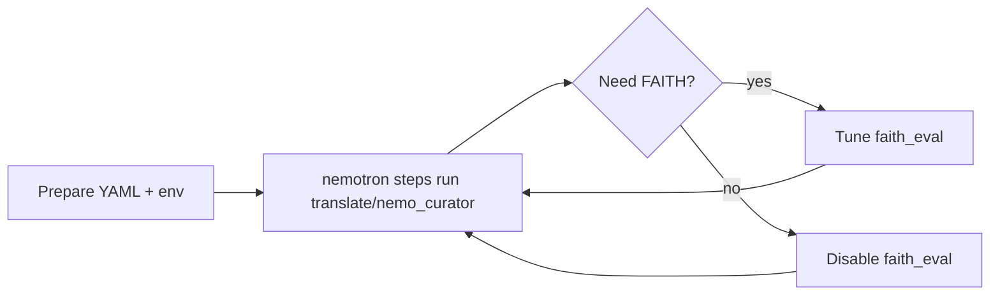

This section has task-focused procedures for changing backends, wiring fields, tuning segmentation, and adjusting FAITH.

For copy-paste prompts and habits when you work with a coding agent, read [Tips for Translation With Agents](/translation/using-skills) first.
Start with [Getting Started With Translation](/translation/getting-started) if you have not run the step yet.

Focused procedures for `nemotron steps run translate/nemo_curator`.

## Run Translation

<CardGroup cols={2}>
<Card href="/translation/how-to/run-llm-translation" icon="solid microchip" iconSize={8} title="LLM backend">
OpenAI-compatible servers, hosted or on-prem.

---

<Badge intent="info">backend=llm</Badge>

</Card>

<Card href="/translation/how-to/run-nmt-translation" icon="solid server" iconSize={8} title="NMT HTTP service">
Self-hosted `POST /translate` microservices.

---

<Badge intent="info">backend=nmt</Badge>

</Card>

<Card href="/translation/how-to/run-google-aws-translation" icon="solid cloud" iconSize={8} title="Google or AWS">
Managed cloud translation APIs.

---

<Badge intent="info">backend=google|aws</Badge>

</Card>

</CardGroup>

## Configure and Tune

<CardGroup cols={2}>
<Card href="/translation/how-to/configure-fields-and-output" icon="regular folder" iconSize={8} title="Fields and outputs">
Wildcards, `output_mode`, chat reconstruction.

---

<Badge intent="info">schema</Badge>

</Card>

<Card href="/translation/how-to/use-fine-segmentation" icon="solid box" iconSize={8} title="Segmentation">
Switch `segmentation_mode` deliberately.

---

<Badge intent="info">segmentation</Badge>

</Card>

</CardGroup>

## FAITH Quality Gates

<CardGroup cols={2}>
<Card href="/translation/how-to/run-faith-evaluation" icon="solid list-check" iconSize={8} title="FAITH evaluation">
Thresholds, filtering, model overrides.

---

<Badge intent="info">faith</Badge>

</Card>

</CardGroup>

