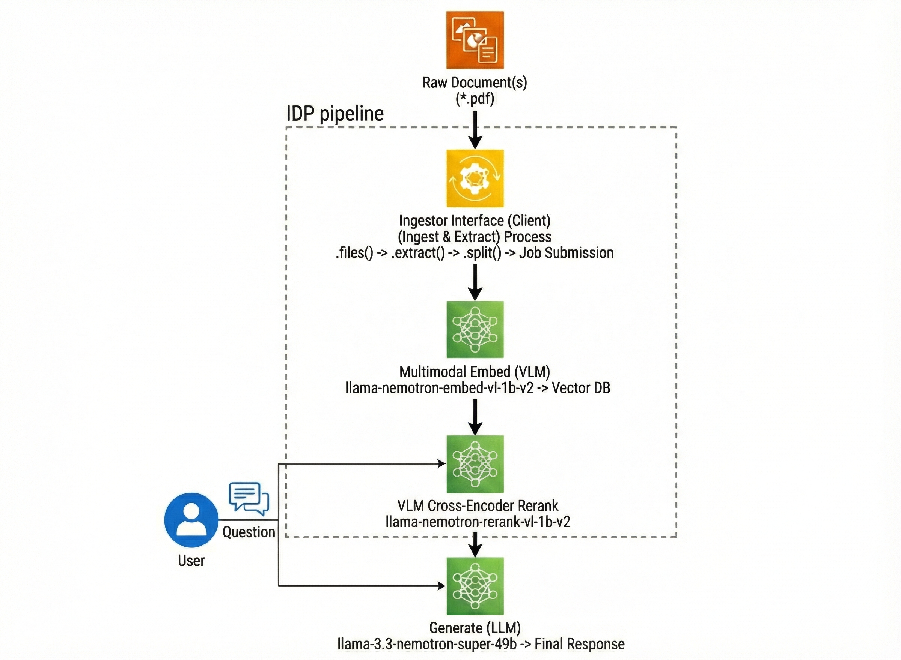

Build a production-grade Intelligent Document Processing (IDP) pipeline that transforms complex enterprise documents—containing dense text, charts, and tables—into a queryable knowledge base using NVIDIA Nemotron models.

## 📋 Overview

Standard text extraction often fails on complex enterprise documents due to “Linearization Loss”—the loss of structural context. This example demonstrates how to solve this using **NVIDIA NeMo Retriever** and **multimodal Nemotron models**.

The pipeline handles:

1. **Complex Layouts**: Preserves structure in financial reports and manuals.

2. **Visual Data**: Extracts and understands trends in charts (e.g., bar graphs).

3. **Dense Tables**: Maintains row/column alignment for accurate financial lookups.

## 📦 Models Used

| Component | Model | Function | Deployment |
| --- | --- | --- | --- |
| **Extraction** | <code>NeMo Retriever Library (nv-ingest)</code> | A library for advanced document parsing | Self-hosted (Library Mode) |
| **Embedding** | <code>nvidia/llama-nemotron-embed-vl-1b-v2</code> | Multimodal Embedding (Text + Images) | Local Inference (Hugging Face) |
| **Reranking** | <code>nvidia/llama-nemotron-rerank-vl-1b-v2</code> | Visual Cross-Encoder Reranking | Local Inference (Hugging Face) |
| **Reasoning** | <code>nvidia/llama-3.3-nemotron-super-49b</code> | Citation-Backed Answer Generation | NVIDIA NIM / API |

## 🌟 Key Features

- **Multimodal RAG**: Retrieves and reasons over both text and visual elements (charts/graphs).

- **Intelligent Extraction**: Uses YOLOX and Transformer-based models to detect and crop charts and parse tables into Markdown.

- **Visual Reranking**: The reranker “sees” the retrieved chart images to verify relevance, improving accuracy over text-only search.

- **Hardware-Aware**: Includes robust fallback mechanisms to run on varying GPU architectures (e.g., T4 vs. H100) by adjusting precision and attention implementations automatically.

- **Citation & Verification**: Enforces strict citation of sources and internal fact-checking (reasoning traces) to reduce hallucinations.

## 🏗️ Pipeline Architecture



## 🔧 Requirements

### Hardware

- **GPU**: NVIDIA GPU recommended: H100 (Tested on H100 and T4).

  -   *Note*: The notebook includes patches to support older GPUs (like T4) by disabling Flash Attention 2 where incompatible.

### Software

- Python 3.12

- **NVIDIA API Key**: Required for the Generation NIM (`llama-3.3-nemotron-super-49b`).

- **Dependencies**: `nv-ingest`, `pymilvus`, `pillow`, `transformer`, etc.

## 🚀 Quick Start

### 1. Set Up Environment

Install the required libraries. Note that `nv-ingest` is used in **Library Mode** for this example, which runs locally without requiring a complex Docker setup.

```bash
uv pip install -r pyproject.toml
```

### 2. Configure API Key

Export your NVIDIA API key to access the cloud-hosted generation models.

```bash
export NVIDIA_API_KEY="nvapi-..."
```

### 3. Run the Notebook

Launch Jupyter and run the pipeline:

```bash
jupyter notebook intelligent_document_processing_pipeline.ipynb
```

## 📄 License

This project uses NVIDIA open models. Each model is governed by its respective license:

- [NVIDIA Open Model License](https://www.nvidia.com/en-us/agreements/enterprise-software/nvidia-open-model-license/)
