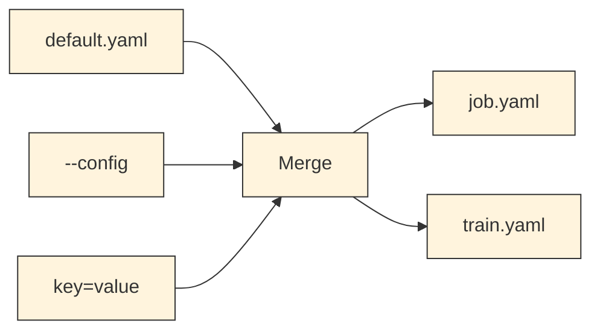

# CLI Framework

The CLI framework is built on [Typer](https://typer.tiangolo.com/) and the [`nemo_runspec`](../../src/nemo_runspec/README.md) toolkit. Each command file contains **visible execution logic** -- no decorators hide how jobs are submitted.

<div class="termy">

```console
$ uv run nemotron nano3 sft --help
Usage: nemotron nano3 sft [OPTIONS]

 Run supervised fine-tuning with Megatron-Bridge (stage1).

╭─ Options ────────────────────────────────────────────────────────────────╮
│ --help  -h        Show this message and exit.                            │
╰──────────────────────────────────────────────────────────────────────────╯
╭─ Global Options ─────────────────────────────────────────────────────────╮
│  -c, --config NAME       Config name or path                             │
│  -r, --run PROFILE       Submit to cluster (attached)                    │
│  -b, --batch PROFILE     Submit to cluster (detached)                    │
│  -d, --dry-run           Preview config without execution                │
│  --stage                 Stage files for interactive debugging           │
╰──────────────────────────────────────────────────────────────────────────╯
╭─ Configs (-c/--config) ──────────────────────────────────────────────────╮
│ Built-in: default, tiny                                                  │
│ Custom: -c /path/to/your/config.yaml                                     │
╰──────────────────────────────────────────────────────────────────────────╯
╭─ Artifact Overrides (W&B artifact references) ───────────────────────────╮
│  run.model     Base model checkpoint artifact                            │
│  run.data      SFT data artifact (packed .npy)                           │
╰──────────────────────────────────────────────────────────────────────────╯
╭─ Run Overrides (override env.toml settings) ─────────────────────────────╮
│  run.env.nodes               Number of nodes                             │
│  run.env.nproc_per_node      GPUs per node                               │
│  run.env.partition           Slurm partition                             │
│  run.env.account             Slurm account                               │
│  run.env.time                Job time limit (e.g., 04:00:00)             │
│  run.env.container_image     Override container image                    │
╰──────────────────────────────────────────────────────────────────────────╯
╭─ env.toml Profiles ──────────────────────────────────────────────────────╮
│ Available profiles: my-cluster, my-cluster-large                         │
│ Usage: --run PROFILE or --batch PROFILE                                  │
╰──────────────────────────────────────────────────────────────────────────╯
╭─ Examples ───────────────────────────────────────────────────────────────╮
│ $ ... sft -c tiny                    Local execution                     │
│ $ ... sft -c tiny --dry-run          Preview config                      │
│ $ ... sft -c tiny --run my-cluster   Submit to cluster                   │
│ $ ... sft -c tiny -r cluster run.env.nodes=4                             │
╰──────────────────────────────────────────────────────────────────────────╯
```

</div>

## Overview

The CLI framework enables:

- **Nested Commands** -- Build hierarchical CLIs like `uv run nemotron nano3 data prep pretrain`
- **Config Integration** -- Automatic YAML config loading with dotlist overrides
- **[Artifact Resolution](./artifacts.md)** -- Map [W&B artifacts](../nemotron/wandb.md) to config fields via `${art:...}` resolver
- **[Remote Execution](./nemo-run.md)** -- Submit jobs to Slurm via NeMo-Run with `--run` / `--batch`
- **Visible Execution** -- All job submission logic lives directly in each command file

For artifacts, see [Nemotron Kit](../nemotron/kit.md). For execution profiles, see [Execution through NeMo-Run](./nemo-run.md). For the full `nemo_runspec` toolkit, see the [nemo_runspec README](../../src/nemo_runspec/README.md).

## Architecture

```mermaid
%%{init: {'theme': 'base', 'themeVariables': { 'primaryBorderColor': '#333333', 'lineColor': '#333333', 'primaryTextColor': '#333333', 'clusterBkg': '#f5f5f5', 'clusterBorder': '#666666'}}}%%
flowchart LR
    subgraph cli["CLI Layer (Typer)"]
        Root["nemotron"]
        Recipe["nano3"]
        Commands["pretrain/sft/rl"]
    end

    subgraph runspec["nemo_runspec Toolkit"]
        Config["Config Loading"]
        Env["env.toml Profiles"]
        Exec["Execution Helpers"]
    end

    subgraph execution["Execution Modes"]
        Local["Local (torchrun)"]
        NemoRun["NeMo-Run (Slurm)"]
        Ray["Ray Jobs"]
    end

    Root --> Recipe --> Commands
    Commands --> runspec
    runspec --> execution
```



## Command Pattern

Each CLI command follows the same explicit pattern. Recipe metadata comes from PEP 723 `[tool.runspec]` blocks in the script itself:

```python
# src/nemotron/cli/commands/nano3/pretrain.py

from nemo_runspec import parse as parse_runspec
from nemo_runspec.config import parse_config, build_job_config, save_configs
from nemo_runspec.execution import create_executor, execute_local, build_env_vars
from nemo_runspec.recipe_config import RecipeConfig, parse_recipe_config

# Metadata read from [tool.runspec] in the training script
SCRIPT_PATH = "src/nemotron/recipes/nano3/stage0_pretrain/train.py"
SPEC = parse_runspec(SCRIPT_PATH)

def _execute_pretrain(cfg: RecipeConfig):
    # 1. Parse configuration
    train_config = parse_config(cfg.ctx, SPEC.config_dir, SPEC.config.default)
    job_config = build_job_config(train_config, cfg.ctx, SPEC.name, ...)

    # 2. Save configs
    job_dir = generate_job_dir(SPEC.name)
    job_path, train_path = save_configs(job_config, ..., job_dir)

    # 3. Execute based on mode
    if cfg.mode == "local":
        execute_local(SCRIPT_PATH, train_path, cfg.passthrough, ...)
    else:
        # Remote execution - THIS IS WHAT YOU'D CHANGE FOR SKYPILOT
        executor = create_executor(env=env, env_vars=env_vars, packager=packager, ...)
        with run.Experiment(recipe_name) as exp:
            exp.add(script_task, executor=executor)
            exp.run(detach=not attached)

# CLI entry point
def pretrain(ctx: typer.Context) -> None:
    """Run pretraining with Megatron-Bridge (stage0)."""
    cfg = parse_recipe_config(ctx)
    _execute_pretrain(cfg)
```

### Registering Commands

Commands are registered via `RecipeTyper` from `nemo_runspec`, which provides standardized help panels:

```python
# src/nemotron/cli/commands/nano3/_typer_group.py
from nemo_runspec.recipe_typer import RecipeTyper

nano3_app = RecipeTyper(name="nano3", help="Nano3 training recipes")
nano3_app.add_recipe_command(pretrain, meta=PRETRAIN_META, rich_help_panel="Training Stages")
```

## Global Options

All recipe commands automatically receive these global options:

| Option | Short | Description |
|--------|-------|-------------|
| `--config` | `-c` | Config name or path (from `config_dir`) |
| `--run` | `-r` | Attached [NeMo-Run](./nemo-run.md) execution (waits, streams logs) |
| `--batch` | `-b` | Detached [NeMo-Run](./nemo-run.md) execution (submits, exits) |
| `--dry-run` | `-d` | Preview config without executing |
| `--stage` | | Stage files to remote for debugging |
| `key=value` | | Dotlist overrides (any position) |

### GlobalContext

Global options are captured in a `GlobalContext` dataclass (in `nemo_runspec.cli_context`):

```python
@dataclass
class GlobalContext:
    config: str | None = None      # -c/--config value
    run: str | None = None         # --run profile name
    batch: str | None = None       # --batch profile name
    dry_run: bool = False          # --dry-run flag
    stage: bool = False            # --stage flag
    dotlist: list[str]             # key=value overrides
    passthrough: list[str]         # Unknown args for script
```

Key properties:
- `mode` -> `"run"`, `"batch"`, or `"local"`
- `profile` -> Environment profile name (from `--run` or `--batch`)

## Configuration Pipeline

Config loading is handled by `nemo_runspec.config`:



### Two-Config System

The CLI generates two config files:

| File | Purpose |
|------|---------|
| `job.yaml` | Full provenance: config + CLI args + env profile |
| `train.yaml` | Clean config for script (paths rewritten for remote) |

**job.yaml structure:**
```yaml
recipe:
  _target_: megatron.bridge.recipes...
  per_split_data_args_path: /data/blend.json
train:
  train_iters: 1000
run:
  mode: "run"
  profile: "my-cluster"
  env:
    executor: "slurm"
    nodes: 4
    gpus_per_node: 8
  cli:
    argv: ["nemotron", "nano3", "pretrain", "-c", "tiny", "--run", "my-cluster"]
    dotlist: ["train.train_iters=1000"]
  wandb:
    entity: "nvidia"
    project: "nemotron"
```

### Dotlist Overrides

Override any config value with `key.path=value` syntax:

```bash
# Override nested values
uv run nemotron nano3 pretrain train.train_iters=5000

# Multiple overrides
uv run nemotron nano3 pretrain \
    train.train_iters=5000 \
    train.micro_batch_size=2 \
    run.data=PretrainBlendsArtifact-v2:latest
```

## Execution Modes

### Local Execution

Without `--run` or `--batch`, commands execute locally:

```bash
# Local execution (no NeMo-Run)
uv run nemotron nano3 pretrain -c tiny

# Equivalent to:
python -m torch.distributed.run \
    --nproc_per_node=1 \
    src/nemotron/recipes/nano3/stage0_pretrain/train.py \
    --config train.yaml
```

### NeMo-Run Attached (`--run`)

Submit job and wait for completion, streaming logs:

```bash
uv run nemotron nano3 pretrain -c tiny --run MY-CLUSTER
```

### NeMo-Run Detached (`--batch`)

Submit job and exit immediately:

```bash
uv run nemotron nano3 pretrain -c tiny --batch MY-CLUSTER
```

### Ray Jobs

For recipes with `launch = "ray"` in their `[tool.runspec]` (data prep, RL), jobs are submitted via Ray:

```bash
# Data prep uses Ray for distributed processing
uv run nemotron nano3 data prep pretrain --run MY-CLUSTER

# RL uses Ray for actor orchestration
uv run nemotron nano3 rl -c tiny --run MY-CLUSTER
```

## Artifact Resolution

### Config Resolver

Use `${art:...}` in YAML configs to resolve artifact paths:

```yaml
run:
  data: PretrainBlendsArtifact-default:latest

recipe:
  per_split_data_args_path: ${art:data,path}/blend.json
```

### CLI Override

Override artifacts via dotlist:

```bash
uv run nemotron nano3 sft --run MY-CLUSTER \
    run.data=PretrainBlendsArtifact-v2:latest \
    run.model=ModelArtifact-pretrain:v3
```

## Packager Types

Control how code is synced to remote (configured in `[tool.runspec.run]`):

| Packager | Description | Use Case |
|----------|-------------|----------|
| `pattern` | Minimal sync (`main.py` + `config.yaml`) | Default |
| `code` | Full codebase with exclusions | Ray jobs needing imports |
| `self_contained` | Inline all `nemotron.*` imports | Isolated scripts |

## CLI Examples

<div class="termy">

```console
// Preview config without executing
$ uv run nemotron nano3 pretrain -c tiny --dry-run

// Submit to cluster (attached)
$ uv run nemotron nano3 pretrain -c tiny --run MY-CLUSTER

// Submit to cluster (detached)
$ uv run nemotron nano3 pretrain -c tiny --batch MY-CLUSTER

// Override training iterations
$ uv run nemotron nano3 pretrain -c tiny --run MY-CLUSTER train.train_iters=5000

// Stage files for interactive debugging
$ uv run nemotron nano3 pretrain -c tiny --run MY-CLUSTER --stage

// Data preparation (Ray job)
$ uv run nemotron nano3 data prep pretrain --run MY-CLUSTER

// RL training (Ray job)
$ uv run nemotron nano3 rl -c tiny --run MY-CLUSTER
```

</div>

## Building a Recipe

### Step 1: Create Recipe Script with Runspec

```python
# src/nemotron/recipes/myrecipe/train.py

# /// script
# [tool.runspec]
# name = "myrecipe/train"
# image = "nvcr.io/nvidia/nemo:25.11"
#
# [tool.runspec.run]
# launch = "torchrun"
#
# [tool.runspec.config]
# dir = "./config"
# default = "default"
# ///

import argparse
from pathlib import Path
from omegaconf import OmegaConf

def main():
    parser = argparse.ArgumentParser()
    parser.add_argument("--config", type=Path, required=True)
    args, unknown = parser.parse_known_args()

    cfg = OmegaConf.load(args.config)
    if unknown:
        cfg = OmegaConf.merge(cfg, OmegaConf.from_dotlist(unknown))

    print(f"Training with {cfg.train.train_iters} iterations")

if __name__ == "__main__":
    main()
```

### Step 2: Create Config Directory

```
src/nemotron/recipes/myrecipe/
├── config/
│   ├── default.yaml
│   └── tiny.yaml
└── train.py          # Script with [tool.runspec] block
```

### Step 3: Create CLI Command

```python
# src/nemotron/cli/commands/myrecipe/train.py
from nemo_runspec import parse as parse_runspec
from nemo_runspec.config import parse_config, build_job_config, save_configs, generate_job_dir
from nemo_runspec.execution import create_executor, execute_local, build_env_vars
from nemo_runspec.env import parse_env
from nemo_runspec.recipe_config import RecipeConfig, parse_recipe_config
from nemo_runspec.recipe_typer import RecipeMeta
import typer

SCRIPT_PATH = "src/nemotron/recipes/myrecipe/train.py"
SPEC = parse_runspec(SCRIPT_PATH)

META = RecipeMeta(
    name=SPEC.name,
    script_path=SCRIPT_PATH,
    config_dir=str(SPEC.config_dir),
    default_config=SPEC.config.default,
)

def _execute_train(cfg: RecipeConfig):
    train_config = parse_config(cfg.ctx, SPEC.config_dir, SPEC.config.default)
    env = parse_env(cfg.ctx)
    job_config = build_job_config(train_config, cfg.ctx, SPEC.name, SCRIPT_PATH, cfg.argv, env_profile=env)

    if cfg.dry_run:
        return

    job_dir = generate_job_dir(SPEC.name)
    _, train_path = save_configs(job_config, ..., job_dir)

    if cfg.mode == "local":
        execute_local(SCRIPT_PATH, train_path, cfg.passthrough, torchrun=True)
    else:
        # Remote execution via nemo-run
        ...

def train(ctx: typer.Context) -> None:
    """Run training for my recipe."""
    cfg = parse_recipe_config(ctx)
    _execute_train(cfg)
```

### Step 4: Register and Run

```python
# src/nemotron/cli/commands/myrecipe/_typer_group.py
from nemo_runspec.recipe_typer import RecipeTyper
from .train import META, train

app = RecipeTyper(name="myrecipe", help="My training recipe")
app.add_recipe_command(train, meta=META)
```

```bash
# Test locally
uv run nemotron myrecipe train -c tiny

# Run on cluster
uv run nemotron myrecipe train -c tiny --run MY-CLUSTER
```

## API Reference

### nemo_runspec Toolkit

| Export | Module | Description |
|--------|--------|-------------|
| `parse()` | `nemo_runspec` | Parse `[tool.runspec]` from a script file |
| `parse_config()` | `nemo_runspec.config` | Load YAML config with dotlist overrides |
| `build_job_config()` | `nemo_runspec.config` | Build full job config with provenance |
| `save_configs()` | `nemo_runspec.config` | Save job.yaml and train.yaml |
| `parse_env()` | `nemo_runspec.env` | Load env.toml profile |
| `parse_recipe_config()` | `nemo_runspec.recipe_config` | Parse CLI options into RecipeConfig |
| `RecipeTyper` | `nemo_runspec.recipe_typer` | Typer subclass with rich help panels |
| `RecipeMeta` | `nemo_runspec.recipe_typer` | Recipe metadata for help panels |
| `GlobalContext` | `nemo_runspec.cli_context` | Shared CLI state |
| `create_executor()` | `nemo_runspec.execution` | Build NeMo-Run executor |
| `execute_local()` | `nemo_runspec.execution` | Run locally via torchrun |
| `build_env_vars()` | `nemo_runspec.execution` | Build env vars (HF, W&B tokens) |

## Further Reading

- [Nemotron Kit](../nemotron/kit.md) -- Artifacts and lineage tracking
- [`nemo_runspec` Package](../../src/nemo_runspec/README.md) -- Full toolkit documentation
- [Execution through NeMo-Run](./nemo-run.md) -- Execution profiles and env.toml
- [Data Preparation](../nemotron/data-prep.md) -- Data preparation module
- [Artifact Lineage](./artifacts.md) -- W&B artifact system and lineage tracking
- [W&B Integration](../nemotron/wandb.md) -- Credentials and configuration
- [Nano3 Recipe](./nano3/README.md) -- Complete training recipe example
