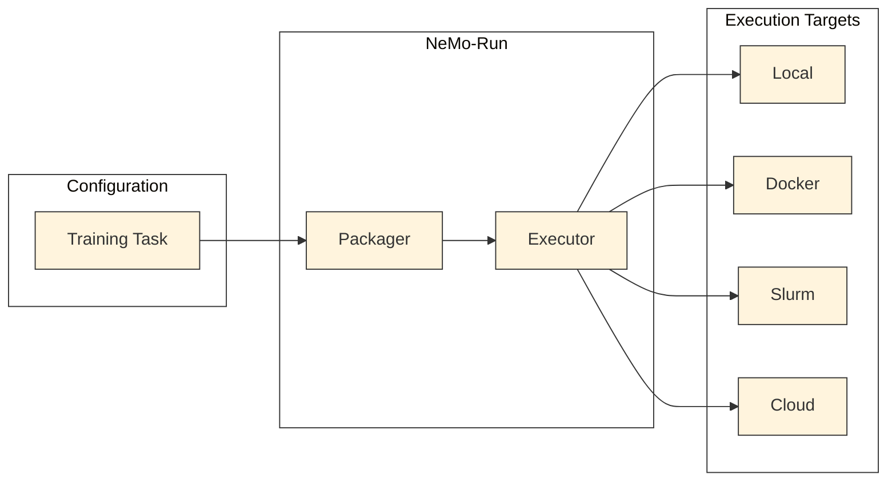

# Execution through NeMo-Run

Nemotron recipes use [NeMo-Run](https://github.com/NVIDIA-NeMo/Run) for job orchestration. NeMo-Run is an NVIDIA tool for configuring, executing, and managing ML experiments across computing environments.

> **Note**: This release supports Slurm, DGX Cloud (run:ai), and Lepton executors, including Ray-based runs on all three backends.

## What is NeMo-Run?

NeMo-Run decouples **what** you want to run from **where** you run it:



**Core concepts:**
- **Executor** – where to run (local, Docker, Slurm, cloud)
- **Packager** – how to package code for the executor
- **Launcher** – how to launch the process (torchrun, direct)

For full documentation, see the [NeMo-Run GitHub repository](https://github.com/NVIDIA-NeMo/Run).

## Quick Start

Add `--run <profile>` to any recipe command:

```bash
# Execute on a Slurm cluster
uv run nemotron nano3 pretrain -c tiny --run YOUR-CLUSTER

# Detached execution (submit and exit)
uv run nemotron nano3 pretrain -c tiny --batch YOUR-CLUSTER

# Preview without executing
uv run nemotron nano3 pretrain -c tiny --run YOUR-CLUSTER --dry-run
```

## Execution Profiles

The `nemo_runspec` package adds an `env.toml` configuration layer on top of NeMo-Run. This gives you declarative execution profiles that integrate with the CLI. This is a **Nemotron-specific feature** -- standard NeMo-Run requires programmatic configuration.

Create an `env.toml` in your project root. Each section defines a named execution profile that can be referenced via `--run <profile>` or `--batch <profile>`:

```toml
# env.toml

[wandb]
project = "nemotron"
entity = "YOUR-TEAM"

[YOUR-CLUSTER]
executor = "slurm"
account = "YOUR-ACCOUNT"
partition = "batch"
nodes = 2
ntasks_per_node = 8
gpus_per_node = 8
mounts = ["/lustre:/lustre"]
```

When you run `uv run nemotron nano3 pretrain --run YOUR-CLUSTER`, the kit reads this profile, builds the appropriate NeMo-Run executor, and submits your job.

### Profile Inheritance

Profiles can extend other profiles to reduce duplication:

```toml
[base-slurm]
executor = "slurm"
account = "my-account"
partition = "gpu"
time = "04:00:00"

[YOUR-CLUSTER]
extends = "base-slurm"
nodes = 4
ntasks_per_node = 8
gpus_per_node = 8

[YOUR-CLUSTER-large]
extends = "YOUR-CLUSTER"
nodes = 16
time = "08:00:00"
```

## Executors

### Slurm

Submit jobs to a Slurm cluster. Container execution requires [Pyxis](https://github.com/NVIDIA/pyxis), NVIDIA's container plugin for Slurm.

```toml
[YOUR-CLUSTER]
executor = "slurm"
account = "my-account"
partition = "gpu"
nodes = 4
ntasks_per_node = 8
gpus_per_node = 8
time = "04:00:00"
mounts = ["/data:/data"]
```

#### SSH Tunnel Submission

Submit from a remote machine via SSH:

```toml
[YOUR-CLUSTER]
executor = "slurm"
account = "my-account"
partition = "gpu"
nodes = 4
tunnel = "ssh"
host = "cluster.example.com"
user = "username"
identity = "~/.ssh/id_rsa"
```

#### Partition Overrides

Specify different partitions for `--run` vs `--batch`:

```toml
[YOUR-CLUSTER]
executor = "slurm"
partition = "batch"           # Default
run_partition = "interactive" # For --run (attached)
batch_partition = "backfill"  # For --batch (detached)
```

### DGX Cloud (run:ai)

Submit jobs to NVIDIA DGX Cloud via the run:ai API. This executor handles authentication, data movement to PVCs, and multi-node distributed training through DGX Cloud workloads.

```toml
[dgxcloud]
executor = "dgxcloud"
base_url = "https://your-dgxcloud-instance.example.com/api/v1"
kube_apiserver_url = "https://your-dgxcloud-k8s.example.com"
client_id = "YOUR-CLIENT-ID"          # `app_id` accepted as legacy alias
client_secret = "YOUR-CLIENT-SECRET"  # `app_secret` accepted as legacy alias
project_name = "YOUR-PROJECT"
container_image = "nvcr.io/nvidia/nemo:latest"
pvc_nemo_run_dir = "/pvc/nemo_run"
nodes = 2
gpus_per_node = 8
nprocs_per_node = 8
pvcs = [
    { claimName = "my-pvc", path = "/pvc", readOnly = false }
]
```

For run:ai scheduler integration, use `custom_spec`:

```toml
[dgxcloud-runai]
extends = "dgxcloud"
custom_spec = { schedulerName = "runai-scheduler" }
```

### Lepton

Submit jobs to NVIDIA DGX Cloud Lepton clusters. Lepton provides SDK-based job submission with node group scheduling and shared memory configuration.

```toml
[lepton]
executor = "lepton"
container_image = "nvcr.io/nvidia/nemo:latest"
nemo_run_dir = "/nemo_run"
nodes = 2
gpus_per_node = 8
resource_shape = "gpu.h100.8"
node_group = "my-node-group"
shared_memory_size = 65536
mounts = [
    { path = "/data", mount_path = "/data" }
]
pre_launch_commands = ["pip install my-package"]
```

### Docker

Run in a local Docker container with GPU support:

```toml
[docker]
executor = "docker"
container_image = "nvcr.io/nvidia/nemo:latest"
gpus_per_node = 8
runtime = "nvidia"
mounts = ["/data:/data"]
```

### Other Executors

NeMo-Run also supports these executors (not yet integrated into env.toml profiles):

| Executor | Description |
|----------|-------------|
| `skypilot` | Cloud instances (AWS, GCP, Azure) via SkyPilot |
| `kubeflow` | Kubernetes Training Operator (PyTorchJob) |

## Packagers

Packagers determine how your code is bundled and transferred to the execution target. NeMo-Run provides several packagers for different workflows.

### GitArchivePackager (Default)

Packages code from a git repository using `git archive`. Only includes committed files.

```toml
[YOUR-CLUSTER]
executor = "slurm"
packager = "git"
# ... other settings
```

**How it works:**
1. Runs `git archive --format=tar.gz` from repository root
2. Includes only committed files (uncommitted changes are excluded)
3. Optionally includes git submodules
4. Transfers archive to execution target

**Key options:**

| Option | Default | Description |
|--------|---------|-------------|
| `subpath` | - | Package only a subdirectory of the repo |
| `include_submodules` | `true` | Include git submodules in archive |
| `include_pattern` | - | Glob pattern for additional uncommitted files |

**Best for:** Production runs with version-controlled code.

### PatternPackager

Packages files matching glob patterns. Useful for code not under version control.

```toml
[YOUR-CLUSTER]
executor = "slurm"
packager = "pattern"
packager_include_pattern = "src/**/*.py"
```

**How it works:**
1. Finds files matching the glob pattern
2. Creates tar archive of matched files
3. Preserves directory structure relative to pattern base

**Key options:**

| Option | Description |
|--------|-------------|
| `include_pattern` | Glob pattern(s) for files to include |
| `relative_path` | Base path for pattern matching |

**Best for:** Quick iterations, non-git projects, or including generated files.

### HybridPackager

Combines multiple packagers into a single archive. Useful for complex projects.

```toml
[YOUR-CLUSTER]
executor = "slurm"
packager = "hybrid"
# Configuration via code (see below)
```

**How it works:**
1. Runs each sub-packager independently
2. Extracts outputs to temporary directories
3. Merges all into final archive with folder organization

**Example in code:**

```python
import nemo_run as run

hybrid = run.HybridPackager(
    sub_packagers={
        "code": run.GitArchivePackager(subpath="src"),
        "configs": run.PatternPackager(include_pattern="configs/*.yaml"),
        "data": run.PatternPackager(include_pattern="data/*.json"),
    }
)
```

**Best for:** Projects with mixed version-controlled and generated content.

### Passthrough Packager

No packaging—assumes code is already available on the target (e.g., in a container image or shared filesystem).

```toml
[YOUR-CLUSTER]
executor = "slurm"
packager = "none"
```

**Best for:** Pre-built containers, shared filesystems like `/lustre`.

## CLI Options

### `--run` vs `--batch`

| Option | Behavior | Use Case |
|--------|----------|----------|
| `--run` | Attached—waits for completion, streams logs | Interactive development |
| `--batch` | Detached—submits and exits immediately | Long-running jobs |

### Config Overrides

Override config values using Hydra-style syntax:

```bash
# Override training iterations
uv run nemotron nano3 pretrain --run YOUR-CLUSTER train.train_iters=5000

# Override nodes
uv run nemotron nano3 pretrain --run YOUR-CLUSTER run.env.nodes=8
```

## env.toml Reference

An `env.toml` file contains two kinds of sections: **system-level sections** (reserved names) and **execution profiles** (any other name).

### System-Level Sections

These sections have reserved names and are not execution profiles:

```toml
[wandb]
project = "nemotron"
entity = "YOUR-TEAM"

[artifacts]
backend = "file"           # "file" or "wandb" (default: "wandb" if [wandb] exists)
root = "/path/to/artifacts" # Root directory for file-based artifacts

[cache]
git_dir = "/lustre/.../git-cache"  # Directory for caching git repos (for auto_mount)

[cli]
theme = "github-light"     # Rich console theme
```

| Section | Field | Type | Description |
|---------|-------|------|-------------|
| `[wandb]` | `project` | str | W&B project name (injected into `run.wandb.project`) |
| `[wandb]` | `entity` | str | W&B entity/team name (injected into `run.wandb.entity`) |
| `[artifacts]` | `backend` | str | Artifact storage backend: `"file"` or `"wandb"` |
| `[artifacts]` | `root` | str | Root directory for file-based artifact storage |
| `[cache]` | `git_dir` | str | Directory for caching git repos cloned by `${auto_mount:...}` |
| `[cli]` | `theme` | str | Rich console theme name |

### Execution Profile Fields

Every other section is an execution profile. Use `--run <name>` or `--batch <name>` to select one.

```toml
[my-cluster]
executor = "slurm"
account = "my-account"
partition = "batch"
run_partition = "interactive"
batch_partition = "batch"
tunnel = "ssh"
host = "cluster.example.com"
user = "username"
remote_job_dir = "/lustre/users/me/run"
time = "04:00:00"
nodes = 2
ntasks_per_node = 8
gpus_per_node = 8
mem = "0"
exclusive = true
container_image = "/path/to/image.sqsh"
mounts = ["/lustre:/lustre"]
startup_commands = ["source /opt/env.sh"]
```

**Core:**

| Field | Type | Default | Description |
|-------|------|---------|-------------|
| `executor` | str | `"local"` | Execution backend: `"local"`, `"docker"`, `"slurm"`, `"dgxcloud"`, or `"lepton"` |
| `extends` | str | - | Parent profile to inherit from |

**Local executor:**

| Field | Type | Default | Description |
|-------|------|---------|-------------|
| `nproc_per_node` | int | `1` | Number of GPU processes (for torchrun) |

**Slurm executor:**

| Field | Type | Default | Description |
|-------|------|---------|-------------|
| `account` | str | - | Slurm account for job billing |
| `partition` | str | - | Default Slurm partition |
| `run_partition` | str | - | Partition for `--run` (attached mode) |
| `batch_partition` | str | - | Partition for `--batch` (detached mode) |
| `nodes` | int | `1` | Number of compute nodes |
| `ntasks_per_node` | int | `1` | Tasks per node |
| `gpus_per_node` | int | - | GPUs per node |
| `cpus_per_task` | int | - | CPU cores per task |
| `time` | str | `"04:00:00"` | Job time limit (HH:MM:SS) |
| `mem` | str | - | Memory per node (`"0"` = all available) |
| `exclusive` | bool | - | Request exclusive node access |

**SSH tunnel (for remote submission):**

| Field | Type | Default | Description |
|-------|------|---------|-------------|
| `tunnel` | str | - | Set to `"ssh"` for remote submission |
| `host` | str | - | SSH hostname |
| `user` | str | - | SSH username |
| `remote_job_dir` | str | - | Working directory on the remote cluster |

**Container:**

| Field | Type | Default | Description |
|-------|------|---------|-------------|
| `container_image` | str | - | Container image path (`.sqsh` for Slurm, Docker URI for local) |
| `container` | str | - | Alias for `container_image` (checked as fallback) |
| `mounts` | list | `[]` | Container mount points (`"/host:/container"`) |

**Startup:**

| Field | Type | Default | Description |
|-------|------|---------|-------------|
| `startup_commands` | list | `[]` | Shell commands to run before the training script |

**DGX Cloud executor:**

| Field | Type | Default | Description |
|-------|------|---------|-------------|
| `base_url` | str | *required* | DGX Cloud API base URL |
| `kube_apiserver_url` | str | *required* | Kubernetes API server URL for the DGX Cloud cluster |
| `client_id` | str | *required* | Client ID for authentication |
| `client_secret` | str | *required* | Client secret for authentication |
| `app_id` | str | - | Legacy alias for `client_id` (back-compat shim) |
| `app_secret` | str | - | Legacy alias for `client_secret` (back-compat shim) |
| `project_name` | str | *required* | DGX Cloud project name |
| `pvc_nemo_run_dir` | str | *required* | PVC path for nemo-run job directory |
| `nodes` | int | `1` | Number of compute nodes |
| `gpus_per_node` | int | `0` | GPUs per node |
| `nprocs_per_node` | int | `1` | Processes per node |
| `pvcs` | list | `[]` | PVC mount specifications (list of dicts with `claimName`, `path`, `readOnly`) |
| `distributed_framework` | str | `"PyTorch"` | Distributed framework (`"PyTorch"`) |
| `custom_spec` | dict | `{}` | Additional workload spec overrides (e.g., `schedulerName` for run:ai) |

**Lepton executor:**

| Field | Type | Default | Description |
|-------|------|---------|-------------|
| `nemo_run_dir` | str | *required* | Remote directory for nemo-run job files |
| `nodes` | int | `1` | Number of compute nodes |
| `gpus_per_node` | int | `0` | GPUs per node |
| `nprocs_per_node` | int | `1` | Processes per node |
| `resource_shape` | str | `""` | Resource shape (e.g., `"gpu.h100.8"`) |
| `node_group` | str | `""` | Target node group |
| `node_reservation` | str | `""` | Node reservation identifier |
| `shared_memory_size` | int | `65536` | Shared memory size in MB |
| `mounts` | list | `[]` | Mount specifications (list of dicts with `path`, `mount_path`) |
| `image_pull_secrets` | list | `[]` | Container registry authentication secrets |
| `pre_launch_commands` | list | `[]` | Commands to run before launching the job |
| `custom_spec` | dict | `{}` | Additional job spec overrides |

### How Profiles Are Resolved

When you run `--run my-cluster`:

1. **Load**: `env.toml` is found by walking up from the current directory
2. **Inherit**: If `extends = "parent"` is set, fields are inherited recursively
3. **Merge**: The profile overlays the config YAML's `run.env` defaults (`{**yaml_defaults, **profile}`)
4. **Inject**: `[wandb]` section is injected into `run.wandb`

This means config YAML provides defaults for any field env.toml doesn't set. For example, the evaluator config sets `container: nvcr.io/nvidia/nemo-evaluator:latest` in its YAML, which is used unless your env.toml profile overrides it.

### Full Example

```toml
# env.toml

# --- System sections (not profiles) ---

[wandb]
project = "nemotron"
entity = "my-team"

[artifacts]
backend = "file"
root = "/lustre/users/me/artifacts"

[cache]
git_dir = "/lustre/users/me/git-cache"

# --- Execution profiles ---

[local]
executor = "local"
nproc_per_node = 8

[my-cluster]
executor = "slurm"
account = "my-account"
partition = "batch"
run_partition = "interactive"
batch_partition = "batch"
time = "04:00:00"
tunnel = "ssh"
host = "login.cluster.com"
user = "me"
remote_job_dir = "/lustre/users/me/run"

[pretrain]
extends = "my-cluster"
nodes = 2
ntasks_per_node = 8
gpus_per_node = 8
mem = "0"
exclusive = true
mounts = ["/lustre:/lustre"]

[pretrain-large]
extends = "pretrain"
nodes = 8
time = "08:00:00"

[data-prep]
extends = "my-cluster"
run_partition = "cpu"
batch_partition = "cpu"
nodes = 1
ntasks_per_node = 1
cpus_per_task = 96

[rl]
extends = "pretrain"
container_image = "/lustre/users/me/nano3-rl.sqsh"

# --- DGX Cloud (run:ai) ---

[dgxcloud]
executor = "dgxcloud"
base_url = "https://dgx.example.com/api/v1"
app_id = "MY-APP-ID"
app_secret = "MY-APP-SECRET"
project_name = "my-project"
container_image = "nvcr.io/nvidia/nemo:latest"
pvc_nemo_run_dir = "/pvc/nemo_run"
nodes = 2
gpus_per_node = 8
nprocs_per_node = 8
pvcs = [
    { claimName = "my-pvc", path = "/pvc", readOnly = false }
]

# --- Lepton ---

[lepton]
executor = "lepton"
container_image = "nvcr.io/nvidia/nemo:latest"
nemo_run_dir = "/nemo_run"
nodes = 2
gpus_per_node = 8
resource_shape = "gpu.h100.8"
node_group = "my-node-group"
```

## Ray-Enabled Recipes

Some recipes use Ray for distributed execution. When you run a Ray-enabled recipe with `--run`, the Ray cluster is set up automatically:

```bash
# Data prep uses Ray
uv run nemotron nano3 data prep pretrain --run YOUR-CLUSTER

# RL training uses Ray
uv run nemotron nano3 rl -c tiny --run YOUR-CLUSTER
```

### Ray on DGX Cloud and Lepton

Ray-based recipes work with DGX Cloud and Lepton executors. The framework automatically selects the appropriate Ray backend based on the executor type:

- **Slurm**: Uses `SlurmRayJob` with SSH tunnel (default)
- **DGX Cloud**: Uses `DGXCloudRayJob` for self-organizing Ray topology within distributed workloads
- **Lepton**: Uses `LeptonRayJob` with the Lepton SDK

```toml
# Ray-enabled RL on DGX Cloud
[dgxcloud-rl]
executor = "dgxcloud"
base_url = "https://dgx.example.com/api/v1"
app_id = "YOUR-ID"
app_secret = "YOUR-SECRET"
project_name = "your-project"
container_image = "nvcr.io/nvidia/nemo-rl:latest"
pvc_nemo_run_dir = "/pvc/nemo_run"
nodes = 4
gpus_per_node = 8

# Ray-enabled RL on Lepton
[lepton-rl]
executor = "lepton"
container_image = "nvcr.io/nvidia/nemo-rl:latest"
nemo_run_dir = "/nemo_run"
nodes = 4
gpus_per_node = 8
resource_shape = "gpu.h100.8"
node_group = "my-node-group"
```

Use with any Ray-enabled recipe:

```bash
uv run nemotron nano3 rl -c tiny --run dgxcloud-rl
uv run nemotron nano3 rl -c tiny --run lepton-rl
```

## Further Reading

- [NeMo-Run GitHub](https://github.com/NVIDIA-NeMo/Run) – full documentation
- [W&B Integration](../nemotron/wandb.md) – credential handling
- [Nemotron Kit](../nemotron/kit.md) – artifact system and lineage tracking
- [CLI Framework](../nemotron/cli.md) – building recipe CLIs
