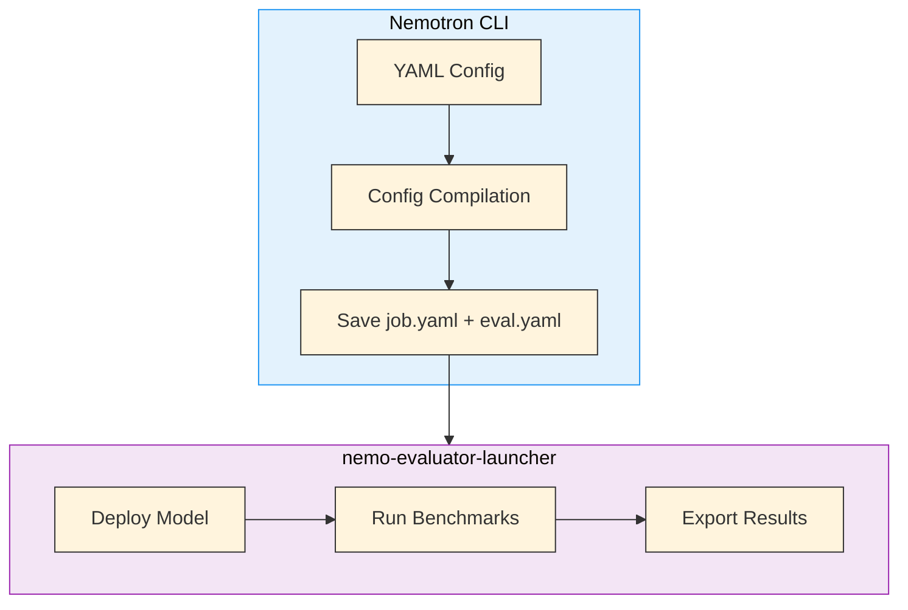
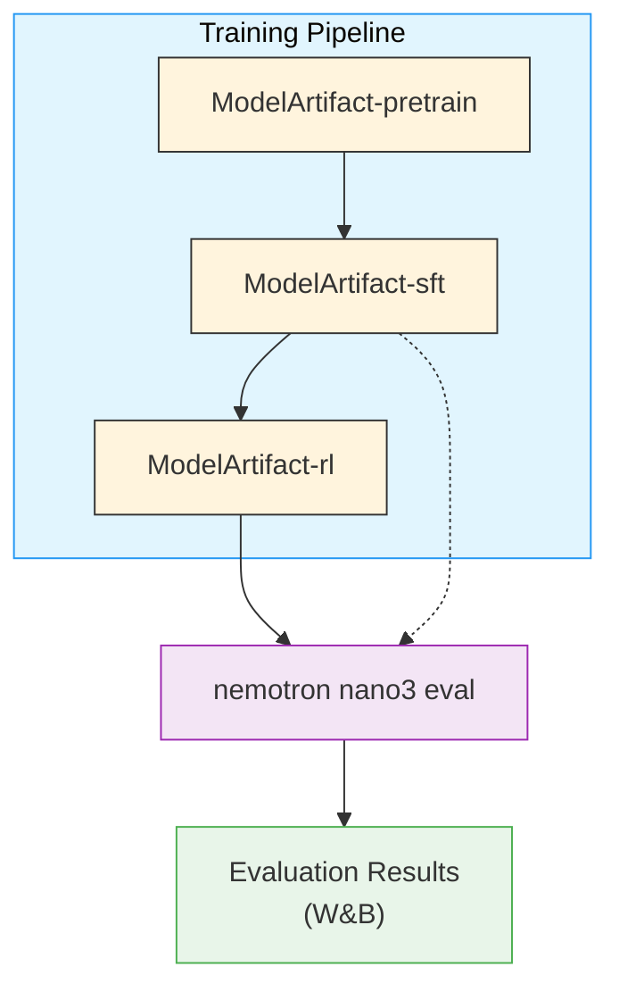

# Evaluation

Evaluate Nemotron models against standard benchmarks using [NeMo Evaluator](https://github.com/NVIDIA-NeMo/Evaluator).

## Overview

The Nemotron CLI integrates with [nemo-evaluator-launcher](https://github.com/NVIDIA-NeMo/Evaluator) to provide a streamlined evaluation workflow: deploy a model, run benchmarks, and export results to W&B—all from a single command.

```bash
nemotron nano3 eval --run YOUR-CLUSTER
```

The eval command resolves model artifacts from W&B lineage and uses NeMo Framework's Ray-based in-framework deployment. It defaults to evaluating the latest RL stage output.

## Quick Start

<div class="termy">

```console
// Evaluate the latest RL model from the Nano3 pipeline
$ uv run nemotron nano3 eval --run YOUR-CLUSTER

// Evaluate a specific model artifact
$ uv run nemotron nano3 eval --run YOUR-CLUSTER run.model=sft:v2

// Filter to specific benchmarks
$ uv run nemotron nano3 eval --run YOUR-CLUSTER -t adlr_mmlu -t hellaswag

// Dry run: preview the resolved config without executing
$ uv run nemotron nano3 eval --dry-run
```

</div>

> **Note**: The `--run YOUR-CLUSTER` flag submits jobs via [NeMo-Run](../nemo_runspec/nemo-run.md). See [Execution through NeMo-Run](../nemo_runspec/nemo-run.md) for setup.

## Prerequisites

- **[NeMo Evaluator](https://github.com/NVIDIA-NeMo/Evaluator)**: Install with `pip install "nemotron[evaluator]"` or ensure `nemo-evaluator-launcher` is available
- **Container image**: `nvcr.io/nvidia/nemo:25.11.nemotron_3_nano` (NeMo Megatron container for model serving; nemo-evaluator-launcher pulls its own evaluation containers)
- **[Weights & Biases](./wandb.md)**: For result export (optional but recommended)
- **Slurm cluster**: For remote execution

## How Evaluation Works

Unlike training commands that submit Python scripts via NeMo-Run, evaluation commands call `nemo-evaluator-launcher` directly. The flow is:



### Config Compilation

The CLI performs several transformations on your YAML config before passing it to the launcher:

1. **Load** the YAML config via OmegaConf (with Hydra defaults resolution)
2. **Merge** env.toml profile values and CLI dotlist overrides
3. **Auto-inject** W&B credential mappings if W&B export is configured
4. **Auto-squash** container images for Slurm (converts Docker images to `.sqsh` files)
5. **Strip** the `run` section and resolve all `${run.*}` interpolations
6. **Resolve** artifact references (`${art:model,path}`) via W&B Artifacts
7. **Pass** the cleaned config to `nemo-evaluator-launcher`'s `run_eval()`

Two YAML files are saved for provenance:
- `job.yaml` — full config including `run` section (for reproducibility)
- `eval.yaml` — compiled config as seen by the launcher

## Config Structure

Evaluation configs have five sections:

```yaml
# Nemotron extension (stripped before passing to launcher)
run:
  model: rl:latest                    # W&B artifact reference
  env:                                 # Populated from env.toml profile
    container: nvcr.io/nvidia/nemo:25.11.nemotron_3_nano
    executor: slurm
    host: ${oc.env:HOSTNAME,localhost}
    ...
  wandb:
    entity: null
    project: null

# Passed directly to nemo-evaluator-launcher
execution:
  type: slurm
  num_nodes: 1
  gres: gpu:8
  auto_export:
    enabled: true
    destinations: [wandb]

deployment:
  type: generic                        # NeMo Framework Ray
  checkpoint_path: ${art:model,path}   # Resolved from W&B artifact
  command: >-
    bash -c 'python deploy_ray_inframework.py
    --megatron_checkpoint /checkpoint/
    --num_gpus 8
    --tensor_model_parallel_size 2
    --expert_model_parallel_size 8
    --port 1235'

evaluation:
  nemo_evaluator_config:
    config:
      params:
        parallelism: 4
        request_timeout: 6000
  tasks:
    - name: adlr_mmlu
    - name: adlr_arc_challenge_llama_25_shot
    - name: adlr_winogrande_5_shot
    - name: hellaswag
    - name: openbookqa

export:
  wandb:
    entity: ${run.wandb.entity}
    project: ${run.wandb.project}
```

| Section | Purpose | Passed to Launcher? |
|---------|---------|:-------------------:|
| `run` | env.toml injection, artifact references | No (stripped) |
| `execution` | Where to run, auto-export, mounts | Yes |
| `deployment` | How to serve the model | Yes |
| `evaluation` | Tasks and evaluation parameters | Yes |
| `export` | Result destinations (W&B) | Yes |

## Deployment

The default config uses NeMo Framework's Ray-based in-framework deployment (`type: generic`) with a custom command for serving:

```yaml
deployment:
  type: generic
  multiple_instances: true
  image: nvcr.io/nvidia/nemo:25.11.nemotron_3_nano
  checkpoint_path: ${art:model,path}
  port: 1235
  command: >-
    bash -c 'python deploy_ray_inframework.py
    --megatron_checkpoint /checkpoint/
    --num_gpus 8
    --tensor_model_parallel_size 2
    --expert_model_parallel_size 8
    --port 1235'
```

## Evaluation Tasks

Tasks are defined in the `evaluation.tasks` list. Each task maps to a benchmark supported by NeMo Evaluator:

```yaml
evaluation:
  tasks:
    - name: adlr_mmlu
      nemo_evaluator_config:       # Optional per-task overrides
        config:
          params:
            top_p: 0.0
    - name: adlr_arc_challenge_llama_25_shot
    - name: adlr_winogrande_5_shot
    - name: hellaswag
    - name: openbookqa
```

### Task Filtering

Filter tasks at runtime with `-t`/`--task` flags:

```bash
# Run only MMLU
uv run nemotron nano3 eval --run YOUR-CLUSTER -t adlr_mmlu

# Run MMLU and HellaSwag
uv run nemotron nano3 eval --run YOUR-CLUSTER -t adlr_mmlu -t hellaswag
```

### Available Tasks

To discover available tasks, use the nemo-evaluator-launcher CLI:

```bash
nemo-evaluator-launcher ls tasks
```

Common benchmarks include:

| Task | Type | Description |
|------|------|-------------|
| `adlr_mmlu` | Text Generation | Massive Multitask Language Understanding |
| `hellaswag` | Log Probability | Commonsense sentence completion |
| `adlr_arc_challenge_llama_25_shot` | Log Probability | ARC Challenge with 25-shot prompting |
| `adlr_winogrande_5_shot` | Log Probability | Winogrande commonsense reasoning |
| `openbookqa` | Log Probability | Open-domain science questions |

## Artifact Resolution

The default config uses `${art:model,path}` for the model checkpoint:

```yaml
run:
  model: rl:latest  # Resolve latest RL artifact

deployment:
  checkpoint_path: ${art:model,path}  # Resolved at runtime
```

Override the model artifact on the command line:

```bash
# Evaluate the RL model (default)
uv run nemotron nano3 eval --run YOUR-CLUSTER

# Evaluate SFT model
uv run nemotron nano3 eval --run YOUR-CLUSTER run.model=sft:latest

# Evaluate a specific version
uv run nemotron nano3 eval --run YOUR-CLUSTER run.model=sft:v2

# Bypass artifacts entirely
uv run nemotron nano3 eval --run YOUR-CLUSTER deployment.checkpoint_path=/path/to/checkpoint
```

### Artifact Lineage



→ [Artifact Lineage & W&B Integration](../nemo_runspec/artifacts.md)

## W&B Integration

Evaluation results are automatically exported to W&B when configured:

1. **Auto-detection**: The CLI detects your local `wandb login` and propagates `WANDB_API_KEY` to evaluation containers
2. **env.toml config**: `WANDB_PROJECT` and `WANDB_ENTITY` are loaded from `env.toml`:

   ```toml
   [wandb]
   project = "nemotron"
   entity = "YOUR-TEAM"
   ```

3. **Auto-export**: Results are exported after evaluation completes when `execution.auto_export.destinations` includes `wandb`

See [W&B Integration](./wandb.md) for setup.

## Execution Options

All evaluation commands support [NeMo-Run](../nemo_runspec/nemo-run.md) execution modes:

| Option | Behavior | Use Case |
|--------|----------|----------|
| `--run <profile>` | Attached—submits and waits | Interactive evaluation |
| `--batch <profile>` | Detached—submits and exits | Batch evaluation jobs |
| `--dry-run` | Preview resolved config | Validation |

See [Execution through NeMo-Run](../nemo_runspec/nemo-run.md) for profile configuration.

## CLI Reference

<div class="termy">

```console
$ uv run nemotron nano3 eval --help
Usage: nemotron nano3 eval [OPTIONS]

 Run evaluation with NeMo-Evaluator (stage3).

╭─ Options ────────────────────────────────────────────────────────────────╮
│  -c, --config NAME       Config name or path                             │
│  -r, --run PROFILE       Submit to cluster (attached)                    │
│  -b, --batch PROFILE     Submit to cluster (detached)                    │
│  -d, --dry-run           Preview config without execution                │
│  -t, --task NAME         Filter to specific task (repeatable)            │
╰──────────────────────────────────────────────────────────────────────────╯
╭─ Artifact Overrides ─────────────────────────────────────────────────────╮
│  run.model     Model checkpoint artifact (default: rl:latest)            │
╰──────────────────────────────────────────────────────────────────────────╯
```

</div>

## Troubleshooting

**`nemo-evaluator-launcher` not found**: Install with `pip install "nemotron[evaluator]"`.

**W&B authentication**: Ensure you're logged in (`wandb login`). See [W&B Integration](./wandb.md).

**Model deployment fails**: Check that the container image has the required serving framework and that parallelism settings match your GPU configuration.

**Artifact resolution fails**: Verify the artifact exists in W&B (`run.model=sft:latest`). Use `deployment.checkpoint_path=/explicit/path` to bypass artifact resolution.

**Task not found**: List available tasks with `nemo-evaluator-launcher ls tasks`.

## Further Reading

- [NeMo Evaluator](https://github.com/NVIDIA-NeMo/Evaluator) — Upstream evaluation framework
- [Nano3 Training Recipe](./nano3/README.md) — Complete training pipeline
- [Artifact Lineage](../nemo_runspec/artifacts.md) — W&B artifact system
- [Execution through NeMo-Run](../nemo_runspec/nemo-run.md) — Cluster configuration
- [W&B Integration](./wandb.md) — Credentials and export setup
- **Recipe Source:** `src/nemotron/recipes/nano3/stage3_eval/`
