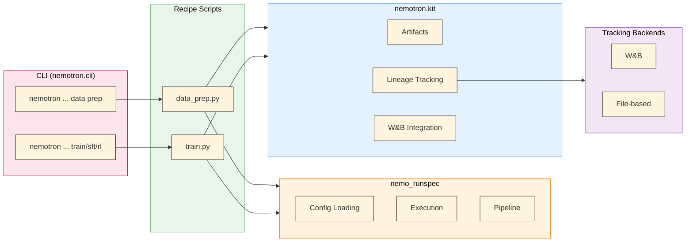

# Nemotron Kit

The `nemotron.kit` module provides domain-specific building blocks for Nemotron training recipes: artifact types, lineage tracking, and W&B integration.

> **Focused by Design**: Kit handles artifacts and tracking -- not CLI, configuration, or execution. Those responsibilities live in the [`nemo_runspec`](../../src/nemo_runspec/README.md) package. All heavy-lifting training is done by the [NVIDIA AI Stack](./nvidia-stack.md): [Megatron-Core](https://github.com/NVIDIA/Megatron-LM) for distributed training primitives, [Megatron-Bridge](https://github.com/NVIDIA/Megatron-Bridge) for model training, and [NeMo-RL](https://github.com/NVIDIA/NeMo-RL) for reinforcement learning.

## Overview

Kit handles three core responsibilities:

| Component | Purpose |
|-----------|---------|
| **[Artifacts](../nemo_runspec/artifacts.md)** | Path-centric data and model versioning with typed metadata |
| **[Lineage Tracking](../nemo_runspec/artifacts.md)** | Experiment tracking and artifact provenance via [W&B](./wandb.md) or file-based backends |
| **[W&B Integration](./wandb.md)** | Automatic W&B initialization, credential handling, and tag management |

For CLI infrastructure, config loading, execution, and packaging, see [`nemo_runspec`](../../src/nemo_runspec/README.md).

## Architecture



## Quick Example

```python
from nemotron.kit import PretrainBlendsArtifact, ModelArtifact
from pathlib import Path

# Load data artifact
data = PretrainBlendsArtifact.load(Path("/output/data"))
print(f"Training on {data.total_tokens:,} tokens")

# ... training code ...

# Save model artifact with lineage
model = ModelArtifact(path=Path("/output/checkpoint"), step=10000, loss=2.5)
model.save(name="ModelArtifact-pretrain")
```

## Key Concepts

### Artifacts

Artifacts are path-centric objects with typed metadata. The core field is always `path` -- the filesystem location of the data. See [Artifact Lineage](../nemo_runspec/artifacts.md) for details.

```python
from nemotron.kit import PretrainBlendsArtifact

# Load from semantic URI
artifact = PretrainBlendsArtifact.from_uri("art://PretrainBlendsArtifact:latest")
print(f"Path: {artifact.path}")
print(f"Tokens: {artifact.total_tokens:,}")
```

### Lineage Tracking

Kit tracks artifact lineage through pluggable backends. The `WandbTracker` logs to W&B; the `FileTracker` writes to local filesystem. See [W&B Integration](./wandb.md) for credential handling and [Artifact Lineage](../nemo_runspec/artifacts.md) for the lineage graph.

```python
from nemotron.kit import set_lineage_tracker, WandbTracker

# Use W&B for tracking
set_lineage_tracker(WandbTracker())
```

### W&B Integration

```python
from nemotron.kit import WandbConfig, init_wandb_if_configured, add_wandb_tags

# Initialize W&B from config
wandb_cfg = WandbConfig(entity="nvidia", project="nemotron")
init_wandb_if_configured(wandb_cfg)

# Add tags to the run
add_wandb_tags(["pretrain", "nano3"])
```

## Module Structure

```
src/nemotron/kit/
├── __init__.py          # Public API exports + kit.init()
├── artifact.py          # Artifact base class and all artifact types
├── artifacts/           # Artifact type definitions
├── trackers.py          # LineageTracker, WandbTracker, FileTracker, NoOpTracker
├── wandb.py             # WandbConfig, init_wandb_if_configured, add_wandb_tags
├── track.py             # TrackConfig for artifact resolution
├── train_script.py      # Training script utilities (parse_config_and_overrides)
├── filesystem.py        # fsspec helpers for art:// URIs
├── recipe_loader.py     # Recipe loading utilities
└── megatron_stub.py     # Megatron stub for testing
```

## API Reference

### Artifacts

| Export | Description |
|--------|-------------|
| `Artifact` | Base artifact class |
| `PretrainBlendsArtifact` | Pretrain data with train/valid/test splits |
| `PretrainDataArtifact` | Raw pretrain data |
| `SFTDataArtifact` | Packed SFT sequences |
| `SplitJsonlDataArtifact` | RL JSONL data |
| `DataBlendsArtifact` | Generic data blends |
| `ModelArtifact` | Model checkpoints |
| `TrackingInfo` | Tracking metadata for artifacts |

### Tracking

| Export | Description |
|--------|-------------|
| `LineageTracker` | Abstract base for lineage tracking |
| `WandbTracker` | W&B-backed lineage tracker |
| `FileTracker` | File-based lineage tracker |
| `NoOpTracker` | No-op tracker (for testing) |
| `set_lineage_tracker()` | Set the global lineage tracker |
| `get_lineage_tracker()` | Get the current lineage tracker |
| `to_wandb_uri()` | Convert artifact to W&B URI |
| `tokenizer_to_uri()` | Convert tokenizer to URI |

### W&B

| Export | Description |
|--------|-------------|
| `WandbConfig` | W&B configuration dataclass |
| `init_wandb_if_configured()` | Conditional W&B initialization |
| `add_wandb_tags()` | Add tags to W&B runs |

### Kit Initialization

| Export | Description |
|--------|-------------|
| `init()` | Initialize kit with storage backend (fsspec or wandb) |
| `get_config()` | Get current kit configuration |
| `is_initialized()` | Check if kit has been initialized |

## Further Reading

- [`nemo_runspec` Package](../../src/nemo_runspec/README.md) -- CLI toolkit, config loading, execution, packaging
- [NVIDIA AI Stack](./nvidia-stack.md) -- Megatron-Core, Megatron-Bridge, NeMo-RL
- [OmegaConf Configuration](./omegaconf.md) -- Artifact interpolations and unified W&B logging
- [Artifact Lineage](../nemo_runspec/artifacts.md) -- Artifact versioning and W&B lineage
- [W&B Integration](./wandb.md) -- Automatic credential handling
- [Execution through NeMo-Run](./nemo-run.md) -- Execution profiles and packagers
- [CLI Framework](./cli.md) -- Building recipe CLIs
- [Data Preparation](./data-prep.md) -- Data prep module
