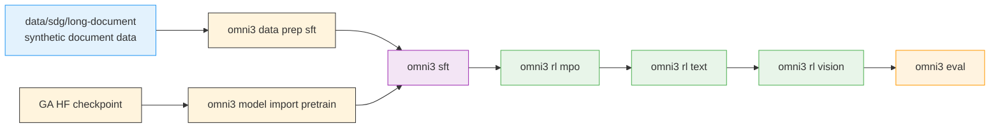

# Nemotron 3 Omni Training Recipe

Multimodal post-training pipeline for Nemotron 3 Omni. Unlike Nano3 and Super3, Omni starts from a GA checkpoint and owns its stage-local container builds.

## Current Limitations

The recipe structure, CLI, Dockerfiles, and configs are all in place, but some pieces still depend on upstream work or internal-only data:

- **Vision RL training is stubbed.** `stage3_vision_rl/train.py` raises `NotImplementedError` and declares a degenerate resource footprint (`nodes=1, gpus_per_node=0`) so a stray submission doesn't allocate GPUs. `omni3 pipe` auto-detects this and skips stage 4 by default; pass `pipe.force_vision=true` once the upstream launcher lands. Data prep for MMPR-Tiny is fully functional.
- **RL container Dockerfile is a placeholder.** `stage1_rl/Dockerfile` has the correct ARGs (vLLM wheel pin + submodule ref) and metadata LABELs, but the body is marked `TODO(release): replace body with forked content from nemo-rl-omni/docker/Dockerfile release target`. `omni3 build rl` will fail until this lands.
- **SFT default uses CORD-v2 (open); Valor32k is an opt-in.** `default.yaml` pulls [CORD-v2](https://huggingface.co/datasets/naver-clova-ix/cord-v2) from HuggingFace via the `vlm-hf` loader — no local shard building required. `-c valor32k` switches to the full audio-visual-language flow, but requires internal access to a prepared Valor32k-AVQA Energon dataset (the raw-shard builder is internal-only at release). `data_prep.py` validates the Energon path or emits a manifest for HF — it does not assemble shards.
- **Long-document SDG pipeline is a scaffold.** `src/nemotron/recipes/data/sdg/long-document/` has 9 numbered scripts with their argparse surfaces and a thorough README, but the script bodies raise `NotImplementedError` — port bodies from upstream at release time. See `designs/long-document-sdg-pipeline.md`.
- **Eval defaults are text-only.** `stage2_eval/config/default.yaml` inherits nano3's language-benchmark task list to track language-capability regression. Multimodal sanity checks (image / video / audio / audio-video-text) run via `nemotron omni3 model eval` — see [SFT guide §Model lifecycle](./sft.md).
- **Upstream branches may still be private at merge time.** The Dockerfiles reference `github.com/NVIDIA/Megatron-Bridge @ dev/nomni` and `github.com/NVIDIA/NeMo-RL @ nano-v3-omni-recipes`. These URLs come live on Omni release day; until then, `omni3 build sft` / `omni3 build rl` will fail at the `ADD <git-url>` step.

The linked stage guides (SFT / RL / Evaluate) call out each stage's specific limitations.

## Quick Start

### Prerequisites

- **Slurm cluster** with GPU nodes for SFT, RL, and evaluation — see [Execution through NeMo-Run](../../nemo_runspec/nemo-run.md)
- **[Weights & Biases](../wandb.md)** for experiment tracking and [artifact lineage](../artifacts.md)
- **Build-capable execution profile** for `nemotron omni3 build <stage>` jobs
- **GA checkpoint**: [nvidia/Nemotron-3-Nano-Omni-30B-A3B-Reasoning](https://huggingface.co/nvidia/Nemotron-3-Nano-Omni-30B-A3B-Reasoning)

### Installation

```bash
git clone https://github.com/NVIDIA/nemotron
cd nemotron
uv sync
```

### Configuration

Create an `env.toml` profile with both training and build settings:

```toml
[wandb]
project = "nemotron"
entity = "YOUR-TEAM"

[YOUR-CLUSTER]
executor = "slurm"
account = "YOUR-ACCOUNT"
partition = "batch"
run_partition = "interactive"
build_partition = "cpu"
build_time = "02:00:00"
nodes = 1
ntasks_per_node = 8
gpus_per_node = 8
mounts = ["/lustre:/lustre"]
```

### Run the Pipeline

<div class="termy">

```console
// Stage 0: SFT
$ uv run nemotron omni3 build sft --run YOUR-CLUSTER
$ uv run nemotron omni3 data prep sft --run YOUR-CLUSTER
$ uv run nemotron omni3 model import pretrain --run YOUR-CLUSTER \
    --hf-model nvidia/Nemotron-3-Nano-Omni-30B-A3B-Reasoning \
    --megatron-path /checkpoints/nemotron_omni
$ uv run nemotron omni3 sft --run YOUR-CLUSTER

// Stage 1.1: RL MPO
$ uv run nemotron omni3 build rl --run YOUR-CLUSTER
$ uv run nemotron omni3 data prep rl -c mpo --run YOUR-CLUSTER
$ uv run nemotron omni3 rl mpo --run YOUR-CLUSTER

// Stage 1.2: RL text
$ uv run nemotron omni3 data prep rl -c text --run YOUR-CLUSTER
$ uv run nemotron omni3 rl text --run YOUR-CLUSTER

// Stage 1.3: RL vision
$ uv run nemotron omni3 data prep rl -c vision --run YOUR-CLUSTER
$ uv run nemotron omni3 rl vision --run YOUR-CLUSTER

// Stage 2: Evaluation
$ uv run nemotron omni3 eval --run YOUR-CLUSTER
```

</div>

> **Note**: `omni3 build` submits a short CPU-only container build job through [NeMo-Run](../../nemo_runspec/nemo-run.md). SFT, RL, and eval then consume the resulting OCI archives.

## Resources

- **Model checkpoint**: [nvidia/Nemotron-3-Nano-Omni-30B-A3B-Reasoning](https://huggingface.co/nvidia/Nemotron-3-Nano-Omni-30B-A3B-Reasoning)
- **SFT recipe**: [Stage 0: SFT](./sft.md)
- **RL recipe**: [Stage 1: RL](./rl.md)
- **Eval recipe**: [Stage 2: Evaluation](./evaluate.md)

## Training Pipeline

| Stage | Name | Purpose | Guide |
|-------|------|---------|-------|
| 0 | [SFT](./sft.md) | Fine-tune the GA checkpoint on Valor32k and related multimodal variants | [sft.md](./sft.md) |
| 1 | [RL](./rl.md) | Multi-stage Omni RL: MPO → text RL → vision RL | [rl.md](./rl.md) |
| 2 | [Evaluation](./evaluate.md) | Benchmark the final checkpoint with NeMo Evaluator | [evaluate.md](./evaluate.md) |

## Pipeline Overview



The upstream synthetic-data pipeline lives outside the family tree under `src/nemotron/recipes/data/sdg/long-document/`. That keeps the recipe split explicit:

- **`src/nemotron/recipes/data/curation/`** — filter, dedup, and curate existing corpora (for example [Nemotron-CC](../nemotron-cc.md))
- **`src/nemotron/recipes/data/sdg/`** — generate new datasets, including the long-document SDG pipeline consumed by Omni SFT
- **`src/nemotron/recipes/omni3/`** — family-specific training, RL, and evaluation stages

## Stage Summaries

### Stage 0: SFT

Omni SFT owns its own `Dockerfile`, `build.py`, `data_prep.py`, and `train.py`. The stage ports the Valor32k flow plus LoRA/PEFT variants for image-text and audio-text tuning.

→ [SFT Guide](./sft.md)

### Stage 1: RL

The RL stack uses one shared NeMo-RL container and three sub-stages:

1. **MPO** for multimodal preference optimization
2. **Text RL** for text-only continuation of alignment
3. **Vision RL** for the final multimodal stage (with data prep ready and training launcher pending upstream)

→ [RL Guide](./rl.md)

### Stage 2: Evaluation

Evaluation reuses the Omni SFT container to serve the Megatron checkpoint and hands the compiled config to `nemo-evaluator-launcher`.

→ [Evaluation Guide](./evaluate.md)

## Execution Options

All Omni commands support [NeMo-Run](../../nemo_runspec/nemo-run.md) execution modes:

| Option | Behavior | Use Case |
|--------|----------|----------|
| `--run <profile>` | Attached—submits job and streams logs | Interactive development |
| `--batch <profile>` | Detached—submits and exits immediately | Long-running jobs |
| `--dry-run` | Preview resolved config or build plan | Validation |

## CLI Reference

<div class="termy">

```console
$ uv run nemotron omni3 --help
Usage: nemotron omni3 [OPTIONS] COMMAND [ARGS]...

 Omni3 training recipe

╭─ Infrastructure ─────────────────────────────────────────────────────────╮
│ build      Build an Omni3 stage container via podman on the cluster.     │
╰───────────────────────────────────────────────────────────────────────────╯
╭─ Commands ────────────────────────────────────────────────────────────────╮
│ data       Data preparation commands                                      │
│ model      Model import/export/eval commands                              │
│ rl         Reinforcement learning sub-stages                              │
╰───────────────────────────────────────────────────────────────────────────╯
╭─ Training Stages ─────────────────────────────────────────────────────────╮
│ sft        Run omni3 supervised fine-tuning.                              │
╰───────────────────────────────────────────────────────────────────────────╯
╭─ Evaluation ──────────────────────────────────────────────────────────────╮
│ eval       Run evaluation with NeMo-Evaluator (stage2).                   │
╰───────────────────────────────────────────────────────────────────────────╯
```

</div>

## Further Reading

- [Stage 0: SFT](./sft.md)
- [Stage 1: RL](./rl.md)
- [Stage 2: Evaluation](./evaluate.md)
- [Artifact Lineage](../artifacts.md)
- [Execution through NeMo-Run](../../nemo_runspec/nemo-run.md)
- [W&B Integration](../wandb.md)

```{toctree}
:hidden:

sft.md
rl.md
evaluate.md
```
