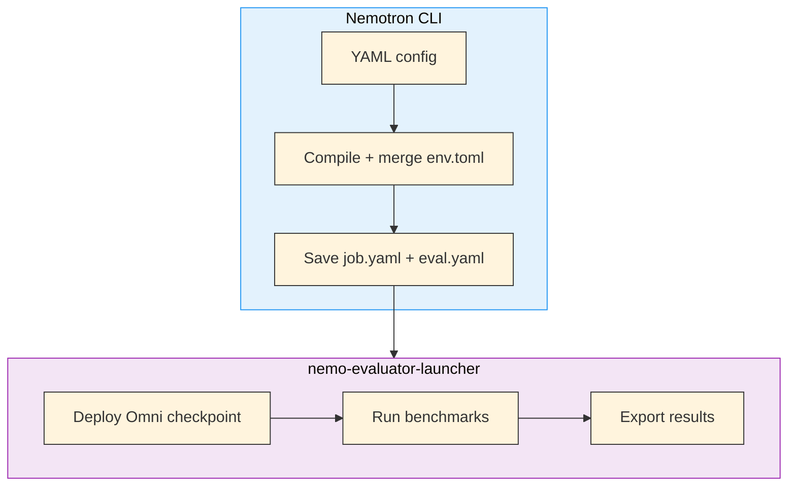

# Stage 2: Evaluation

Evaluate trained Nemotron Omni checkpoints against standard benchmarks using [NeMo Evaluator](https://github.com/NVIDIA-NeMo/Evaluator).

> **Different execution pattern**: Like the Nano3 and Super3 evaluators, Omni eval does not submit a recipe script. The CLI resolves config, env profile values, and artifacts, then passes the compiled config directly to `nemo-evaluator-launcher`.

---

## How Evaluation Works

The eval command resolves model artifacts from lineage and deploys the checkpoint with NeMo Framework's Ray-based in-framework serving.



### Config Compilation Pipeline

Before the launcher sees the config, the CLI:

1. loads the OmegaConf YAML with Hydra defaults
2. merges env profile values and dotlist overrides
3. injects W&B environment mappings when needed
4. auto-squashes the container for Slurm execution
5. strips the `run` section from the final launcher config
6. resolves `${art:model,path}` through artifact lineage
7. calls `run_eval()` from `nemo-evaluator-launcher`

Two files are written for provenance:

- `job.yaml` — the full Nemotron-side config
- `eval.yaml` — the launcher-facing compiled config

## Deployment

The default config reuses the Omni SFT container because it contains the required Megatron-Bridge fork:

```yaml
run:
  model: omni3-vision-rl-model:latest
  env:
    container: oci-archive:///home/${oc.env:USER}/.cache/nemotron/containers/omni3-sft.tar

deployment:
  type: generic
  checkpoint_path: ${art:model,path}
  command: >-
    bash -c 'python /opt/Export-Deploy/scripts/deploy/nlp/deploy_ray_inframework.py
    --megatron_checkpoint /checkpoint/
    --num_gpus 8
    --tensor_model_parallel_size 4
    --expert_model_parallel_size 4
    --port 1235'
```

### Parallelism Settings

Omni evaluation matches the default SFT parallelism:

| Setting | Value |
|---------|-------|
| `num_gpus` | 8 |
| `tensor_model_parallel_size` | 4 |
| `expert_model_parallel_size` | 4 |
| `port` | 1235 |

## Evaluation Tasks

The default task list mirrors the existing family evaluators:

| Task | Type |
|------|------|
| `adlr_mmlu` | Text generation |
| `adlr_arc_challenge_llama_25_shot` | Log probability |
| `adlr_winogrande_5_shot` | Log probability |
| `hellaswag` | Log probability |
| `openbookqa` | Log probability |

To discover additional tasks:

```bash
nemo-evaluator-launcher ls tasks
```

---

## Recipe Execution

### Quick Start

<div class="termy">

```console
// Evaluate the latest final RL checkpoint
$ uv run nemotron omni3 eval --run YOUR-CLUSTER

// Evaluate an earlier stage instead
$ uv run nemotron omni3 eval --run YOUR-CLUSTER run.model=omni3-sft-model:latest

// Filter to a subset of tasks
$ uv run nemotron omni3 eval --run YOUR-CLUSTER -t adlr_mmlu -t hellaswag

// Preview the resolved config
$ uv run nemotron omni3 eval --dry-run
```

</div>

### Prerequisites

- `nemo-evaluator-launcher` available (`pip install "nemotron[evaluator]"`)
- the Omni SFT container archive built locally or via `nemotron omni3 build sft`
- a model artifact or checkpoint path to evaluate

### Configuration

| File | Purpose |
|------|---------|
| `src/nemotron/recipes/omni3/stage2_eval/config/default.yaml` | Default NeMo Evaluator config for Omni |

The config is split into:

| Section | Purpose |
|---------|---------|
| `run` | env profile injection and artifact references |
| `execution` | where evaluation runs |
| `deployment` | how the checkpoint is served |
| `evaluation` | tasks and launcher parameters |
| `export` | result destinations |

### Artifact Resolution

The default config evaluates the final RL output:

```yaml
run:
  model: omni3-vision-rl-model:latest
```

Override it on the command line:

```bash
uv run nemotron omni3 eval --run YOUR-CLUSTER run.model=omni3-sft-model:latest
uv run nemotron omni3 eval --run YOUR-CLUSTER deployment.checkpoint_path=/path/to/checkpoint
```

### Task Filtering

Use repeated `-t` flags:

```bash
uv run nemotron omni3 eval --run YOUR-CLUSTER -t adlr_mmlu -t openbookqa
```

## Infrastructure

This stage uses:

| Component | Role | Documentation |
|-----------|------|---------------|
| [NeMo Evaluator](https://github.com/NVIDIA-NeMo/Evaluator) | Benchmark launcher and evaluation framework | [GitHub](https://github.com/NVIDIA-NeMo/Evaluator) |
| [NeMo Framework](../nvidia-stack.md) | Ray-based in-framework serving | [Docs](https://docs.nvidia.com/nemo/) |

### Container

```text
oci-archive:///home/${oc.env:USER}/.cache/nemotron/containers/omni3-sft.tar
```

## Troubleshooting

| Problem | Solution |
|---------|----------|
| `nemo-evaluator-launcher` not found | Install `pip install "nemotron[evaluator]"` |
| Eval container missing | Run `uv run nemotron omni3 build sft --run YOUR-CLUSTER` first |
| Deployment fails | Confirm TP=4 / EP=4 matches the intended Omni checkpoint layout |
| Artifact resolution fails | Override `deployment.checkpoint_path=/explicit/path` |

## Reference

- **Recipe source:** `src/nemotron/recipes/omni3/stage2_eval/`
- [Back to Overview](./README.md)
- [Execution through NeMo-Run](../../nemo_runspec/nemo-run.md)
