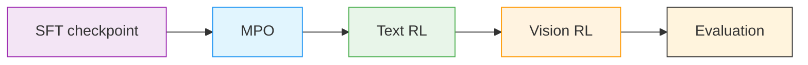

# Stage 1: Reinforcement Learning (RL)

Omni RL continues the multimodal post-training pipeline with [NeMo-RL](../nvidia-stack.md#nemo-rl) using one shared container and three explicit sub-stages.

> **Shared container**: All RL sub-stages use the `src/nemotron/recipes/omni3/stage1_rl/` Dockerfile and `build.py`, which produce `omni3-rl.tar`.

---

## RL Pipeline Overview



The shared RL tree contains:

| Path | Purpose |
|------|---------|
| `stage1_rl/Dockerfile` | Shared NeMo-RL Omni image |
| `stage1_rl/build.py` | Exports `omni3-rl.tar` |
| `stage1_rl/data_prep.py` | Dispatcher for `-c mpo|text|vision` |
| `stage1_rl/stage1_mpo/` | MPO launcher, config, and data prep |
| `stage1_rl/stage2_text_rl/` | Text RL launcher, config, and data prep |
| `stage1_rl/stage3_vision_rl/` | Vision RL launcher stub, config, and data prep |

## Sub-Stages

| Sub-stage | Command | Default input model | Data prep config | Notes |
|-----------|---------|---------------------|------------------|-------|
| MPO | `nemotron omni3 rl mpo` | `omni3-sft-model:latest` | `-c mpo` | Public MMPR preference optimization |
| Text RL | `nemotron omni3 rl text` | `omni3-rl-mpo-model:latest` | `-c text` | Continues alignment on text-only RL data |
| Vision RL | `nemotron omni3 rl vision` | `omni3-rl-text-model:latest` | `-c vision` | Data prep is wired; training launcher is still upstream-stubbed |

## Build the Shared RL Container

```bash
uv run nemotron omni3 build rl --run YOUR-CLUSTER
```

Canonical archive path:

```text
oci-archive:///home/${oc.env:USER}/.cache/nemotron/containers/omni3-rl.tar
```

For local iteration:

```bash
cd src/nemotron/recipes/omni3/stage1_rl
docker build -t nemotron/omni3-rl:latest -f Dockerfile .
# or
podman build -t nemotron/omni3-rl:latest -f Dockerfile .
```

## Quick Start

<div class="termy">

```console
// 1. Build the shared RL container
$ uv run nemotron omni3 build rl --run YOUR-CLUSTER

// 2. MPO
$ uv run nemotron omni3 data prep rl -c mpo --run YOUR-CLUSTER
$ uv run nemotron omni3 rl mpo --run YOUR-CLUSTER

// 3. Text RL
$ uv run nemotron omni3 data prep rl -c text --run YOUR-CLUSTER
$ uv run nemotron omni3 rl text --run YOUR-CLUSTER

// 4. Vision RL
$ uv run nemotron omni3 data prep rl -c vision --run YOUR-CLUSTER
$ uv run nemotron omni3 rl vision --run YOUR-CLUSTER
```

</div>

## Data Preparation

Use one CLI command with config variants:

```bash
uv run nemotron omni3 data prep rl -c mpo --run YOUR-CLUSTER
uv run nemotron omni3 data prep rl -c text --run YOUR-CLUSTER
uv run nemotron omni3 data prep rl -c vision --run YOUR-CLUSTER
```

The configs under `stage1_rl/config/data_prep/` map to:

| Config | Output |
|--------|--------|
| `mpo.yaml` | MMPR MPO metadata |
| `text.yaml` | Train/validation JSONL artifacts for text RL |
| `vision.yaml` | MMPR-Tiny cache for the vision stage |

## Stage-Specific Notes

### MPO

MPO uses the SFT checkpoint as input and launches `bash scripts/omni/step_1_nanov3_mpo.sh` inside `/opt/nemo-rl-omni`.

### Text RL

Text RL consumes the MPO checkpoint and exposes the key launcher overrides described in the design doc:

- `CONTEXT_PARALLEL_SIZE`
- `TRAIN_GLOBAL_BATCH_SIZE`
- `NUM_PROMPTS_PER_STEP`
- `NUM_GENERATIONS_PER_PROMPT`
- `WANDB_PROJECT`

### Vision RL

The vision stage is intentionally honest about its current status:

- data prep is implemented
- the command exists and resolves the expected config
- `train.py` raises `NotImplementedError` until the upstream launcher lands

That keeps the pipeline wiring visible without pretending the missing upstream piece is available yet.

## Infrastructure

This stage uses:

| Component | Role | Documentation |
|-----------|------|---------------|
| [NeMo-RL](../nvidia-stack.md#nemo-rl) | RL trainers and launch scripts | [Docs](https://docs.nvidia.com/nemo/rl/latest/) |
| [Ray](https://ray.io/) | Distributed execution for RL and data prep | [Docs](https://docs.ray.io/) |
| [Megatron-Core](../nvidia-stack.md#megatron-core) | Distributed training backend | [GitHub](https://github.com/NVIDIA/Megatron-LM) |

## Next Steps

After RL completes, proceed to [Stage 2: Evaluation](./evaluate.md).

## Reference

- **Recipe source:** `src/nemotron/recipes/omni3/stage1_rl/`
- [Back to Overview](./README.md)
- [Execution through NeMo-Run](../../nemo_runspec/nemo-run.md)
