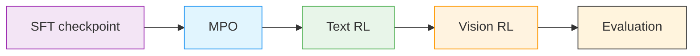

# Stage 1: Reinforcement Learning (RL)

Omni RL continues the multimodal post-training pipeline with [NeMo-RL](../nvidia-stack.md#nemo-rl) using one shared container and three explicit sub-stages. RL aligns the model's perception-sub-agent surface — preference quality on visual reasoning, factual grounding for downstream agent calls, and ASR fidelity. The full upstream alignment corpus runs **~2.3M rollouts across 20 RL datasets / 25 environments** covering visual grounding, charts, vision-critical STEM, video understanding, and ASR (per the [release blog](https://developer.nvidia.com/blog/nvidia-nemotron-3-nano-omni-powers-multimodal-agent-reasoning-in-a-single-efficient-open-model/)). This recipe folder surfaces the **3 of 25** environments that have public data: MMPR (preference), the Nano RL training blend (text), and MMPR-Tiny (vision); the remaining 22 environments use internal or third-party data and aren't included.

> **Shared container**: All RL sub-stages use `src/nemotron/recipes/omni3/stage1_rl/Dockerfile`. The `nemotron omni3 build rl` dispatcher turns it into `omni3-rl.sqsh` under your `build_cache_dir`.

> **Current notes** (also summarized in the [family README](./README.md#current-limitations)):
> - **All three sub-stages have working launchers** that mirror the upstream NeMo-RL `nano-v3-omni` flow (`scripts/nanov3_mpo.sh`, `scripts/nanov3_text_rl.sh`, `scripts/nanov3_vision_rl.sh`).
> - **`stage1_rl/Dockerfile` mirrors NeMo-RL's release Dockerfile** — clones `NVIDIA/NeMo-RL @ nano-v3-omni` recursively (carrying the [omni vllm fork](https://github.com/aroshanghias-nvd/vllm) as a `3rdparty/vllm` submodule) and runs the same `BUILD_CUSTOM_VLLM=1` + `uv sync` flow as the upstream `docker/Dockerfile`. `omni3 build rl` produces `omni3-rl.sqsh`.
> - **`nano-v3-omni` is the active release branch for Nemotron 3 Omni**; bump to a versioned tag (or `main`) once these changes merge upstream.

---

## RL Pipeline Overview



The shared RL tree contains:

| Path | Purpose |
|------|---------|
| `stage1_rl/Dockerfile` | Shared NeMo-RL Omni image |
| `stage1_rl/data_prep.py` | Dispatcher for `-c mpo` / `-c text` / `-c vision` |
| `stage1_rl/stage1_mpo/` | MPO launcher, config, and data prep |
| `stage1_rl/stage2_text_rl/` | Text RL launcher, config, and data prep |
| `stage1_rl/stage3_vision_rl/` | Vision RL launcher stub, config, and data prep |

## Sub-Stages

| Sub-stage | Command | Default input model | Data prep config | Notes |
|-----------|---------|---------------------|------------------|-------|
| MPO | `nemotron omni3 rl mpo` | `omni3-sft-model:latest` | `-c mpo` | Public MMPR preference optimization |
| Text RL | `nemotron omni3 rl text` | `omni3-rl-mpo-model:latest` | `-c text` | Continues alignment on text-only RL data |
| Vision RL | `nemotron omni3 rl vision` | `omni3-rl-text-model:latest` | `-c vision` | Data prep is wired; training launcher is still upstream-stubbed |

## Build the Shared RL Container

```bash
uv run nemotron omni3 build rl --run YOUR-CLUSTER
```

Canonical archive path:

```text
/home/${oc.env:USER}/.cache/nemotron/containers/omni3-rl.sqsh
```

For local iteration:

```bash
cd src/nemotron/recipes/omni3/stage1_rl
docker build -t nemotron/omni3-rl:latest -f Dockerfile .
# or
podman build -t nemotron/omni3-rl:latest -f Dockerfile .
```

## Quick Start

<div class="termy">

```console
// 1. Build the shared RL container
$ uv run nemotron omni3 build rl --run YOUR-CLUSTER

// 2. MPO
$ uv run nemotron omni3 data prep rl -c mpo --run YOUR-CLUSTER
$ uv run nemotron omni3 rl mpo --run YOUR-CLUSTER

// 3. Text RL
$ uv run nemotron omni3 data prep rl -c text --run YOUR-CLUSTER
$ uv run nemotron omni3 rl text --run YOUR-CLUSTER

// 4. Vision RL
$ uv run nemotron omni3 data prep rl -c vision --run YOUR-CLUSTER
$ uv run nemotron omni3 rl vision --run YOUR-CLUSTER
```

</div>

## Data Preparation

Use one CLI command with config variants:

```bash
uv run nemotron omni3 data prep rl -c mpo --run YOUR-CLUSTER
uv run nemotron omni3 data prep rl -c text --run YOUR-CLUSTER
uv run nemotron omni3 data prep rl -c vision --run YOUR-CLUSTER
```

The configs under `stage1_rl/config/data_prep/` map to:

| Config | Source | Output |
|--------|--------|--------|
| `mpo.yaml` | `hf://OpenGVLab/MMPR` (auto-downloads via `source_uri`) | `MMPR-v1.2/` cache + rewritten `meta_public.json` |
| `text.yaml` | `hf://nvidia/Nemotron-3-Nano-RL-Training-Blend` (resolved through Nano3's HF placeholder pipeline) | per-blend train/val JSONL with `responses_create_params` schema |
| `vision.yaml` | `hf://OpenGVLab/MMPR-Tiny` (auto-downloads via `source_uri`) | `MMPR-Tiny/` cache + parquet + preview |

When `input_dir` is empty/incomplete and `source_uri` is set, the
dispatcher snapshot-downloads the HF repo before the prep stage runs.
Pre-stage data manually (or set `OMNI3_MMPR_PUBLIC_RAW` /
`OMNI3_MMPR_TINY_RAW`) to skip the download.

> **See [data-prep.md](rl/data-prep.md)** for the full data-prep guide:
> auto-download semantics, helper scripts under `scripts/`, output
> layouts, artifact registration, and parallel-submission notes.

## Stage-Specific Notes

### MPO

MPO uses the SFT checkpoint as input and launches `bash scripts/omni/step_1_nanov3_mpo.sh` inside `/opt/nemo-rl-omni`.

### Text RL

Text RL consumes the MPO checkpoint and exposes the key launcher overrides described in the design doc:

- `CONTEXT_PARALLEL_SIZE`
- `TRAIN_GLOBAL_BATCH_SIZE`
- `NUM_PROMPTS_PER_STEP`
- `NUM_GENERATIONS_PER_PROMPT`
- `WANDB_PROJECT`

### Vision RL

The vision stage is intentionally honest about its current status:

- data prep is implemented
- the command exists and resolves the expected config
- `train.py` raises `NotImplementedError` until the upstream launcher lands

That keeps the pipeline wiring visible without pretending the missing upstream piece is available yet.

## Infrastructure

This stage uses:

| Component | Role | Documentation |
|-----------|------|---------------|
| [NeMo-RL](../nvidia-stack.md#nemo-rl) | RL trainers and launch scripts | [Docs](https://docs.nvidia.com/nemo/rl/latest/) |
| [Ray](https://ray.io/) | Distributed execution for RL and data prep | [Docs](https://docs.ray.io/) |
| [Megatron-Core](../nvidia-stack.md#megatron-core) | Distributed training backend | [GitHub](https://github.com/NVIDIA/Megatron-LM) |

## Next Steps

After RL completes, run benchmarks via `nemotron omni3 model eval` (a dedicated `nemotron omni3 eval` stage is on the roadmap).

## Upstream

This stage is the cookbook view of the upstream NeMo-RL omni RL flow.
For the canonical end-to-end walkthrough (build, data prep,
MPO/text/vision launchers, `.env` setup), see the **[NeMo-RL
`nano-v3-omni` Nemotron 3 Nano Omni guide](https://github.com/NVIDIA-NeMo/RL/blob/nano-v3-omni/docs/guides/nemotron-3-nano-omni.md)**.
The Dockerfile in this stage pins `NVIDIA/NeMo-RL @ nano-v3-omni`,
which carries the omni vllm fork at
[`aroshanghias-nvd/vllm` `nano-v3-vl`](https://github.com/aroshanghias-nvd/vllm/tree/nano-v3-vl)
as a `3rdparty/vllm` submodule. Bump the NeMo-RL branch when it merges
to a versioned tag.

## Reference

- **Recipe source:** [`src/nemotron/recipes/omni3/stage1_rl/`](../../../src/nemotron/recipes/omni3/stage1_rl/) ([README](../../../src/nemotron/recipes/omni3/stage1_rl/README.md))
- **Upstream**: [NeMo-RL `nano-v3-omni` guide](https://github.com/NVIDIA-NeMo/RL/blob/nano-v3-omni/docs/guides/nemotron-3-nano-omni.md)
- [RL data prep deep-dive](./rl/data-prep.md)
- [Architecture deep-dive](./architecture.md)
- [Inference & deployment](./inference.md)
- [Back to Overview](./README.md)
- [Execution through NeMo-Run](../../nemo_runspec/nemo-run.md)
