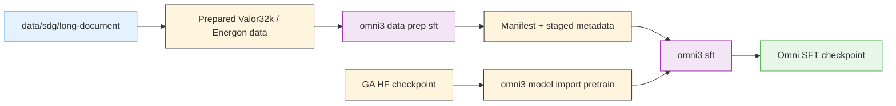

# Stage 0: Supervised Fine-Tuning (SFT)

Omni starts from the GA checkpoint and fine-tunes it with the Valor32k multimodal recipe family using [Megatron-Bridge](../nvidia-stack.md#megatron-bridge).

> **Container-first stage**: Omni does not ship with a pre-baked image. This stage owns the `Dockerfile` and `build.py` that produce `omni3-sft.tar`, and all later SFT/eval commands reuse that archive.

> **Defaults** — the shipped `default.yaml` uses [CORD-v2](https://huggingface.co/datasets/naver-clova-ix/cord-v2) from HuggingFace via Megatron-Bridge's `vlm-hf` loader, so `nemotron omni3 sft --run <profile>` works out of the box with no internal data access. `-c valor32k` switches to the full audio-visual-language Energon flow but requires the internal Valor32k-AVQA dataset (see [Config Variants](#config-variants)).

> **Current limitations** (also summarized in the [family README](./README.md#current-limitations)):
> - **Open-dataset default trains projector only.** CORD-v2 plus `freeze_language_model: true` fits on a single 8-GPU node (per QA guide §5.2.2). For full-model SFT, switch to `-c image_text_peft` (LoRA on CORD-v2) or prepare your own Energon dataset and point `dataset.path` at it.
> - `nemotron omni3 data prep sft` with `-c valor32k` validates a **prepared** Energon dataset; the raw-shard builder is internal-only. With the default (HF) flow the command is a no-op manifest writer — the training container pulls from the Hub on demand.
> - The `omni3-sft` Dockerfile's `ADD https://github.com/NVIDIA/Megatron-Bridge.git#dev/nomni` resolves only once the upstream branch is public (Omni release day). Before then `omni3 build sft` fails at that `ADD` step.

---

## Stage Overview

The stage directory is `src/nemotron/recipes/omni3/stage0_sft/` and contains:

| File | Purpose |
|------|---------|
| `Dockerfile` | Builds the pinned Megatron-Bridge `dev/nomni` environment |
| `build.py` | Saves the image as `oci-archive:///.../omni3-sft.tar` |
| `data_prep.py` | Validates or stages a prepared Valor32k Energon dataset |
| `train.py` | Runs `scripts/training/run_recipe.py` with the selected recipe |
| `config/*.yaml` | Full SFT, PEFT, audio-text, and tiny variants |

## Container Build

Build the SFT container on-cluster:

```bash
uv run nemotron omni3 build sft --run YOUR-CLUSTER
```

The canonical archive path is:

```text
oci-archive:///home/${oc.env:USER}/.cache/nemotron/containers/omni3-sft.tar
```

For local iteration, you can build the same stage directly from the Dockerfile:

```bash
cd src/nemotron/recipes/omni3/stage0_sft
docker build -t nemotron/omni3-sft:latest -f Dockerfile .
# or
podman build -t nemotron/omni3-sft:latest -f Dockerfile .
```

## Valor32k and SDG Data Flow



The public CLI does not build Valor32k shards from scratch yet. Instead, `data_prep.py` gives the recipe a concrete staging hook by:

- validating `dataset_path`
- optionally running a site-local `builder_command`
- writing `manifest.json` under `metadata_dir`
- optionally refreshing a convenience symlink with `link_path`

Run it with:

```bash
uv run nemotron omni3 data prep sft --run YOUR-CLUSTER
```

## Quick Start

<div class="termy">

```console
// 1. Build the container
$ uv run nemotron omni3 build sft --run YOUR-CLUSTER

// 2. Stage or validate the Valor32k Energon dataset
$ uv run nemotron omni3 data prep sft --run YOUR-CLUSTER

// 3. Convert the GA Hugging Face checkpoint to Megatron format
$ uv run nemotron omni3 model import pretrain --run YOUR-CLUSTER \
    --hf-model nvidia/Nemotron-3-Nano-Omni-30B-A3B-Reasoning \
    --megatron-path /checkpoints/nemotron_omni

// 4. Launch SFT
$ uv run nemotron omni3 sft --run YOUR-CLUSTER
```

</div>

## Config Variants

The stage ports the QA-guide variants into explicit YAML files:

| Config | Purpose |
|--------|---------|
| `default.yaml` | Full Valor32k SFT |
| `image_text_sft.yaml` | Image-text projector SFT |
| `image_text_peft.yaml` | Image-text LoRA / PEFT |
| `audio_text.yaml` | Audio-text SFT |
| `peft_valor32k.yaml` | Valor32k LoRA / PEFT |
| `tiny.yaml` | Small smoke-test config |

Select a variant with `-c`:

```bash
uv run nemotron omni3 sft -c image_text_peft --run YOUR-CLUSTER
```

## LoRA and PEFT Variants

The two PEFT-oriented configs are:

- `image_text_peft.yaml`
- `peft_valor32k.yaml`

They keep the same stage-local execution path as full SFT but swap in LoRA-oriented training settings. After training, the family also exposes the related model lifecycle commands:

- `uv run nemotron omni3 model lora-merge --run YOUR-CLUSTER ...`
- `uv run nemotron omni3 model adapter-export --run YOUR-CLUSTER ...`
- `uv run nemotron omni3 model export pretrain --run YOUR-CLUSTER ...`

## Training Configuration Notes

The default Omni SFT config currently uses:

| Setting | Value |
|---------|-------|
| `nproc_per_node` | 8 |
| `tensor_model_parallel_size` | 4 |
| `expert_model_parallel_size` | 4 |
| `seq_length` | 4096 |
| `global_batch_size` | 128 |
| `micro_batch_size` | 1 |

The model checkpoint and staged dataset are passed through the artifact system or environment overrides:

```yaml
checkpoint:
  pretrained_checkpoint: ${oc.env:OMNI3_MEGATRON_CHECKPOINT,/checkpoints/nemotron_omni}

dataset:
  path: ${oc.env:OMNI3_VALOR32K_ENERGON_PATH,/datasets/valor32k/energon}
```

## Infrastructure

This stage uses:

| Component | Role | Documentation |
|-----------|------|---------------|
| [Megatron-Core](../nvidia-stack.md#megatron-core) | Distributed TP/EP training primitives | [GitHub](https://github.com/NVIDIA/Megatron-LM) |
| [Megatron-Bridge](../nvidia-stack.md#megatron-bridge) | Recipe execution and checkpoint conversion | [Docs](https://docs.nvidia.com/nemo/megatron-bridge/latest/) |

## Next Steps

After SFT completes, proceed to [Stage 1: RL](./rl.md).

## Reference

- **Recipe source:** `src/nemotron/recipes/omni3/stage0_sft/`
- [Back to Overview](./README.md)
- [Execution through NeMo-Run](../../nemo_runspec/nemo-run.md)
