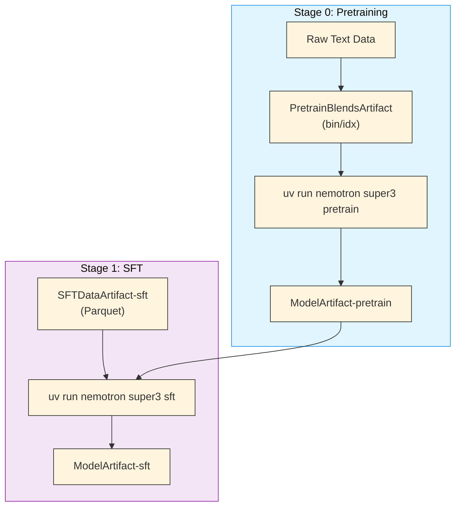

# Nemotron 3 Super Training Recipe

A complete, reproducible training pipeline for Nemotron 3 Super—an open, high-capacity Mixture-of-Experts hybrid Mamba-Transformer model with multi-token prediction.

## Quick Start

### Prerequisites

- **Slurm cluster** with GPU nodes (B200 recommended for NVFP4 support) — see [Execution through NeMo-Run](../../nemo_runspec/nemo-run.md)
- **[Weights & Biases](../wandb.md) account** for experiment tracking and [artifact lineage](../../nemo_runspec/artifacts.md)
- **Container image**: `gitlab-master.nvidia.com/dl/joc/nemo-ci/liding_r25.11-super-v3/train:pipe.44680568`

### Installation

```bash
git clone https://github.com/NVIDIA/nemotron
cd nemotron
uv sync
```

### Configuration

Create an `env.toml` file (see [Execution through NeMo-Run](../../nemo_runspec/nemo-run.md) for details):

```toml
[wandb]
project = "nemotron"
entity = "YOUR-TEAM"

[YOUR-CLUSTER]
executor = "slurm"
account = "YOUR-ACCOUNT"
partition = "batch"
nodes = 4
ntasks_per_node = 8
gpus_per_node = 8
mounts = ["/lustre:/lustre"]
```

### Run the Pipeline

<div class="termy">

```console
// Stage 0: Pretraining
$ uv run nemotron super3 data prep pretrain --run YOUR-CLUSTER
$ uv run nemotron super3 pretrain --run YOUR-CLUSTER

// Stage 1: Supervised Fine-Tuning
$ uv run nemotron super3 data prep sft --run YOUR-CLUSTER
$ uv run nemotron super3 sft --run YOUR-CLUSTER
```

</div>

## Resources

- **Megatron-Bridge Docs**: [Nemotron 3 Super](https://github.com/NVIDIA-NeMo/Megatron-Bridge/blob/super-v3/docs/models/llm/nemotron3-super.md)
- **Model Weights**: TBD

## Training Pipeline

| Stage | Name | Purpose | Guide |
|-------|------|---------|-------|
| 0 | [Pretraining](./pretrain.md) | Base model training with MoE and multi-token prediction | [pretrain.md](./pretrain.md) |
| 1 | [SFT](./sft.md) | Multi-domain instruction tuning | [sft.md](./sft.md) |

## Model Specifications

| Specification | Value |
|---------------|-------|
| **Architecture** | Hybrid Mamba-Transformer with sparse MoE and MTP |
| **Expert Parallelism** | 8-way (default) |
| **MoE** | Routed experts with shared expert, DeepEP support |
| **Multi-Token Prediction** | MTP layers with repeated layer optimization |
| **Precision** | BF16 mixed (NVFP4 for pretrain on B200) |

## Stage Summaries

### Stage 0: Pretraining

Multi-node pretraining with MoE, multi-token prediction, and WSD learning rate schedule. Default parallelism: TP=4, EP=8, SP=True.

> [Pretraining Guide](./pretrain.md)

### Stage 1: Supervised Fine-Tuning

Full-parameter SFT or LoRA fine-tuning with packed Parquet sequences and role-based loss masking. Full SFT default: TP=1, EP=8; LoRA default: TP=1, EP=1.

> [SFT Guide](./sft.md)

## Execution Options

All commands support [NeMo-Run](../../nemo_runspec/nemo-run.md) execution modes:

| Option | Behavior | Use Case |
|--------|----------|----------|
| `--run <profile>` | Attached—submits job and streams logs | Interactive development |
| `--batch <profile>` | Detached—submits and exits immediately | Long-running jobs |
| `--dry-run` | Preview execution plan | Validation |

See [Execution through NeMo-Run](../../nemo_runspec/nemo-run.md) for profile configuration and advanced options.

## Artifact Lineage

The pipeline tracks full lineage via [W&B Artifacts](../../nemo_runspec/artifacts.md), enabling traceability from raw data to final model.



> [Artifact Lineage & W&B Integration](../../nemo_runspec/artifacts.md)

## CLI Reference

<div class="termy">

```console
// Show available commands
$ uv run nemotron super3 --help
Usage: nemotron super3 [OPTIONS] COMMAND [ARGS]...

 Super3 training recipe

╭─ Commands ───────────────────────────────────────────────────────────────╮
│ data       Data curation and preparation commands                        │
│ model      Model evaluation and import commands                          │
╰──────────────────────────────────────────────────────────────────────────╯
╭─ Training Stages ────────────────────────────────────────────────────────╮
│ pretrain   Run pretraining with Megatron-Bridge (stage0).                │
│ sft        Run supervised fine-tuning with Megatron-Bridge (stage1).     │
╰──────────────────────────────────────────────────────────────────────────╯
```

</div>

## Troubleshooting

**W&B authentication**: See [W&B Integration](../wandb.md) for setup.
```bash
wandb login
```

**Container not found**: Verify image path in config files.

**Job submission fails**: Check Slurm account and partition in `env.toml`. See [Execution through NeMo-Run](../../nemo_runspec/nemo-run.md).

## Further Reading

- [Stage 0: Pretraining](./pretrain.md)
- [Stage 1: SFT](./sft.md)
- [Artifact Lineage](../../nemo_runspec/artifacts.md)
- [Execution through NeMo-Run](../../nemo_runspec/nemo-run.md)
- [W&B Integration](../wandb.md)
- [NVIDIA AI Stack](../nvidia-stack.md)
- [CLI Framework](../../nemo_runspec/cli.md)
- [Data Preparation Module](../data-prep.md)
