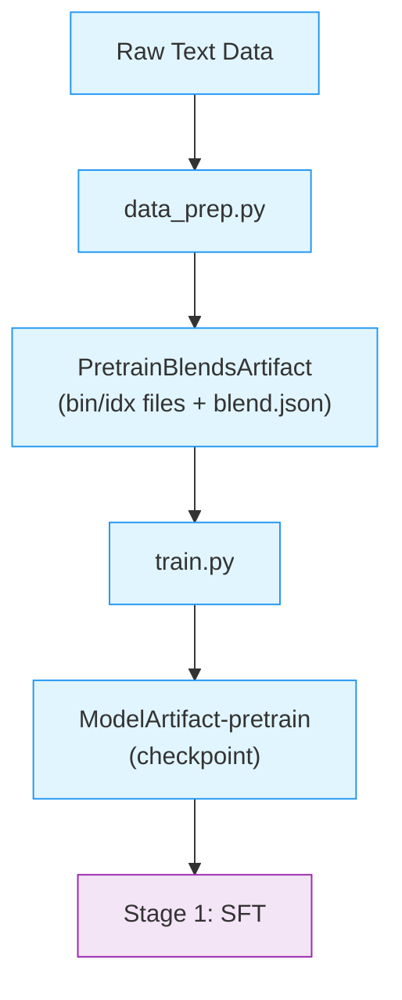

# Stage 0: Pretraining

This stage trains the base Nemotron 3 Super model using [Megatron-Bridge](../nvidia-stack.md#megatron-bridge).

Nemotron 3 Super is a **hybrid Mamba-Transformer-MoE** model with multi-token prediction (MTP), combining state-space models for efficiency, attention for global context, mixture-of-experts for capacity, and MTP for improved training signal.

---

## Training Methodology

> **Training Framework**: Pretraining is implemented using [Megatron-Bridge](https://docs.nvidia.com/nemo/megatron-bridge/latest/)'s `pretrain()` entry point. See [Training Entry Points](https://docs.nvidia.com/nemo/megatron-bridge/latest/training/entry-points.html) for implementation details.

### Model Architecture

Nemotron 3 Super uses a **hybrid Mamba-Transformer-MoE** architecture with multi-token prediction:

| Feature | Description |
|---------|-------------|
| **Mamba-2 layers** | Efficient linear-time sequence processing |
| **Attention layers** | Global information mixing at strategic intervals |
| **MoE layers** | Sparse computation with routed + shared experts |
| **Multi-Token Prediction** | MTP layers for improved training signal |
| **DeepEP** | Deep expert parallelism support |

**Key design choices:**

- **Shared expert overlap**: Configurable shared expert computation overlapping with routing
- **MTP with repeated layers**: MTP layers use repeated layer optimization to reduce memory
- **Aux-loss-free MoE balancing**: Router bias adjustment without auxiliary losses

> For implementation details, see [Megatron-Bridge Nemotron 3 Super](https://github.com/NVIDIA-NeMo/Megatron-Bridge/blob/super-v3/docs/models/llm/nemotron3-super.md).

### Hyperparameters

| Parameter | Value |
|-----------|-------|
| **Batch Size** | 3,072 sequences |
| **Sequence Length** | 8,192 tokens |
| **Peak Learning Rate** | 4.5e-4 |
| **Minimum Learning Rate** | 4.5e-6 |
| **Optimizer** | AdamW (beta1=0.9, beta2=0.95) |
| **Weight Decay** | 0.1 |
| **LR Schedule** | WSD (Warmup-Stable-Decay) |
| **LR Warmup** | 333 iterations |
| **MTP Loss Scaling** | 0.3 |
| **Precision** | BF16 mixed (NVFP4 mixed for B200) |

---

## Recipe Execution

### Quick Start

<div class="termy">

```console
// 1. Prepare data (tokenize to bin/idx format)
$ uv run nemotron super3 data prep pretrain --run YOUR-CLUSTER

// 2. Run pretraining
$ uv run nemotron super3 pretrain --run YOUR-CLUSTER
```

</div>

> **Note**: The `--run YOUR-CLUSTER` flag submits jobs via [NeMo-Run](../../nemo_runspec/nemo-run.md). See [Execution through NeMo-Run](../../nemo_runspec/nemo-run.md) for setup.

#### Direct Script Execution (Megatron-Bridge)

For direct execution outside this CLI, use the scripts in the [Megatron-Bridge](https://github.com/NVIDIA-NeMo/Megatron-Bridge) repository:

```bash
# Clone the repository and checkout the super-v3 branch
git clone https://github.com/NVIDIA-NeMo/Megatron-Bridge.git
cd Megatron-Bridge
git checkout super-v3

# Run pretraining with real data (inside container on compute node)
torchrun --nproc-per-node=8 examples/models/nemotron_3/pretrain_nemotron_3_super.py \
    --per-split-data-args-path=/path/to/blend.json \
    logger.wandb_project=your_project \
    logger.wandb_entity=nvidia \
    checkpoint.save=/path/to/checkpoints \
    checkpoint.load=/path/to/checkpoints

# Run pretraining with mock data (for testing)
torchrun --nproc-per-node=8 examples/models/nemotron_3/pretrain_nemotron_3_super.py \
    train.global_batch_size=128 \
    train.train_iters=100 \
    scheduler.lr_warmup_iters=10 \
    model.hybrid_override_pattern="MEME*ME" \
    model.num_layers=7
```

See the [Megatron-Bridge Nemotron 3 Super documentation](https://github.com/NVIDIA-NeMo/Megatron-Bridge/blob/super-v3/docs/models/llm/nemotron3-super.md) for detailed configuration options.

### Configuration

| File | Purpose |
|------|---------|
| `config/default.yaml` | Production configuration |
| `config/tiny.yaml` | Quick testing configuration |
| `config/data_prep/default.yaml` | Data preparation settings |

### Training

#### CLI Command

```bash
uv run nemotron super3 pretrain [options] [overrides...]
```

| Option | Description |
|--------|-------------|
| `--run <profile>` | Attached—submits and waits, streaming logs ([NeMo-Run](../../nemo_runspec/nemo-run.md)) |
| `--batch <profile>` | Detached—submits and exits immediately ([NeMo-Run](../../nemo_runspec/nemo-run.md)) |
| `--dry-run` | Preview execution plan |
| `key=value` | Override config values ([CLI Framework](../../nemo_runspec/cli.md#dotlist-overrides)) |

#### Override Examples

```bash
# More training iterations
uv run nemotron super3 pretrain train.train_iters=5000

# Larger batch size
uv run nemotron super3 pretrain train.global_batch_size=64

# Different checkpoint location
uv run nemotron super3 pretrain checkpoint.save=/path/to/checkpoints
```

### Artifact Lineage



---

## Infrastructure

This stage uses the following components from the [NVIDIA AI Stack](../nvidia-stack.md):

| Component | Role | Documentation |
|-----------|------|---------------|
| [Megatron-Core](../nvidia-stack.md#megatron-core) | Distributed training primitives (TP, PP, DP, EP, CP, SP) | [GitHub](https://github.com/NVIDIA/Megatron-LM) |
| [Megatron-Bridge](../nvidia-stack.md#megatron-bridge) | Model definitions, training loop, checkpoint management | [Docs](https://docs.nvidia.com/nemo/megatron-bridge/latest/) |

### Parallelism Configuration

| Parallelism | Default | Config Key |
|-------------|---------|------------|
| Tensor (TP) | 4 | `model.tensor_model_parallel_size` |
| Pipeline (PP) | 1 | `model.pipeline_model_parallel_size` |
| Expert (EP) | 8 | `model.expert_model_parallel_size` |
| Expert Tensor (ETP) | 1 | `model.expert_tensor_parallel_size` |
| Context (CP) | 1 | `model.context_parallel_size` |
| Sequence (SP) | Yes | `model.sequence_parallel` |
| Data (DP) | Auto | Computed from world size |

**Minimum resources:** 4 nodes with 8 GPUs each (32 GPUs total).

### Container

```
gitlab-master.nvidia.com/dl/joc/nemo-ci/liding_r25.11-super-v3/train:pipe.44680568
```

---

## Next Steps

After pretraining completes, proceed to [Stage 1: SFT](./sft.md) for instruction tuning.

## Reference

- [Megatron-Bridge Nemotron 3 Super](https://github.com/NVIDIA-NeMo/Megatron-Bridge/blob/super-v3/docs/models/llm/nemotron3-super.md) — MB documentation and examples
- [NVIDIA AI Stack](../nvidia-stack.md) — Megatron-Core, Megatron-Bridge documentation
- [Artifact Lineage](../../nemo_runspec/artifacts.md) — W&B artifact system
- **Recipe Source**: `src/nemotron/recipes/super3/stage0_pretrain/` — Implementation details
- [Back to Overview](./README.md)
