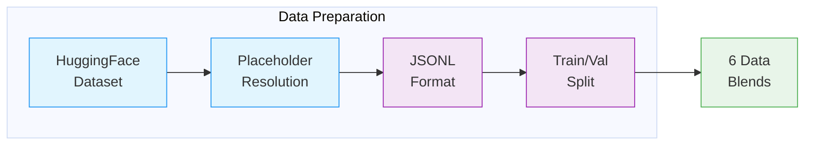
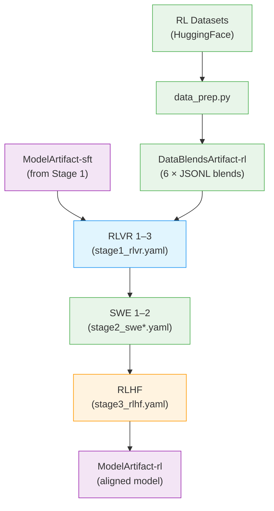

# Stage 2: Reinforcement Learning (RL)

This stage aligns the instruction-tuned model using GRPO (Group Relative Policy Optimization) with [NeMo-RL](../nvidia-stack.md#nemo-rl).

> **Open-Source Data Only**: This recipe uses exclusively open-sourced RL data, which is a subset of the full data used to train the released model. Results will differ from the benchmarks in the tech report. Use this recipe as a reference implementation to apply the methodology with your own data.

---

## Training Methodology

> **Training Framework**: RL alignment is implemented using [NeMo-RL](https://docs.nvidia.com/nemo/rl/latest/) with Ray for distributed actor coordination and vLLM for fast rollout generation. The Megatron backend handles distributed policy training with tensor, pipeline, context, and expert parallelism. See [NeMo-RL Documentation](https://docs.nvidia.com/nemo/rl/latest/) for implementation details.
>
> For complete methodology, see the [Nemotron 3 Super Tech Report](https://research.nvidia.com/labs/nemotron/files/NVIDIA-Nemotron-3-Super-Technical-Report.pdf).

### RL Pipeline Overview

The RL pipeline consists of three main stages with 6 total sub-stages, each targeting a different alignment objective:

1. **Multi-Environment RLVR** (3 sub-stages) — Unified training across 21 environments with verifiable rewards
    - Stage 1.1: RLVR 1 — Initial RL training from SFT checkpoint
    - Stage 1.2: RLVR 2 — Continued training with second data blend
    - Stage 1.3: RLVR 3 — Final RLVR with third data blend
2. **SWE-RL** (2 sub-stages) — End-to-end reinforcement learning for software engineering tasks
    - Stage 2.1: SWE 1 — SWE-pivot training
    - Stage 2.2: SWE 2 — SWE-bench training with Apptainer environments
3. **RLHF** (1 stage) — Principle-following generative reward model-based alignment

Each sub-stage uses a different data blend and takes the output checkpoint of the previous sub-stage as input. The RLVR sub-stages share the same config (`stage1_rlvr.yaml`) with different data paths.

```mermaid
%%{init: {'theme': 'base', 'themeVariables': { 'primaryBorderColor': '#333333', 'lineColor': '#333333', 'primaryTextColor': '#333333'}}}%%
flowchart LR
    sft["SFT<br/>Checkpoint"] --> rlvr1["RLVR 1<br/>(109 nodes)"]
    rlvr1 --> rlvr2["RLVR 2<br/>(109 nodes)"]
    rlvr2 --> rlvr3["RLVR 3<br/>(109 nodes)"]
    rlvr3 --> swe1["SWE 1<br/>(64 nodes)"]
    swe1 --> swe2["SWE 2<br/>(64 nodes)"]
    swe2 --> rlhf["RLHF<br/>(72 nodes)"]
    rlhf --> final["Final<br/>Model"]

    style sft fill:#f3e5f5,stroke:#9c27b0
    style rlvr1 fill:#e1f5fe,stroke:#2196f3
    style rlvr2 fill:#e1f5fe,stroke:#2196f3
    style rlvr3 fill:#e1f5fe,stroke:#2196f3
    style swe1 fill:#e8f5e9,stroke:#4caf50
    style swe2 fill:#e8f5e9,stroke:#4caf50
    style rlhf fill:#fff3e0,stroke:#ff9800
    style final fill:#f3e5f5,stroke:#9c27b0
```



Multi-environment RLVR is the primary stage, training on all environments simultaneously to keep RL updates informed by the full environment mix and prevent accuracy drops across tasks. SWE-RL is handled separately because its rollouts take substantially longer and require longer context lengths. RLHF runs as a final stage to improve model behavior and interaction quality.

### Per-Stage Parameters

| | RLVR (1.1–1.3) | SWE 1 (2.1) | SWE 2 (2.2) | RLHF (3) |
|---|---|---|---|---|
| **Nodes** | 109 | 64 | 64 | 72 |
| **Prompts/step** | 256 | 64 | 16 | 128 |
| **Gens/prompt** | 16 | 16 | 32 | 16 |
| **Batch size** | 4096 | 1024 | 512 | 2048 |
| **Max seq len** | 65K | 131K | 196K | 49K |
| **Learning rate** | 3e-6 | 1e-6 | 1e-6 | 1e-6 |
| **KL penalty** | 0 | 0 | 0 | 1e-4 |
| **Overlong filter** | false | true | true | false |
| **Config** | `stage1_rlvr.yaml` | `stage2_swe1.yaml` | `stage2_swe2.yaml` | `stage3_rlhf.yaml` |

### Data Preparation Pipeline

Before training, the RL datasets are downloaded and resolved into JSONL format compatible with NeMo-Gym:



| Stage | What Happens |
|-------|--------------|
| **HuggingFace Dataset** | Download `nvidia/Nemotron-3-Super-RL-Training-Blends` (6 blend files) |
| **Placeholder Resolution** | Resolve `_hf_placeholder` records by fetching from external datasets (DAPO, Skywork) and applying template restoration |
| **JSONL Format** | Convert to JSONL with `question`, `expected_answer`, and `responses_create_params` fields |
| **Train/Val Split** | Last 100 rows held out for validation per blend |
| **6 Data Blends** | `rlvr1/`, `rlvr2/`, `rlvr3/`, `swe1/`, `swe2/`, `rlhf/` — each with `train-split.jsonl` + `val-split.jsonl` |

> For data preparation implementation, see **Recipe Source**: `src/nemotron/recipes/super3/stage2_rl/data_prep.py`

### GRPO Algorithm

GRPO (Group Relative Policy Optimization) optimizes the policy using group-relative advantages:

1. **Generate responses** from the current policy using vLLM
2. **Evaluate** responses using NeMo-Gym reward environments
3. **Compute group-relative advantages** across response groups per prompt
4. **Update the policy** to favor higher-reward responses with clipped gradients

The training uses an **asynchronous GRPO** setup where training and inference are decoupled across separate GPU devices. Inference workers continuously generate trajectories stored in a rollout buffer. Once enough trajectories are collected, the batch is sent to the training engine for a model update. Updated weights are pushed to inference workers as soon as a new model version is available.

**Stability Improvements:**

| Improvement | Description |
|-------------|-------------|
| **Importance Sampling Masking** | Masks importance sampling ratios from training/inference logprobs to minimize off-policy effects from policy lag |
| **In-Flight Weight Updates** | Training can update generation worker weights without waiting for ongoing rollouts to finish |
| **One-Step Off-Policy** | Inference workers are restricted to be at most one step behind the latest model version |
| **Overlong Filtering** | Excludes sequences that hit max length without EOS from loss computation |

### Multi-Environment RLVR

Training uses 21 environments across 37 datasets through NeMo-Gym:

| Environment | Description | Reward Type |
|-------------|-------------|-------------|
| **Math** | Competitive math problems (with and without Python tool) + formal proof verification | Answer correctness verification |
| **Code** | Competition code problems | Unit test pass rate |
| **STEM** | Scientific reasoning problems (including newly curated difficult problems) | Answer matching |
| **Instruction Following** | IFEval, Multi-Challenge compliance | Constraint satisfaction |
| **Safety** | Over-refusal mitigation + jailbreak robustness | Safety policy compliance |
| **Long Context** | Long-context document reasoning | Task completion |
| **Agentic Tool Use** | Conversational tool use + terminal use | Task completion |
| **Reasoning Gym** | Diverse reasoning tasks from Reasoning Gym | Task-specific rewards |

Training on all environments simultaneously provides stable gains. Single-environment training leads to severe regressions on other benchmarks.

**Data Curriculum:** Prompts where the SFT model consistently provides correct answers are filtered out. Remaining samples are sorted via a difficulty-based curriculum.

### Low-Effort Reasoning

During multi-environment RL, a subset of prompts are converted to low-effort mode. For each low-effort prompt, the reward is adjusted as a function of both correctness and the number of generated tokens.

| Phase | Scope | Proportion |
|-------|-------|------------|
| Early | Math, STEM QA, Competitive Coding | 2% of all RL prompts |
| Late | Math, STEM QA only | 1% of RL prompts |

### End-to-End SWE-RL

SWE-RL runs as a separate stage due to its distinct systems characteristics: longer rollouts, longer context, and different throughput profile.

**Key Components:**

| Component | Description |
|-----------|-------------|
| **Apptainer Containers** | Each SWE task runs in an isolated Apptainer (Singularity) container with writable tmpfs overlay |
| **OpenHands Agent Loop** | Manages the full lifecycle: initializing runtime, presenting problems, running agent steps, extracting git patches |
| **Harness Diversity** | OpenCode and Codex agent classes within OpenHands match external harness tool formats for training diversity |
| **Memory Watchdog** | Monitors aggregate RSS and proactively kills runaway processes within memory limits |
| **Command Blocklist** | Regex-based blocklist intercepts dangerous commands (killall, pkill) in shared-kernel environments |

**SWE-RL Prerequisites:**

Stage 2.1 (SWE 1) requires a sandbox container for code execution. Stage 2.2 (SWE 2) additionally requires Apptainer `.sif` images for the SWE-bench environments (from R2E-Gym, SWE-Gym, and SWE-Bench Verified). See the [upstream NeMo-RL Super3 guide](https://github.com/NVIDIA-NeMo/RL) for building these containers.

### RLHF

The final RL stage uses a principle-following Generative Reward Model (GenRM) for RLHF:

| Parameter | Value |
|-----------|-------|
| **GenRM Initialization** | Qwen3-235B-A22B-Thinking-2507 |
| **Training Data** | HelpSteer 3 + lmarena-140k (commercially friendly subsets) + recently collected human preference data |
| **Approach** | Principle-following GenRM for guiding behavior on identity and safety domains |

The GenRM is used throughout both the multi-environment RL stage and a separate RLHF-only stage at the end of post-training.

---

## Recipe Execution

### Quick Start

<div class="termy">

```console
// 1. Prepare data (downloads and resolves all 6 blends)
$ uv run nemotron super3 data prep rl --run YOUR-CLUSTER

// 2. Run RL training stages sequentially (each stage takes the previous output as input)
// Stage 1.1 - RLVR 1
$ uv run nemotron super3 rl -c stage1_rlvr \
    data.train.data_path=$DATA/rlvr1/train-split.jsonl \
    data.validation.data_path=$DATA/rlvr1/val-split.jsonl \
    policy.model_name=/path/to/sft_checkpoint \
    --run YOUR-CLUSTER

// Stage 1.2 - RLVR 2
$ uv run nemotron super3 rl -c stage1_rlvr \
    data.train.data_path=$DATA/rlvr2/train-split.jsonl \
    data.validation.data_path=$DATA/rlvr2/val-split.jsonl \
    policy.model_name=/path/to/rlvr1_checkpoint \
    --run YOUR-CLUSTER

// Stage 1.3 - RLVR 3 (same config, rlvr3 data, rlvr2 checkpoint)
// Stage 2.1 - SWE 1
$ uv run nemotron super3 rl -c stage2_swe1 \
    data.train.data_path=$DATA/swe1/train-split.jsonl \
    data.validation.data_path=$DATA/swe1/val-split.jsonl \
    policy.model_name=/path/to/rlvr3_checkpoint \
    --run YOUR-CLUSTER

// Stage 2.2 - SWE 2 (requires Apptainer SIF images)
$ uv run nemotron super3 rl -c stage2_swe2 \
    data.train.data_path=$DATA/swe2/train-split.jsonl \
    data.validation.data_path=$DATA/swe2/val-split.jsonl \
    policy.model_name=/path/to/swe1_checkpoint \
    sif_dir=/path/to/sif \
    --run YOUR-CLUSTER

// Stage 3 - RLHF
$ uv run nemotron super3 rl -c stage3_rlhf \
    data.train.data_path=$DATA/rlhf/train-split.jsonl \
    data.validation.data_path=$DATA/rlhf/val-split.jsonl \
    policy.model_name=/path/to/swe2_checkpoint \
    --run YOUR-CLUSTER
```

</div>

> **Note**: The `--run YOUR-CLUSTER` flag submits jobs via [NeMo-Run](../../nemo_runspec/nemo-run.md). See [Execution through NeMo-Run](../../nemo_runspec/nemo-run.md) for setup.

### Configuration

| File | Purpose |
|------|---------|
| `config/stage1_rlvr.yaml` | RLVR stages 1.1–1.3 (109 nodes, 25 NeMo-Gym environments) |
| `config/stage2_swe1.yaml` | SWE stage 2.1 — SWE-pivot (64 nodes) |
| `config/stage2_swe2.yaml` | SWE stage 2.2 — SWE-bench with Apptainer (64 nodes) |
| `config/stage3_rlhf.yaml` | RLHF stage (72 nodes, GenRM reward) |
| `config/small_stage1_rlvr_21node.yaml` | Reduced RLVR (21 nodes) |
| `config/small_stage2_swe_pivot_8node.yaml` | Reduced SWE (8 nodes) |
| `config/small_stage3_rlhf_24node.yaml` | Reduced RLHF (24 nodes) |
| `config/default.yaml` | Base GRPO configuration |
| `config/tiny.yaml` | Testing variant (1 node) |
| `config/data_prep/default.yaml` | Data preparation settings |
| `config/data_prep/data_blend_raw.json` | RL dataset blend |

### Data Preparation

The `data_prep.py` script downloads `nvidia/Nemotron-3-Super-RL-Training-Blends` from HuggingFace, resolves placeholder entries, and produces 6 data blends. See [Data Preparation Module](../data-prep.md) for detailed documentation.

#### CLI Command

```bash
uv run nemotron super3 data prep rl [options]
```

| Option | Description |
|--------|-------------|
| `--run <profile>` | Execute on Slurm via [NeMo-Run](../../nemo_runspec/nemo-run.md) |
| `--sample N` | Limit rows per dataset (for testing) |
| `--force` | Force re-run, ignoring cache |

#### Output

```
output/stage2_rl_resolved/
├── rlvr1/
│   ├── train-split.jsonl
│   └── val-split.jsonl
├── rlvr2/
│   ├── train-split.jsonl
│   └── val-split.jsonl
├── rlvr3/
│   ├── train-split.jsonl
│   └── val-split.jsonl
├── swe1/
│   ├── train-split.jsonl
│   └── val-split.jsonl
├── swe2/
│   ├── train-split.jsonl
│   └── val-split.jsonl
├── rlhf/
│   ├── train-split.jsonl
│   └── val-split.jsonl
└── manifest.json
```

The output is registered as a [W&B Artifact](../../nemo_runspec/artifacts.md) (`DataBlendsArtifact-rl`) for lineage tracking.

### Training

#### CLI Command

```bash
uv run nemotron super3 rl [options] [overrides...]
```

| Option | Description |
|--------|-------------|
| `-c <config>` | Config file (e.g., `-c stage1_rlvr`, `-c tiny`) |
| `--run <profile>` | Attached—submits and waits, streaming logs ([NeMo-Run](../../nemo_runspec/nemo-run.md)) |
| `--batch <profile>` | Detached—submits and exits immediately ([NeMo-Run](../../nemo_runspec/nemo-run.md)) |
| `--dry-run` | Preview execution plan |
| `key=value` | Override config values ([CLI Framework](../../nemo_runspec/cli.md#dotlist-overrides)) |

#### Override Examples

```bash
# Fewer steps for testing
uv run nemotron super3 rl -c stage1_rlvr grpo.max_num_steps=100

# Different temperature for generation
uv run nemotron super3 rl -c stage1_rlvr policy.generation.temperature=0.8

# Different learning rate
uv run nemotron super3 rl -c stage1_rlvr policy.megatron_cfg.optimizer.lr=5e-7

# Use reduced-scale config
uv run nemotron super3 rl -c small_stage1_rlvr_21node --run YOUR-CLUSTER
```

### Running with NeMo-Run

Configure execution profiles in `env.toml`:

```toml
[wandb]
project = "nemotron"
entity = "YOUR-TEAM"

[YOUR-CLUSTER]
executor = "slurm"
account = "YOUR-ACCOUNT"
partition = "batch"
nodes = 109
ntasks_per_node = 8
gpus_per_node = 8
mem = "0"
exclusive = true
mounts = ["/lustre:/lustre"]
```

See [Execution through NeMo-Run](../../nemo_runspec/nemo-run.md) for complete configuration options.

### Artifact Lineage



---

## Infrastructure

This stage uses the following components from the [NVIDIA AI Stack](../nvidia-stack.md):

| Component | Role | Documentation |
|-----------|------|---------------|
| [NeMo-RL](../nvidia-stack.md#nemo-rl) | Async GRPO algorithm, policy training, reward computation | [Docs](https://docs.nvidia.com/nemo/rl/latest/) |
| [NeMo-Gym](https://github.com/NVIDIA-NeMo/NeMo-Gym) | Multi-environment reward evaluation (21+ environments) | [GitHub](https://github.com/NVIDIA-NeMo/NeMo-Gym) |
| [Megatron-Core](../nvidia-stack.md#megatron-core) | Distributed training primitives (TP, PP, CP, EP) | [GitHub](https://github.com/NVIDIA/Megatron-LM) |
| [Ray](https://ray.io/) | Distributed actor coordination and resource management | [Docs](https://docs.ray.io/) |
| vLLM | Fast rollout generation | [GitHub](https://github.com/vllm-project/vllm) |

### Parallelism Configuration (RLVR)

Training uses multiple parallelism strategies for efficient scaling:

| Parallelism | Value | Config Key |
|-------------|-------|------------|
| Tensor (TP) | 4 | `policy.megatron_cfg.tensor_model_parallel_size` |
| Pipeline (PP) | 1 | `policy.megatron_cfg.pipeline_model_parallel_size` |
| Context (CP) | 8 | `policy.megatron_cfg.context_parallel_size` |
| Expert (EP) | 8 | `policy.megatron_cfg.expert_model_parallel_size` |
| Sequence (SP) | Yes | `policy.megatron_cfg.sequence_parallel` |

**Generation (vLLM):**

| Parameter | Value | Description |
|-----------|-------|-------------|
| `tensor_parallel_size` | 4 | TP for vLLM generation |
| `gpu_memory_utilization` | 0.8 | GPU memory fraction for KV cache |
| `colocated` | false | Dedicated generation nodes (72 nodes for RLVR) |

**Cluster (RLVR):**

| Parameter | Value |
|-----------|-------|
| `num_nodes` | 109 |
| `gpus_per_node` | 8 |

> SWE stages use TP=8, CP=8 with 64 nodes. RLHF uses TP=4, CP=4 with 72 nodes. See [Per-Stage Parameters](#per-stage-parameters) for details.

### Container

```
nvcr.io/nvidia/nemo-rl:v0.5.0.nemotron_3_super
```

---

## Next Steps

After RL completes, the aligned model can be [quantized](./quantization.md) for efficient deployment or [evaluated](./evaluate.md) against standard benchmarks.

## Reference

- [Nemotron 3 Super Tech Report](https://research.nvidia.com/labs/nemotron/files/NVIDIA-Nemotron-3-Super-Technical-Report.pdf) — RL methodology
- [NeMo-RL Documentation](https://docs.nvidia.com/nemo/rl/latest/) — GRPO, DPO, environments
- [NVIDIA AI Stack](../nvidia-stack.md) — NeMo-RL, Megatron-Core documentation
- [Artifact Lineage](../../nemo_runspec/artifacts.md) — W&B artifact system
- [Stage 0: Pretraining](./pretrain.md) — Pretrain the base model
- [Stage 1: SFT](./sft.md) — Instruction tuning
- [Stage 3: Quantization](./quantization.md) — Post-training quantization
- [Stage 4: Evaluation](./evaluate.md) — Benchmark evaluation
- **Recipe Source**: `src/nemotron/recipes/super3/stage2_rl/` — Implementation details
- [Back to Overview](./README.md)
