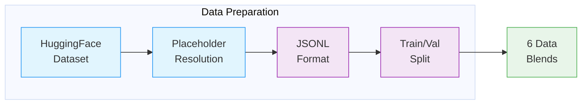

# RL Data Preparation

Data preparation for the RL pipeline downloads `nvidia/Nemotron-3-Super-RL-Training-Blends` from HuggingFace, resolves placeholder entries by fetching from external datasets (DAPO, Skywork), and produces 6 data blends with train/val splits.

---

## Pipeline



| Stage | What Happens |
|-------|--------------|
| **HuggingFace Dataset** | Download `nvidia/Nemotron-3-Super-RL-Training-Blends` (6 blend files) |
| **Placeholder Resolution** | Resolve `_hf_placeholder` records by fetching from external datasets (DAPO, Skywork) and applying template restoration |
| **JSONL Format** | Convert to JSONL with `question`, `expected_answer`, and `responses_create_params` fields |
| **Train/Val Split** | Last 100 rows held out for validation per blend |
| **6 Data Blends** | `rlvr1/`, `rlvr2/`, `rlvr3/`, `swe1/`, `swe2/`, `rlhf/` — each with `train-split.jsonl` + `val-split.jsonl` |

---

## Quick Start (Standalone)

The simplest way to prepare data is using the upstream script directly:

```bash
# Download RL data blends
uvx --from huggingface-hub hf download nvidia/Nemotron-3-Super-RL-Training-Blends \
    --repo-type dataset --local-dir=data_with_placeholders

# Fill in placeholders
chmod +x data_with_placeholders/fill_placeholders.py
./data_with_placeholders/fill_placeholders.py \
    --input-dir data_with_placeholders --output-dir data_filled

# Create train/val splits (last 100 rows held out for validation)
for f in data_filled/*.jsonl; do
  name=$(basename "$f" .jsonl)
  mkdir -p "data/$name"
  head -n -100 "$f" > "data/$name/train-split.jsonl"
  tail -n 100 "$f" > "data/$name/val-split.jsonl"
done
```

## Nemotron CLI (with xenna pipeline)

Alternatively, use the Nemotron CLI which runs the xenna pipeline with Ray for distributed processing and W&B artifact tracking:

```bash
# Prepare data for each sub-stage
uv run nemotron super3 data prep rl rlvr --run YOUR-CLUSTER
uv run nemotron super3 data prep rl swe1 --run YOUR-CLUSTER
uv run nemotron super3 data prep rl swe2 --run YOUR-CLUSTER
uv run nemotron super3 data prep rl rlhf --run YOUR-CLUSTER
```

Each sub-stage has its own data prep command because the data blends differ (RLVR uses HF placeholder resolution, while SWE/RLHF use direct JSONL splitting).

> **`--run YOUR-CLUSTER`** refers to a profile defined in your `env.toml` file.
> See the [env.toml setup guide](../README.md#envtoml-setup) for details.

| Option | Description |
|--------|-------------|
| `--run <profile>` | Execute on Slurm via [NeMo-Run](../../../nemo_runspec/nemo-run.md) |
| `sample=N` | Limit rows per dataset (for testing) |
| `force=true` | Force re-run, ignoring cache |

---

## Output

```
output/stage2_rl_resolved/
├── rlvr1/
│   ├── train-split.jsonl
│   └── val-split.jsonl
├── rlvr2/
│   ├── train-split.jsonl
│   └── val-split.jsonl
├── rlvr3/
│   ├── train-split.jsonl
│   └── val-split.jsonl
├── swe1/
│   ├── train-split.jsonl
│   └── val-split.jsonl
├── swe2/
│   ├── train-split.jsonl
│   └── val-split.jsonl
├── rlhf/
│   ├── train-split.jsonl
│   └── val-split.jsonl
└── manifest.json
```

---

**Recipe Source**: `src/nemotron/recipes/super3/stage2_rl/data_prep.py`
