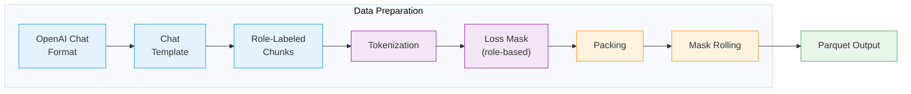
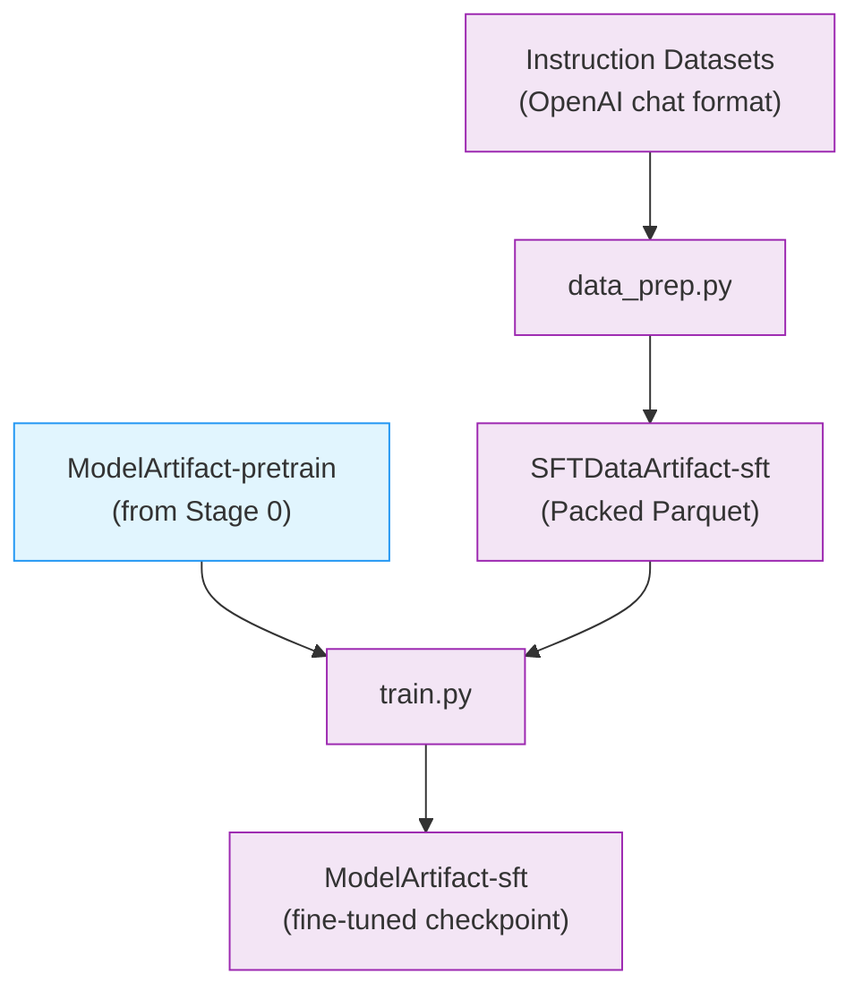

# Stage 1: Supervised Fine-Tuning (SFT)

This stage fine-tunes the pretrained Nemotron 3 Super model for instruction following using [Megatron-Bridge](../nvidia-stack.md#megatron-bridge).

---

## Training Methodology

> **Training Framework**: SFT is implemented using [Megatron-Bridge](https://docs.nvidia.com/nemo/megatron-bridge/latest/)'s `finetune()` entry point, which loads a pretrained checkpoint and handles the training loop with role-based loss masking. See [Training Entry Points](https://docs.nvidia.com/nemo/megatron-bridge/latest/training/entry-points.html) for implementation details.

### Data Preparation Pipeline

Before training, chat conversations are transformed into training-ready sequences through several stages:



| Stage | What Happens |
|-------|--------------|
| **OpenAI Chat Format** | Input messages with `role` (system/user/assistant) and `content` fields |
| **Chat Template** | Renders messages using the Super3 Jinja chat template |
| **Role-Labeled Chunks** | Splits rendered text back into chunks, each tagged with its source role |
| **Tokenization** | Converts text chunks to token IDs |
| **Loss Mask** | Builds mask: `1` for assistant tokens, `0` for system/user tokens |
| **Packing** | Multiple sequences packed into fixed-length bins (4096 tokens) |
| **Mask Rolling** | Shifts mask by 1 position for next-token prediction alignment |

> For data preparation implementation, see **Recipe Source**: `src/nemotron/recipes/super3/stage1_sft/data_prep.py`

### Loss Masking

Loss masking determines which tokens contribute to the training loss. In SFT, we only want the model to learn to generate responses—not to predict prompts or system instructions.

| Role | Loss Mask | Training Signal |
|------|-----------|-----------------|
| `system` | 0 | Ignored (instructions) |
| `user` | 0 | Ignored (prompts) |
| `assistant` | 1 | Learned (responses) |

Per-token loss normalization (`calculate_per_token_loss: true`) ensures consistent learning signal regardless of conversation length. This is set by the recipe's model provider.

### Packed Sequences

Individual chat conversations vary in length. Packing concatenates multiple conversations into a single fixed-length sequence (default 4096 tokens), maximizing GPU utilization.

The packed sequence format stores everything Megatron-Bridge needs for training:

| Field | Description |
|-------|-------------|
| `input_ids` | Concatenated token IDs from multiple conversations |
| `loss_mask` | Rolled mask indicating which positions contribute to loss |
| `seq_start_id` | Boundary indices marking where each original conversation starts within the pack |

Megatron-Bridge uses `seq_start_id` boundaries for variable-length attention (preventing cross-conversation attention leak) and FlashAttention optimization.

### Hyperparameters

#### Full SFT (default)

| Parameter | Value |
|-----------|-------|
| **Learning Rate** | 5e-6 |
| **Sequence Length** | 2048 tokens |
| **Pack Size** | 4096 tokens |
| **Loss Masking** | Role-based (assistant tokens only) |
| **Loss Normalization** | Per-token (`calculate_per_token_loss: true`) |
| **Optimizer** | AdamW (beta1=0.9, beta2=0.95) |
| **LR Schedule** | Cosine decay |
| **LR Warmup** | 50 iterations |
| **Weight Decay** | 0.1 |
| **Precision** | BF16 mixed |
| **MTP Loss Scaling** | 0.3 |

#### LoRA Fine-Tuning

| Parameter | Value |
|-----------|-------|
| **Learning Rate** | 1e-4 |
| **Target Modules** | `linear_qkv`, `linear_proj`, `linear_fc1`, `linear_fc2`, `in_proj`, `out_proj` |
| **Parallelism** | TP=1, EP=1 |

### Troubleshooting

Common data preparation errors and solutions:

| Error | Cause | Solution |
|-------|-------|----------|
| Empty sequences after processing | All tokens masked (no assistant content) | Verify input data contains assistant responses |
| Template rendering mismatch | Tokenizer BPE splits differ from template expectations | Ensure tokenizer model matches the one used during template creation |
| Sequences truncated excessively | Many conversations exceed `max_doc_tokens` | Consider increasing `max_doc_tokens` or `pack_size` |

**Debugging tips:**

- Use `--sample 100` to test data preparation on a small subset
- Check `metadata.json` output for statistics on filtered/truncated sequences
- Review W&B artifacts for lineage tracking and validation metrics

---

## Recipe Execution

### Quick Start

<div class="termy">

```console
// 1. Prepare data (apply chat templates, tokenize to Packed Parquet)
$ uv run nemotron super3 data prep sft --run YOUR-CLUSTER

// 2. Run SFT
$ uv run nemotron super3 sft --run YOUR-CLUSTER
```

</div>

> **Note**: The `--run YOUR-CLUSTER` flag submits jobs via [NeMo-Run](../../nemo_runspec/nemo-run.md). See [Execution through NeMo-Run](../../nemo_runspec/nemo-run.md) for setup.

#### Direct Script Execution (Megatron-Bridge)

For direct execution outside this CLI, use the scripts in the [Megatron-Bridge](https://github.com/NVIDIA-NeMo/Megatron-Bridge) repository:

```bash
# Clone the repository and checkout the super-v3 branch
git clone https://github.com/NVIDIA-NeMo/Megatron-Bridge.git
cd Megatron-Bridge
git checkout super-v3

# Full-parameter SFT (inside container on compute node)
torchrun --nproc-per-node=8 examples/models/nemotron_3/finetune_nemotron_3_super.py \
    logger.wandb_project=your_project \
    logger.wandb_entity=nvidia \
    logger.log_interval=5 \
    checkpoint.save=/path/to/checkpoints \
    checkpoint.load=/path/to/checkpoints \
    checkpoint.pretrained_checkpoint=/path/to/pretrained/ckpt \
    checkpoint.save_interval=50 \
    train.global_batch_size=16 \
    train.train_iters=200 \
    scheduler.lr_warmup_iters=10 \
    model.tensor_model_parallel_size=4 \
    model.sequence_parallel=True

# LoRA fine-tuning
torchrun --nproc-per-node=8 examples/models/nemotron_3/finetune_nemotron_3_super.py \
    --peft lora \
    checkpoint.pretrained_checkpoint=/path/to/pretrained/ckpt \
    train.global_batch_size=4 \
    train.train_iters=200 \
    model.tensor_model_parallel_size=4 \
    model.context_parallel_size=2 \
    model.sequence_parallel=True
```

See the [Megatron-Bridge Nemotron 3 Super documentation](https://github.com/NVIDIA-NeMo/Megatron-Bridge/blob/super-v3/docs/models/llm/nemotron3-super.md) for detailed configuration options.

### Configuration

| File | Purpose |
|------|---------|
| `config/default.yaml` | Production configuration (full SFT) |
| `config/tiny.yaml` | Quick testing configuration |
| `config/data_prep/default.yaml` | Data preparation settings |

### Data Preparation

The `data_prep.py` script processes OpenAI-format chat data into packed sequences with role-based loss masking. See [Data Preparation Module](../data-prep.md) for detailed documentation.

#### CLI Command

```bash
uv run nemotron super3 data prep sft [options]
```

| Option | Description |
|--------|-------------|
| `--run <profile>` | Execute on Slurm via [NeMo-Run](../../nemo_runspec/nemo-run.md) |
| `--sample N` | Limit rows per dataset (for testing) |
| `--force` | Force re-run, ignoring cache |

#### Output

```
output/stage1_sft/
├── blend.json
├── splits/
│   ├── train/
│   │   ├── shard_000000.parquet
│   │   └── ...
│   ├── valid/
│   └── test/
└── runs/{run_hash}/
    └── datasets/{name}/{hash}/
```

The output is registered as a [W&B Artifact](../../nemo_runspec/artifacts.md) (`SFTDataArtifact-sft`) for lineage tracking.

### Training

#### CLI Command

```bash
uv run nemotron super3 sft [options] [overrides...]
```

| Option | Description |
|--------|-------------|
| `--run <profile>` | Attached—submits and waits, streaming logs ([NeMo-Run](../../nemo_runspec/nemo-run.md)) |
| `--batch <profile>` | Detached—submits and exits immediately ([NeMo-Run](../../nemo_runspec/nemo-run.md)) |
| `--dry-run` | Preview execution plan |
| `key=value` | Override config values ([CLI Framework](../../nemo_runspec/cli.md#dotlist-overrides)) |

#### Override Examples

```bash
# More training iterations
uv run nemotron super3 sft train.train_iters=5000

# Different learning rate
uv run nemotron super3 sft optimizer.lr=1e-5

# Load specific pretrained checkpoint
uv run nemotron super3 sft checkpoint.pretrained_checkpoint=/path/to/checkpoint
```

### Running with NeMo-Run

Configure execution profiles in `env.toml`:

```toml
[wandb]
project = "nemotron"
entity = "YOUR-TEAM"

[YOUR-CLUSTER]
executor = "slurm"
account = "YOUR-ACCOUNT"
partition = "batch"
nodes = 4
ntasks_per_node = 8
gpus_per_node = 8
mounts = ["/lustre:/lustre"]
```

See [Execution through NeMo-Run](../../nemo_runspec/nemo-run.md) for complete configuration options.

### Artifact Lineage



---

## Infrastructure

This stage uses the following components from the [NVIDIA AI Stack](../nvidia-stack.md):

| Component | Role | Documentation |
|-----------|------|---------------|
| [Megatron-Core](../nvidia-stack.md#megatron-core) | Distributed training primitives (TP, PP, DP, EP) | [GitHub](https://github.com/NVIDIA/Megatron-LM) |
| [Megatron-Bridge](../nvidia-stack.md#megatron-bridge) | Fine-tuning loop, checkpoint loading, loss masking | [Docs](https://docs.nvidia.com/nemo/megatron-bridge/latest/) |

### Key Features Used

| Feature | Purpose |
|---------|---------|
| `finetune()` entry point | SFT training with pre-loaded checkpoint |
| Role-based loss masking | Only compute loss on assistant tokens |
| Mixed precision (BF16) | Memory-efficient training |
| Packed Parquet sequences | Efficient variable-length sequence handling |
| Multi-token prediction | Continued MTP training during SFT |

### Parallelism Configuration

#### Full SFT (default, `peft: null`)

| Parallelism | Default | Config Key |
|-------------|---------|------------|
| Tensor (TP) | 1 | `model.tensor_model_parallel_size` |
| Pipeline (PP) | 1 | `model.pipeline_model_parallel_size` |
| Expert (EP) | 8 | `model.expert_model_parallel_size` |
| Expert Tensor (ETP) | 1 | `model.expert_tensor_parallel_size` |
| Sequence (SP) | Yes | `model.sequence_parallel` |
| Data (DP) | Auto | Computed from world size |

#### LoRA (`peft: lora`)

| Parallelism | Default | Config Key |
|-------------|---------|------------|
| Tensor (TP) | 1 | `model.tensor_model_parallel_size` |
| Pipeline (PP) | 1 | `model.pipeline_model_parallel_size` |
| Expert (EP) | 1 | `model.expert_model_parallel_size` |
| Sequence (SP) | Yes | `model.sequence_parallel` |

**Minimum resources:** 4 nodes with 8 GPUs each (32 GPUs total).

### Container

```
gitlab-master.nvidia.com/dl/joc/nemo-ci/liding_r25.11-super-v3/train:pipe.44680568
```

---

## Reference

- [Megatron-Bridge Nemotron 3 Super](https://github.com/NVIDIA-NeMo/Megatron-Bridge/blob/super-v3/docs/models/llm/nemotron3-super.md) — MB documentation and examples
- [NVIDIA AI Stack](../nvidia-stack.md) — Megatron-Core, Megatron-Bridge documentation
- [Artifact Lineage](../../nemo_runspec/artifacts.md) — W&B artifact system
- [Stage 0: Pretraining](./pretrain.md) — Pretrain the base model
- **Recipe Source**: `src/nemotron/recipes/super3/stage1_sft/` — Implementation details
- [Back to Overview](./README.md)
