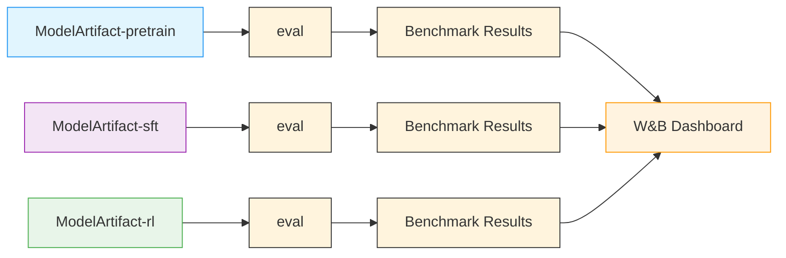

# Stage 3: Evaluation

This stage evaluates trained models using [NeMo Evaluator](https://github.com/NVIDIA/nemo-evaluator-launcher), running standard NLP benchmarks to measure model capabilities.

---

## Quick Start

<div class="termy">

```console
// Run evaluation on the RL model (default)
$ uv run nemotron nano3 eval --run YOUR-CLUSTER

// Evaluate a specific model stage
$ uv run nemotron nano3 eval --run YOUR-CLUSTER run.model=sft:latest

// Run specific benchmarks only
$ uv run nemotron nano3 eval --run YOUR-CLUSTER -t adlr_mmlu -t hellaswag

// Preview config without executing
$ uv run nemotron nano3 eval --dry-run
```

</div>

> **Note**: The `--run YOUR-CLUSTER` flag submits jobs via [NeMo-Run](../nemo-run.md). See [Execution through NeMo-Run](../nemo-run.md) for setup.

---

## CLI Command

```bash
uv run nemotron nano3 eval [options] [overrides...]
```

| Option | Short | Description |
|--------|-------|-------------|
| `--run <profile>` | `-r` | Submit to cluster (attached—waits, streams logs) |
| `--batch <profile>` | `-b` | Submit to cluster (detached—submits and exits) |
| `--dry-run` | `-d` | Preview config without executing |
| `--task <name>` | `-t` | Filter to specific task(s), can be repeated |
| `--force-squash` | | Force re-squash of container image |
| `key=value` | | Override config values |

### Task Filtering

Run specific benchmarks using the `-t` flag:

```bash
# Single task
uv run nemotron nano3 eval --run YOUR-CLUSTER -t adlr_mmlu

# Multiple tasks
uv run nemotron nano3 eval --run YOUR-CLUSTER -t adlr_mmlu -t hellaswag -t arc_challenge
```

### Model Selection

By default, evaluation runs on the RL stage output (`run.model=rl:latest`). Override to evaluate other stages:

```bash
# Evaluate SFT model
uv run nemotron nano3 eval --run YOUR-CLUSTER run.model=sft:latest

# Evaluate pretrained model
uv run nemotron nano3 eval --run YOUR-CLUSTER run.model=pretrain:latest

# Evaluate specific version
uv run nemotron nano3 eval --run YOUR-CLUSTER run.model=rl:v2
```

---

## Available Benchmarks

The default configuration includes these tasks:

| Task | Description |
|------|-------------|
| `adlr_mmlu` | Massive Multitask Language Understanding |
| `hellaswag` | Commonsense reasoning |
| `arc_challenge` | AI2 Reasoning Challenge |

Additional tasks available in NeMo Evaluator:

| Task | Description |
|------|-------------|
| `adlr_arc_challenge_llama_25_shot` | ARC Challenge (25-shot) |
| `adlr_winogrande_5_shot` | Winograd Schema Challenge |
| `openbookqa` | Open-domain question answering |
| `truthfulqa` | Truthfulness evaluation |
| `gsm8k` | Grade school math |

See [NeMo Evaluator](https://github.com/NVIDIA/nemo-evaluator-launcher) for the full list of available tasks.

---

## Configuration

Evaluation configs define how to deploy your model and which benchmarks to run.

| File | Purpose |
|------|---------|
| `config/default.yaml` | Production configuration with vLLM deployment |

### Key Configuration Sections

```yaml
# Model to evaluate (W&B artifact reference)
run:
  model: rl:latest  # Options: pretrain, sft, rl

# Deployment (model serving)
deployment:
  type: vllm
  tensor_parallel_size: 4
  data_parallel_size: 1
  extra_args: "--max-model-len 32768"

# Tasks to run
evaluation:
  tasks:
    - name: adlr_mmlu
    - name: hellaswag
    - name: arc_challenge

# W&B export for results
export:
  wandb:
    entity: ${run.wandb.entity}
    project: ${run.wandb.project}
```

### Override Examples

```bash
# Different tensor parallelism
uv run nemotron nano3 eval --run YOUR-CLUSTER deployment.tensor_parallel_size=8

# Limit samples for quick testing
uv run nemotron nano3 eval --run YOUR-CLUSTER \
    evaluation.nemo_evaluator_config.config.params.limit_samples=10
```

---

## Running with NeMo-Run

The evaluator uses the same `env.toml` profiles as training stages, providing a unified experience across the pipeline.

```toml
[wandb]
project = "nemotron"
entity = "YOUR-TEAM"

[YOUR-CLUSTER]
executor = "slurm"
account = "YOUR-ACCOUNT"
partition = "batch"
tunnel = "ssh"
host = "cluster.example.com"
user = "myuser"
remote_job_dir = "/lustre/fsw/users/myuser/.nemotron"
```

See [Execution through NeMo-Run](../nemo-run.md) for complete configuration options.

### W&B Integration

Results are automatically exported to Weights & Biases when:
1. You're logged in locally (`wandb login`)
2. `[wandb]` section is configured in `env.toml`

```bash
# Verify W&B login
wandb login

# Run evaluation—results auto-export to W&B
uv run nemotron nano3 eval --run YOUR-CLUSTER
# [info] Detected W&B login, setting WANDB_API_KEY
```

---

## Artifact Lineage

Evaluation connects to the training pipeline through [W&B Artifacts](../artifacts.md):



---

## Monitoring Jobs

### Check Status

```bash
# Using nemo-evaluator-launcher
nemo-evaluator-launcher status INVOCATION_ID

# Check Slurm queue
ssh cluster squeue -u $USER
```

### Stream Logs

```bash
nemo-evaluator-launcher logs INVOCATION_ID
```

---

## Troubleshooting

### W&B Credentials Not Detected

1. Verify you're logged in: `wandb login`
2. Check env.toml has `[wandb]` section
3. Look for `[info] Detected W&B login` message

### Model Artifact Not Found

Verify the artifact exists in W&B:
```bash
# Check available artifacts
wandb artifact ls YOUR-ENTITY/YOUR-PROJECT
```

### Evaluation Times Out

Increase the timeout in your config:
```bash
uv run nemotron nano3 eval --run YOUR-CLUSTER \
    evaluation.nemo_evaluator_config.config.params.request_timeout=7200
```

---

## Reference

- [Evaluation Framework](../evaluator.md) — Full evaluator documentation
- [NeMo Evaluator Documentation](https://github.com/NVIDIA/nemo-evaluator-launcher) — Launcher reference
- [Artifact Lineage](../artifacts.md) — W&B artifact system
- [Execution through NeMo-Run](../nemo-run.md) — Execution profiles
- [W&B Integration](../wandb.md) — Credentials and configuration
- **Recipe Source**: `src/nemotron/recipes/nano3/stage3_eval/` — Implementation details
- [Back to Overview](./README.md)
