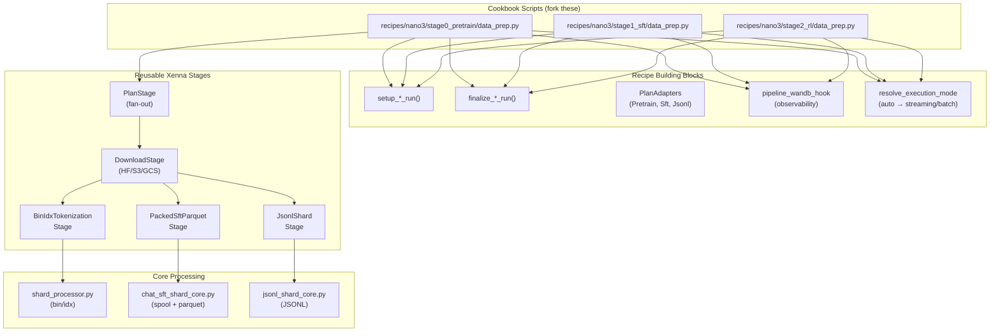

# nemotron.data_prep

Distributed data preparation for LLM training, built on cosmos-xenna pipelines.

## Overview

This module processes raw text data from HuggingFace, S3, or local sources into
training formats for Megatron-Bridge and Megatron-Core:

- **bin/idx** - Tokenized indexed datasets for pretraining
- **JSONL** - Structured records for SFT/RL (with optional transforms)
- **Packed Parquet** - Packed sequences with loss masking for Chat SFT

## Library / Cookbook Boundary

```
Library (shared infrastructure — will be extracted to a package):
    core/      — Planning, receipts, finalize, work items
    stages/    — Reusable xenna stages (PlanStage, DownloadStage, terminal stages)
    recipes/   — Pipeline building blocks (setup, execute, finalize, adapters)

Cookbook (fork and customize):
    recipes/nano3/   — Complete scripts for Nano3 model family
    recipes/super3/  — Complete scripts for Super3 model family

To customize: fork a cookbook script, modify the stage list.
```

Each cookbook `data_prep.py` script shows the full pipeline flow in one file:

```python
# Phase 1: Setup — deterministic hashing, work item creation
items, context, resolved_tok = setup_pretrain_run(blend, cfg.output_dir, cfg.tokenizer, ...)

# Phase 2: 3-stage pipeline (visible — add/swap/remove stages here)
if items:
    ctx = PipelineContext(...)
    stages = [
        StageSpec(PlanStage(cfg.plan, ctx, PretrainPlanAdapter()), num_workers=1),
        StageSpec(DownloadStage(cfg.download, ctx), num_workers_per_node=1),
        StageSpec(BinIdxTokenizationStage(cfg.tokenization, ctx), slots_per_actor=1),
    ]
    spec = pipelines_v1.PipelineSpec(
        input_data=items,
        stages=stages,
        config=pipelines_v1.PipelineConfig(
            execution_mode=resolve_execution_mode(stages, cfg.execution_mode),
        ),
    )
    with pipeline_wandb_hook(items, ctx, "pretrain"):
        pipelines_v1.run_pipeline(spec)

# Phase 3: Finalize — scan receipts, aggregate stats
result = finalize_pretrain_run(context, blend, cfg.output_dir)
```

## Architecture



## Module Structure

```
src/nemotron/data_prep/
├── __init__.py              # Public API exports
├── api.py                   # Public facade (recipe re-exports)
├── blend.py                 # DataBlend specification
├── config.py                # Configuration dataclasses
│
├── core/                    # Core processing logic
│   ├── __init__.py          # process_*_core function aliases
│   ├── chat_sft_shard_core.py # Chat SFT core processing
│   ├── chat_template.py     # Chat templating utilities
│   ├── finalize.py          # Receipt scanning & aggregation
│   ├── jsonl_shard_core.py  # JSONL core processing
│   ├── planning.py          # Shard planning & assignment
│   ├── providers.py         # Tokenizer factories
│   ├── receipt.py           # Receipt lifecycle (atomic writes, verification)
│   ├── shard_processor.py   # bin/idx core processing
│   └── work_items.py        # Work item dataclasses
│
├── formats/                 # Output format builders
│   ├── __init__.py
│   ├── indexed_dataset.py   # bin/idx writer
│   ├── jsonl_dataset.py     # JSONL writer
│   └── transforms.py        # Transform factories
│
├── observability/           # Observability utilities
│   ├── __init__.py          # W&B and stage naming exports
│   ├── stage_keys.py        # Stage naming conventions
│   └── wandb_hook.py        # W&B real-time logging (plan/progress/stage tables)
│
├── packing/                 # Sequence packing
│   ├── __init__.py
│   ├── algorithms.py        # Packing algorithms
│   ├── bin_assignment.py    # Bin assignment logic
│   ├── builder.py           # Sequence builder
│   ├── materialize.py       # Bin materialization
│   ├── spool.py             # Sequence spool I/O
│   └── writers.py           # Parquet shard writer
│
├── recipes/                 # Pipeline building blocks + convenience wrappers
│   ├── __init__.py
│   ├── execution_mode.py    # Execution mode auto-detection
│   ├── pretrain.py          # setup/finalize + PretrainPlanAdapter
│   ├── rl.py                # setup/finalize + JsonlPlanAdapter
│   └── sft.py               # setup/finalize + SftPlanAdapter
│
├── stages/                  # Reusable xenna pipeline stages
│   ├── __init__.py          # Stage + PlanAdapter exports
│   ├── context.py           # PipelineContext shared state
│   ├── download.py          # DownloadStage (HF/S3/GCS/local)
│   ├── jsonl_plan.py        # JsonlPlanStageConfig
│   ├── jsonl_write.py       # JsonlShardStage
│   ├── megatron_bin_idx.py  # BinIdxTokenizationStage
│   ├── packed_sft_parquet.py # PackedSftParquetStage
│   ├── plan.py              # PlanStage + PlanAdapter protocol
│   └── sft_plan.py          # SftPlanStageConfig
│
├── utils/                   # Utilities
│   ├── __init__.py
│   ├── discovery.py         # Dataset metadata fetching (HF API)
│   ├── filesystem.py        # Cloud-native file I/O (fsspec)
│   ├── hf_env.py            # HuggingFace environment
│   ├── hf_placeholder.py    # HF placeholder resolution
│   ├── size.py              # Size parsing & formatting
│   └── splits.py            # Split utilities
│
└── templates/
    └── nano3.jinja          # Nano3 chat template
```

## Quick Start

### Pretrain Pipeline (bin/idx)

```python
from nemotron.data_prep import DataBlend, run_pretrain_pipeline

blend = DataBlend.load("pretrain_blend.json")
result = run_pretrain_pipeline(
    blend=blend,
    output_dir="./output",
    tokenizer="nvidia/NVIDIA-Nemotron-Nano-9B-v2",
    num_shards=128,
)

print(f"Run hash: {result.run_hash}")
print(f"Total tokens: {result.total_tokens:,}")
```

### SFT Pipeline (Packed Parquet)

```python
from nemotron.data_prep import DataBlend, run_sft_pipeline

blend = DataBlend.load("sft_blend.json")
result = run_sft_pipeline(
    blend=blend,
    output_dir="./output",
    tokenizer="nvidia/NVIDIA-Nemotron-Nano-9B-v2",
    num_shards=64,
    chat_template="nano3",
    pack_size=4096,
)

print(f"Run hash: {result.run_hash}")
print(f"Total sequences: {result.total_sequences:,}")
```

## Output Formats

| Format | Recipe | Output | Use Case |
|--------|--------|--------|----------|
| bin/idx | `run_pretrain_pipeline()` | `.bin/.idx` pairs | Pretraining |
| Packed Parquet | `run_sft_pipeline()` | `.parquet` files | Chat SFT |
| JSONL | Stage scripts | `.jsonl` files | RL training |

## Built-in Transforms

For JSONL output (via stage scripts), use transforms to convert input records:

```python
from nemotron.data_prep.formats.transforms import (
    sft,           # SFT format: {input, output}
    openai_chat,   # OpenAI format: {messages: [...]}
    sharegpt,      # ShareGPT format: {conversations: [...]}
    passthrough,   # Pass records unchanged
    select,        # Select specific fields
    rename,        # Rename fields
)
```

## Full Documentation

See [docs/nemotron/data-prep.md](../../../docs/nemotron/data-prep.md) for complete API reference.

## Key Design Principles

1. **Xenna-based pipelines** - Distributed processing via cosmos-xenna stages
2. **Deterministic output** - Frozen shard plans ensure reproducibility
3. **Cloud-native** - fsspec for S3/GCS/local file handling
4. **Resumable** - Skip completed shards on restart via receipts
5. **Artifact tracking** - W&B integration for lineage

## Usage in Cookbook Recipes

Each training stage uses data_prep with the three-phase pattern (setup → pipeline → finalize):

| Stage | Building Blocks | Adapter | Output Format |
|-------|----------------|---------|---------------|
| Stage 0 (Pretrain) | `setup_pretrain_run` / `finalize_pretrain_run` | `PretrainPlanAdapter` | bin/idx |
| Stage 1 (SFT) | `setup_sft_run` / `finalize_sft_run` | `SftPlanAdapter` | Packed Parquet |
| Stage 2 (RL) | `setup_rl_run` / `finalize_rl_run` | `JsonlPlanAdapter` | JSONL |

Pipeline execution uses `pipeline_wandb_hook` (W&B observability) + `resolve_execution_mode` (auto-detect streaming/batch) + explicit `pipelines_v1.run_pipeline(spec)`.

Convenience wrappers (`run_pretrain_pipeline`, `run_sft_pipeline`, `run_rl_resolve_pipeline`)
are still available for simple usage.

See the stage-specific `data_prep.py` files in `nemotron/recipes/nano3/` or `nemotron/recipes/super3/` for examples.
