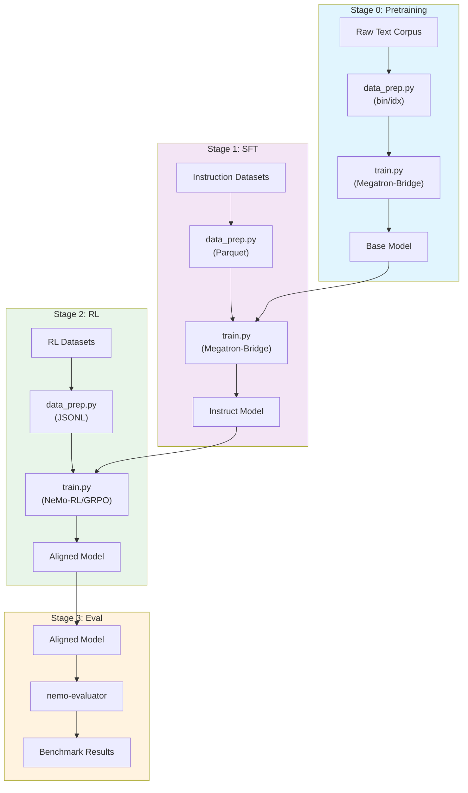
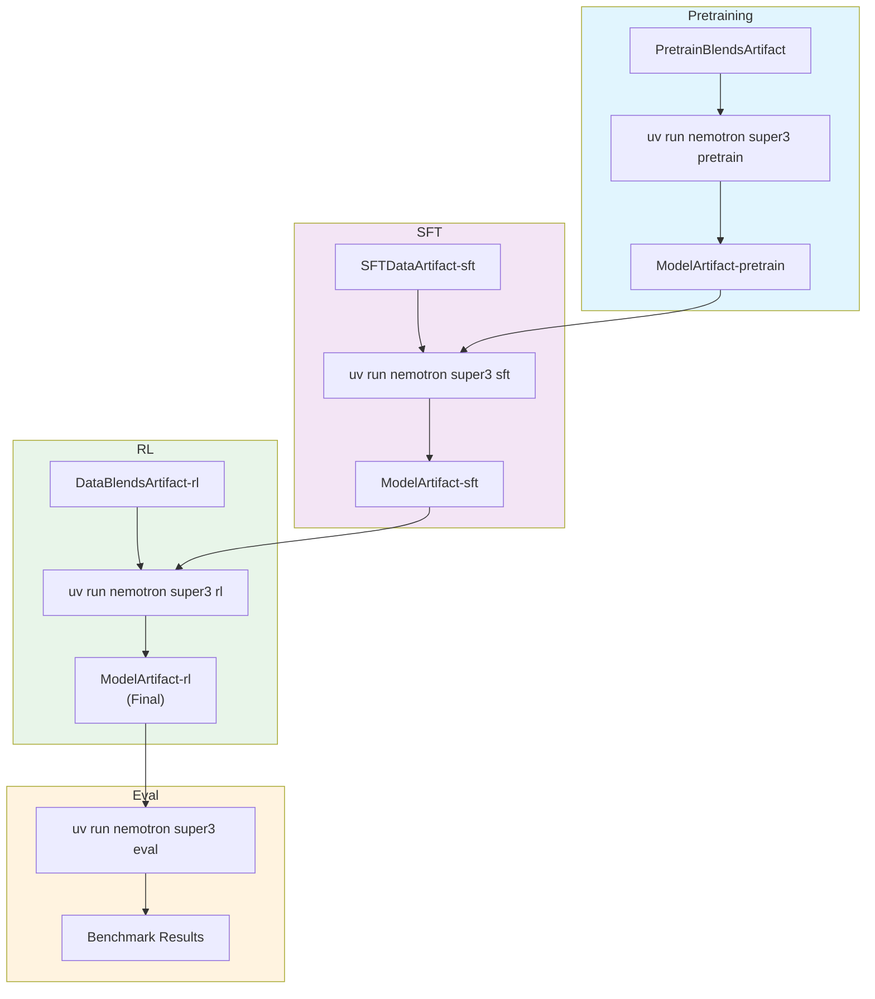

# Nemotron 3 Super Training Recipe

A complete 4-stage training pipeline for Nemotron 3 Super, a high-capacity hybrid Mamba-Transformer-MoE model with multi-token prediction and DeepEP.

## Model Overview

Nemotron 3 Super is a high-capacity hybrid Mamba-Transformer with sparse MoE, featuring multi-token prediction (MTP), shared experts, and DeepEP for efficient expert parallelism.

| Property | Value |
|----------|-------|
| Architecture | Hybrid Mamba-Transformer with sparse MoE |
| Multi-Token Prediction | Yes (MTP layers with 0.3 loss scaling) |
| Shared Experts | Yes |
| DeepEP | Supported |
| Training Stages | 4 (Pretrain → SFT → RL → Eval) |

## Training Pipeline



| Stage | Purpose | Framework | Output |
|-------|---------|-----------|--------|
| [Stage 0: Pretrain](./stage0_pretrain/) | Train on large text corpus | Megatron-Bridge | Base model checkpoint |
| [Stage 1: SFT](./stage1_sft/) | Instruction tuning | Megatron-Bridge | Instruction-following model |
| [Stage 2: RL](./stage2_rl/) | Alignment with GRPO | NeMo-RL | Final aligned model |
| [Stage 3: Eval](./stage3_eval/) | Model evaluation | NeMo-Evaluator | Benchmark results |

## Prerequisites

### v0 Requirements

> **Slurm Only**: This initial release has been tested exclusively with Slurm execution. Support for additional NeMo-Run executors (local, Docker, SkyPilot, DGX Cloud) is planned for future releases.

- **Slurm cluster**: GPU nodes (B200 recommended, 4 nodes for training)
- **Weights & Biases**: Required for experiment tracking and artifact lineage (future versions will be backend-agnostic)
- **Container images**: NeMo containers with Megatron-Bridge and NeMo-RL

### env.toml Setup

Create an `env.toml` file in your project root:

```toml
[wandb]
project = "nemotron"
entity = "YOUR-TEAM"

[YOUR-CLUSTER]
executor = "slurm"
account = "YOUR-ACCOUNT"
partition = "batch"
nodes = 4
ntasks_per_node = 8
gpus_per_node = 8
mounts = ["/lustre:/lustre"]
```

> **Note**: Container images are specified in the recipe config files (e.g., `config/tiny.yaml`), not in env.toml.

See [docs/nemo_runspec/nemo-run.md](../../../docs/nemo_runspec/nemo-run.md) for complete configuration options.

## Quick Start

### Full Pipeline

```bash
# Stage 0: Data prep + Pretraining
uv run nemotron super3 data prep pretrain --run YOUR-CLUSTER
uv run nemotron super3 pretrain --run YOUR-CLUSTER

# Stage 1: Data prep + SFT
uv run nemotron super3 data prep sft --run YOUR-CLUSTER
uv run nemotron super3 sft --run YOUR-CLUSTER

# Stage 2: Data prep + RL
uv run nemotron super3 data prep rl --run YOUR-CLUSTER
uv run nemotron super3 rl --run YOUR-CLUSTER

# Stage 3: Evaluation
uv run nemotron super3 eval --run YOUR-CLUSTER
```

### Testing with Tiny Config

Use the `tiny` config variant for quick testing:

```bash
# Quick test with small dataset sample
uv run nemotron super3 data prep pretrain --run YOUR-CLUSTER --sample 1000

# Quick training test (small model, few iterations)
uv run nemotron super3 pretrain -c tiny --run YOUR-CLUSTER
```

## CLI Commands

### Data Preparation

```bash
# Pretrain data: tokenize to Megatron bin/idx format
uv run nemotron super3 data prep pretrain [--run <profile>] [--sample N] [--force]

# SFT data: apply chat templates, tokenize to packed Parquet
uv run nemotron super3 data prep sft [--run <profile>] [--sample N] [--force]

# RL data: resolve HF placeholders, convert to JSONL
uv run nemotron super3 data prep rl [--run <profile>] [--sample N] [--force]
```

### Training

```bash
# Pretraining
uv run nemotron super3 pretrain [--run <profile>] [-c <config>] [overrides...]

# Supervised Fine-Tuning
uv run nemotron super3 sft [--run <profile>] [-c <config>] [overrides...]

# Reinforcement Learning
uv run nemotron super3 rl [--run <profile>] [-c <config>] [overrides...]

# Evaluation
uv run nemotron super3 eval [--run <profile>] [-t <task>] [overrides...]
```

### Execution Options

| Option | Description |
|--------|-------------|
| `--run <profile>` | **Attached** - submits job and waits, streaming logs to terminal |
| `--batch <profile>` | **Detached** - submits job and exits immediately |
| `-c <config>` | Select config file (e.g., `-c tiny` for testing) |
| `--dry-run` | Preview what would be executed |
| `key=value` | Override config values (Hydra-style) |

#### When to use `--run` vs `--batch`

- **`--run`**: Interactive development, debugging, short test runs where you want to see logs in real-time
- **`--batch`**: Long training runs (hours/days), submitting multiple jobs, overnight/unattended runs

## Configuration Files

Each stage has a `config/` directory with:

| File | Purpose |
|------|---------|
| `default.yaml` | Production configuration template |
| `tiny.yaml` | Testing variant (small model, few iterations) |
| `data_prep/default.yaml` | Data preparation configuration |
| `data_prep/data_blend_raw.json` | Dataset blend specification |

Override config values on the command line:

```bash
# Override training iterations
uv run nemotron super3 pretrain -c tiny train.train_iters=5000

# Override batch size
uv run nemotron super3 sft -c tiny train.global_batch_size=8
```

## Artifact Flow

The pipeline uses W&B Artifacts to track lineage between stages:



Artifacts are automatically linked when you run stages in sequence, providing full traceability from raw data to final model.

## Execution Methods

### nemotron CLI (Recommended)

The main entrypoint integrates with [NeMo-Run](https://github.com/NVIDIA-NeMo/Run) for streamlined execution:

```bash
# Submit to Slurm cluster
uv run nemotron super3 pretrain -c tiny --run YOUR-CLUSTER

# Check execution plan before submitting
uv run nemotron super3 pretrain -c tiny --run YOUR-CLUSTER --dry-run
```

### Direct Script Execution

Scripts can be executed directly inside a container on a compute node (useful for debugging):

```bash
# Inside container on compute node
cd src/nemotron/recipes/super3/stage0_pretrain
python train.py --config config/tiny.yaml

# With torchrun for distributed training
torchrun --nproc_per_node=8 train.py --config config/tiny.yaml
```

## Stage Documentation

- [Stage 0: Pretraining](./stage0_pretrain/README.md) - Pretrain on large text corpus
- [Stage 1: SFT](./stage1_sft/README.md) - Supervised fine-tuning for instruction following
- [Stage 2: RL](./stage2_rl/README.md) - Reinforcement learning for alignment
- [Stage 3: Eval](./stage3_eval/README.md) - Model evaluation and benchmarking

## Further Reading

- [NeMo-Run Configuration](../../../docs/nemo_runspec/nemo-run.md) - Complete guide to env.toml and execution profiles
- [Recipes Overview](../README.md) - General information about Nemotron recipes
