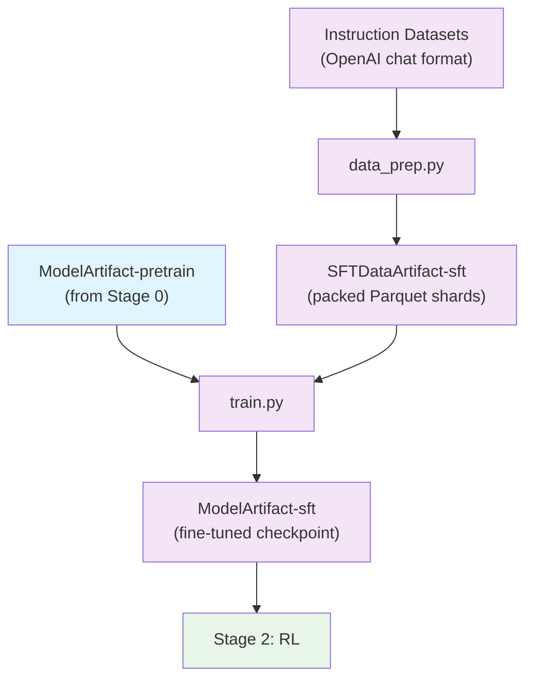

# Stage 1: Supervised Fine-Tuning (SFT)

Fine-tune the pretrained model to follow instructions using Megatron-Bridge.

## Overview

This stage takes instruction-following datasets in OpenAI chat format, applies chat templates with role-based loss masking, packs sequences into Parquet shards, and fine-tunes the pretrained model. The output is an instruction-following model ready for alignment training.

| Component | Description |
|-----------|-------------|
| `data_prep.py` | Applies chat templates, tokenizes to packed Parquet format |
| `train.py` | Runs supervised fine-tuning using Megatron-Bridge |
| `config/` | Configuration files for data prep and training |

## Quick Start

### Using nemotron CLI (Recommended)

```bash
# 1. Prepare data (apply chat templates, tokenize to packed Parquet)
uv run nemotron super3 data prep sft --run YOUR-CLUSTER

# 2. Run SFT
uv run nemotron super3 sft --run YOUR-CLUSTER

# Quick test with tiny config
uv run nemotron super3 sft -c tiny --run YOUR-CLUSTER
```

### Direct Script Execution

Inside a container on a compute node:

```bash
# Data preparation
python data_prep.py --config config/data_prep/default.yaml

# Training (single node)
python train.py --config config/tiny.yaml

# Training (distributed)
torchrun --nproc_per_node=8 train.py --config config/tiny.yaml
```

## Data Preparation

The `data_prep.py` script processes OpenAI-format chat data into packed Parquet sequences with role-based loss masking using a 3-stage Ray pipeline: `SftPlanStage → DownloadStage → PackedSftParquetStage`.

### Pipeline

1. **Apply chat template** → Role-labeled chunks (system, user, assistant)
2. **Tokenize** → input_ids with role boundaries
3. **Build loss_mask** → 0 for system/user tokens, 1 for assistant tokens
4. **Pack sequences** → Efficient batching up to `pack_size` tokens
5. **Split by ratio** → train/, valid/, test/ Parquet shards

### CLI Command

```bash
uv run nemotron super3 data prep sft [options]
```

| Option | Description |
|--------|-------------|
| `--run <profile>` | Execute on Slurm via NeMo-Run |
| `--sample N` | Limit rows per dataset (for testing) |
| `--force` | Force re-run, ignoring cache |

### Input

OpenAI chat format datasets defined in `config/data_prep/data_blend_raw.json`:

```json
{
  "datasets": [
    {
      "name": "dataset-name",
      "path": "hf-org/dataset",
      "split": "train",
      "weight": 1.0
    }
  ]
}
```

Expected record format:

```json
{
  "messages": [
    {"role": "system", "content": "You are a helpful assistant."},
    {"role": "user", "content": "Hello!"},
    {"role": "assistant", "content": "Hi there!"}
  ]
}
```

Records are filtered by `used_in_filter: super_v3` to select only records tagged for Super3 training.

### Output

```
output/stage1_sft/
├── blend.json          # Per-split manifest
├── splits/
│   ├── train/          # Training Parquet shards
│   ├── valid/          # Validation Parquet shards
│   └── test/           # Test Parquet shards
└── runs/{run_hash}/    # Actual Parquet shard files
```

Each Parquet file contains packed sequences with `input_ids`, `loss_mask`, and `seq_start_id` columns.

The output is registered as a W&B Artifact (`SFTDataArtifact-sft`) for lineage tracking.

### Configuration

`config/data_prep/default.yaml`:

```yaml
blend_path: config/data_prep/data_blend_raw.json
output_dir: output/stage1_sft
num_shards: 128
tokenizer:
  model: nvidia/NVIDIA-Nemotron-3-Super-XXB-Base-BF16
  add_bos: false
  add_eos: true
pack_size: 4096
algorithm: first_fit_shuffle
parquet_compression: zstd
chat_template: super3
messages_field: messages
tools_field: tools
used_in_filter: super_v3
train_ratio: 0.98
valid_ratio: 0.01
test_ratio: 0.01
```

| Parameter | Description |
|-----------|-------------|
| `pack_size` | Maximum tokens per packed sequence |
| `chat_template` | Template name (`super3`) or path to .jinja file |
| `messages_field` | Field containing OpenAI-format messages |
| `tools_field` | Field containing tool definitions |
| `used_in_filter` | Only include records where `used_in` contains this value |
| `algorithm` | Packing algorithm: `first_fit_shuffle`, `first_fit_decreasing`, `concatenative` |

## Training

The `train.py` script runs supervised fine-tuning using Megatron-Bridge with the `nemotron_3_super_finetune_config` recipe.

### CLI Command

```bash
uv run nemotron super3 sft [options] [overrides...]
```

| Option | Description |
|--------|-------------|
| `--run <profile>` | Attached execution on Slurm |
| `--batch <profile>` | Detached execution (submit and exit) |
| `-c <config>` | Config file (e.g., `-c tiny` for testing) |
| `--dry-run` | Preview execution plan |
| `key=value` | Override config values (Hydra-style) |

### Input

- **Model**: Pretrained checkpoint from Stage 0 (`ModelArtifact-pretrain`)
- **Data**: `SFTDataArtifact-sft` (from data prep)
- **Config**: `config/default.yaml` or `config/tiny.yaml`

### Output

- Fine-tuned model checkpoints saved to `/nemo_run/sft`
- Registered as W&B Artifact (`ModelArtifact-sft`) for downstream RL stage

### Configuration Files

| File | Purpose |
|------|---------|
| `config/default.yaml` | Production configuration (1700 iterations) |
| `config/tiny.yaml` | Testing variant (100 iterations) |
| `config/data_prep/default.yaml` | Data preparation configuration |
| `config/data_prep/data_blend_raw.json` | Full dataset blend |
| `config/data_prep/data_blend_tiny.json` | Small blend for testing |

#### config/default.yaml

```yaml
run:
  data: SFTDataArtifact-sft:latest
  model: pretrain:latest
  env:
    container: gitlab-master.nvidia.com/dl/joc/nemo-ci/liding_r25.11-super-v3/train:pipe.44680568

recipe:
  _target_: megatron.bridge.recipes.nemotronh.nemotron_3_super.nemotron_3_super_finetune_config
  packed_sequence: true
  peft: null  # Disable LoRA, do full SFT

dataset:
  super3_packed_sft_dir: ${art:data,path}
  seq_length: ${art:data,pack_size}
  packed_sequence_specs:
    packed_sequence_size: ${art:data,pack_size}

train:
  train_iters: 1700
  global_batch_size: 4

checkpoint:
  save: /nemo_run/sft
  save_interval: 20
  pretrained_checkpoint: ${art:model,path}
  finetune: true
```

### Override Examples

```bash
# More training iterations
uv run nemotron super3 sft -c tiny train.train_iters=5000

# Different batch size
uv run nemotron super3 sft -c tiny train.global_batch_size=8

# Load specific pretrained checkpoint
uv run nemotron super3 sft -c tiny run.model=pretrain:v2
```

## Running with NeMo-Run

The nemotron CLI uses [NeMo-Run](https://github.com/NVIDIA-NeMo/Run) for job orchestration.

### env.toml Setup

Configure execution profiles in `env.toml`:

```toml
[wandb]
project = "nemotron"
entity = "YOUR-TEAM"

[YOUR-CLUSTER]
executor = "slurm"
account = "YOUR-ACCOUNT"
partition = "batch"
nodes = 4
ntasks_per_node = 8
gpus_per_node = 8
mounts = ["/lustre:/lustre"]
```

> **Note**: Container images are specified in the recipe config files (e.g., `config/tiny.yaml`), not in env.toml.

### Execution Modes

```bash
# Attached (wait for completion)
uv run nemotron super3 sft -c tiny --run YOUR-CLUSTER

# Detached (submit and exit)
uv run nemotron super3 sft -c tiny --batch YOUR-CLUSTER

# Preview without executing
uv run nemotron super3 sft -c tiny --run YOUR-CLUSTER --dry-run
```

See [docs/nemo_runspec/nemo-run.md](../../../../docs/nemo_runspec/nemo-run.md) for complete configuration options.

## Artifact Lineage



## Next Steps

After SFT completes, proceed to [Stage 2: RL](../stage2_rl/README.md) for alignment training.

## Previous Stage

- [Stage 0: Pretraining](../stage0_pretrain/README.md) - Pretrain the base model
