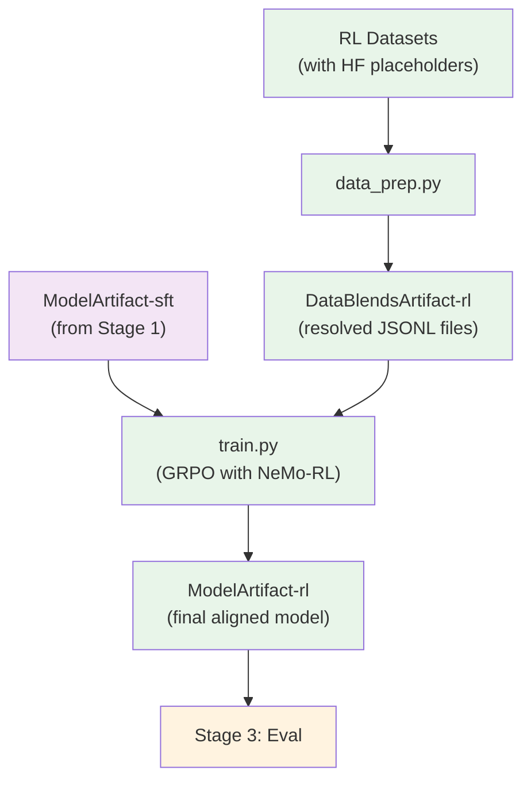

# Stage 2: Reinforcement Learning (RL)

Align the instruction-tuned model using GRPO (Group Relative Policy Optimization) with NeMo-RL.

## Overview

This stage takes the SFT model and further aligns it using reinforcement learning. The GRPO algorithm optimizes the policy based on reward signals from NeMo-Gym environments (math, code generation, workplace assistant, etc.), producing a final aligned model.

| Component | Description |
|-----------|-------------|
| `data_prep.py` | Resolves HF placeholder records, converts to JSONL format |
| `train.py` | Runs GRPO training using NeMo-RL with Ray |
| `config/` | Configuration files for data prep and training |

## Quick Start

### Using nemotron CLI (Recommended)

```bash
# 1. Prepare data (resolve placeholders, convert to JSONL)
uv run nemotron super3 data prep rl --run YOUR-CLUSTER

# 2. Run RL training
uv run nemotron super3 rl --run YOUR-CLUSTER

# Quick test with tiny config
uv run nemotron super3 rl -c tiny --run YOUR-CLUSTER
```

### Direct Script Execution

Inside a container on a compute node (requires NeMo-RL and Ray):

```bash
# Data preparation
python data_prep.py --config config/data_prep/default.yaml

# Training (Ray will be initialized internally)
python train.py --config config/default.yaml
```

## Data Preparation

The `data_prep.py` script resolves HuggingFace placeholder records and converts datasets to JSONL format compatible with NeMo-RL's NeMo-Gym interface.

### Placeholder Resolution

The source dataset (`Nemotron-3-Super-RL-Training-Blend`) contains placeholder records that reference external HF datasets (DAPO, Skywork). The data prep script:

1. Detects placeholder records by the presence of `_hf_placeholder` field
2. Fetches the actual data from the external HF dataset
3. Applies template restoration (DAPO prefix/suffix, Skywork `{question}` replacement)
4. Outputs resolved JSONL with train/val/test splits

### CLI Command

```bash
uv run nemotron super3 data prep rl [options]
```

| Option | Description |
|--------|-------------|
| `--run <profile>` | Execute on Slurm via NeMo-Run |
| `--sample N` | Limit rows per dataset (for testing) |
| `--force` | Force re-run, ignoring cache |

### Input

RL datasets defined in `config/data_prep/data_blend_raw.json` with placeholder records referencing external datasets.

### Output

```
output/stage2_rl_resolved/
├── train/
│   └── data.jsonl       # Training data in NeMo-Gym format
├── val/
│   └── data.jsonl       # Validation data
├── test/
│   └── data.jsonl       # Test data
└── manifest.json        # Split paths and statistics
```

The output is registered as a W&B Artifact (`DataBlendsArtifact-rl`) for lineage tracking.

### Configuration

`config/data_prep/default.yaml`:

```yaml
blend_path: config/data_prep/data_blend_raw.json
output_dir: output/stage2_rl_resolved
sample: null
force: false
```

## Training

The `train.py` script runs GRPO training using NeMo-RL with Ray for distributed execution. It includes support for Megatron-to-HuggingFace checkpoint conversion and NeMo-Gym environments.

### CLI Command

```bash
uv run nemotron super3 rl [options] [overrides...]
```

| Option | Description |
|--------|-------------|
| `--run <profile>` | Attached execution on Slurm |
| `--batch <profile>` | Detached execution (submit and exit) |
| `-c <config>` | Config file (e.g., `-c tiny` for testing) |
| `--dry-run` | Preview execution plan |
| `key=value` | Override config values (Hydra-style) |

### Input

- **Model**: SFT checkpoint from Stage 1 (`ModelArtifact-sft`)
- **Data**: `DataBlendsArtifact-rl` (from data prep)
- **Config**: `config/default.yaml` or `config/tiny.yaml`

### Output

- Aligned model checkpoints
- Training logs and metrics
- Registered as W&B Artifact (`ModelArtifact-rl`)

### Configuration Files

| File | Purpose |
|------|---------|
| `config/default.yaml` | Production GRPO configuration (32 nodes) |
| `config/tiny.yaml` | Testing variant (1 node, 10 steps) |
| `config/data_prep/default.yaml` | Data preparation configuration |
| `config/data_prep/data_blend_raw.json` | RL dataset blend |

### Key Configuration Sections

```yaml
grpo:
  num_prompts_per_step: 128
  num_generations_per_prompt: 16
  max_num_steps: 1000000
  normalize_rewards: true
  val_period: 5

policy:
  model_name: "/path/to/hf_checkpoint"
  tokenizer:
    name: nvidia/NVIDIA-Nemotron-3-Super-XXB-Base-BF16
  train_global_batch_size: 2048
  precision: "bfloat16"
  generation:
    backend: "vllm"
    colocated:
      enabled: true

env:
  nemo_gym:
    config_paths:
    - math_with_judge/configs/math_with_judge.yaml
    - code_gen/configs/code_gen.yaml
    - workplace_assistant/configs/workplace_assistant.yaml
    # ... additional environments

cluster:
  gpus_per_node: 8
  num_nodes: 32
```

### Override Examples

```bash
# Fewer steps for testing
uv run nemotron super3 rl -c tiny grpo.max_num_steps=100

# Different temperature
uv run nemotron super3 rl -c tiny policy.generation.temperature=0.8

# Different learning rate
uv run nemotron super3 rl -c tiny policy.megatron_cfg.optimizer.lr=5e-7
```

## Running with NeMo-Run

The nemotron CLI uses [NeMo-Run](https://github.com/NVIDIA-NeMo/Run) for job orchestration. RL training uses Ray internally for distributed execution.

### env.toml Setup

Configure execution profiles in `env.toml`:

```toml
[wandb]
project = "nemotron"
entity = "YOUR-TEAM"

[YOUR-CLUSTER]
executor = "slurm"
account = "YOUR-ACCOUNT"
partition = "batch"
nodes = 32
ntasks_per_node = 8
gpus_per_node = 8
mem = "0"
exclusive = true
mounts = ["/lustre:/lustre"]
```

> **Note**: Container images are specified in the recipe config files (e.g., `config/tiny.yaml`), not in env.toml.

### Execution Modes

```bash
# Attached (wait for completion)
uv run nemotron super3 rl -c tiny --run YOUR-CLUSTER

# Detached (submit and exit)
uv run nemotron super3 rl -c tiny --batch YOUR-CLUSTER

# Preview without executing
uv run nemotron super3 rl -c tiny --run YOUR-CLUSTER --dry-run
```

See [docs/nemo_runspec/nemo-run.md](../../../../docs/nemo_runspec/nemo-run.md) for complete configuration options.

## GRPO Algorithm

GRPO (Group Relative Policy Optimization) is a reinforcement learning algorithm that:

1. **Generates responses** from the current policy using vLLM
2. **Evaluates** responses using NeMo-Gym reward environments (math, code, etc.)
3. **Computes group-relative advantages** across response groups
4. **Updates the policy** to favor higher-reward responses

Key features:
- Colocated inference (training and generation share GPUs)
- Megatron-based distributed training with expert parallelism
- Sequence packing for efficient batching
- Multi-environment reward evaluation (math, code gen, workplace assistant, MCQA, instruction following, structured outputs)

## Artifact Lineage



## Requirements

- **NeMo-RL**: Required for GRPO training
- **Ray**: Automatically initialized for distributed execution
- **NeMo-Gym**: Provides reward environments
- **GPU nodes**: 32 nodes with 8 GPUs each (production), 1 node for testing

## Previous Stages

- [Stage 0: Pretraining](../stage0_pretrain/README.md) - Pretrain the base model
- [Stage 1: SFT](../stage1_sft/README.md) - Instruction tuning

## Next Steps

After RL completes, proceed to [Stage 3: Eval](../stage3_eval/README.md) for model evaluation.
