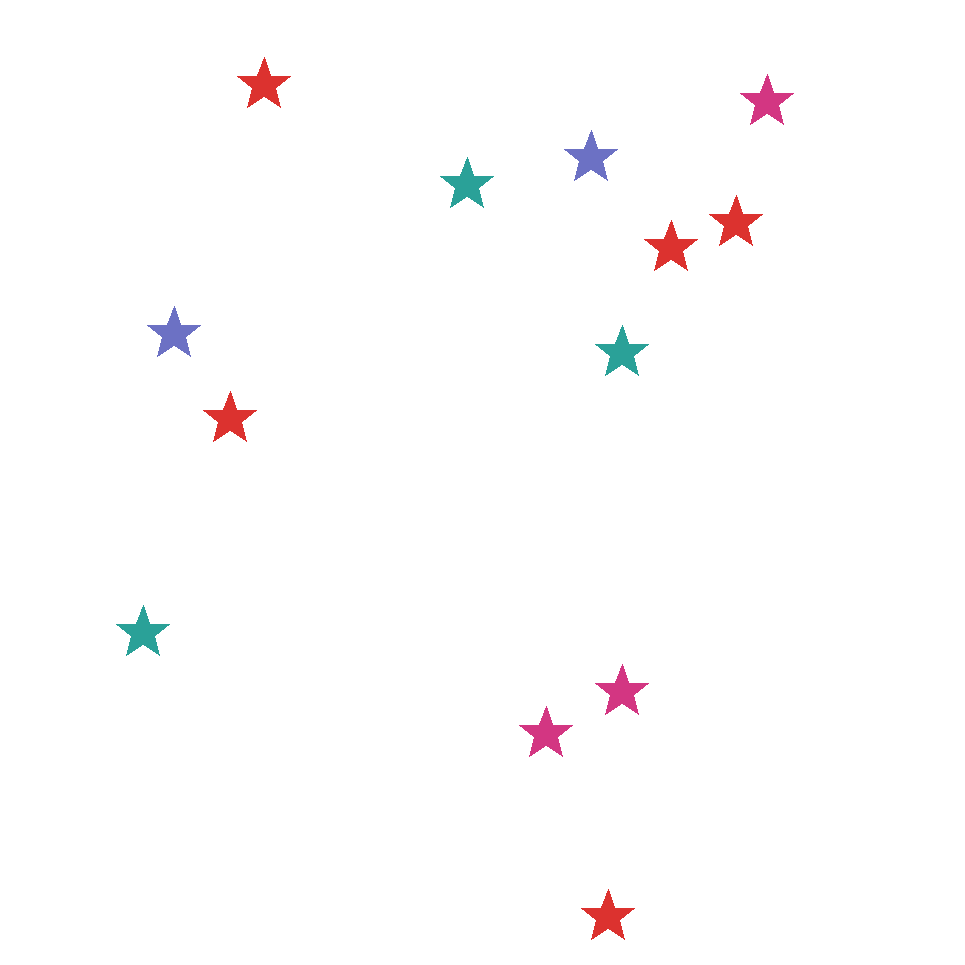
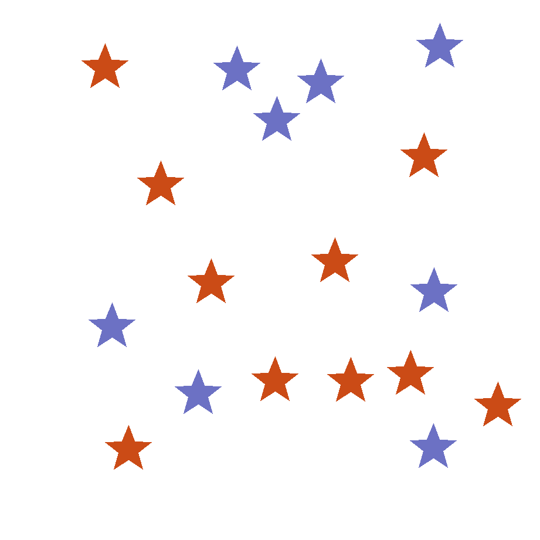
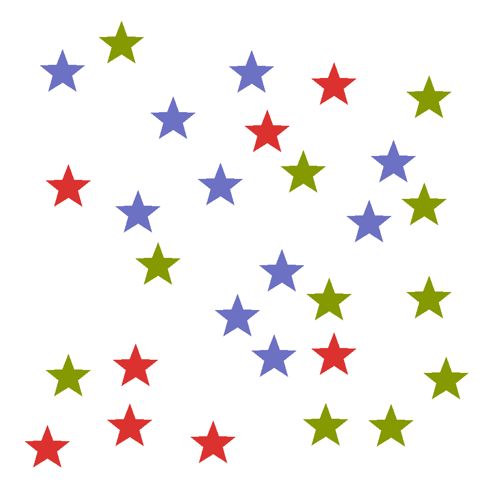

# GRPO with Nemotron 3.5 Super VL and NeMo Gym Star Count

A page of colored stars looks like a simple visual puzzle. Solving it reliably,
however, requires a multimodal model to find the relevant objects, distinguish
their colors, count them, and follow a precise answer format. This guide turns
that compact task into an end-to-end reinforcement learning example with a
clear, automatically verifiable reward.

The workflow uses NeMo RL's Megatron backend for full-weight GRPO, colocated
vLLM for generation, and NeMo Gym for task execution and verification. Begin
with the repository, container, checkpoint, and shared-storage setup in
[`../README.md`](../README.md), then use
[`super_vl_3_5_star_count_megatron.yaml`](super_vl_3_5_star_count_megatron.yaml)
for training.

## The learning task

Each example presents a square image containing colored stars and asks the
policy to count the stars of one specified color. The model returns its final
answer in `\boxed{}` format. NeMo Gym extracts the boxed integer and compares
it with the count in the example metadata:

- a correct count receives reward `1.0`;
- an incorrect, missing, or malformed count receives reward `0.0`.

There is no partial credit and no judge model. Exact-match accuracy therefore
combines several behaviors: perceiving and counting the target stars, emitting
a parseable integer, and following the required boxed-answer format. Report
format coverage alongside accuracy before attributing a gain to visual
counting alone.

The environment is a single-turn `circle_count_simple_agent` interaction with
no tools. The generator retains the verifier's `circles` metadata key for
compatibility, while the rendered images and prompts contain stars throughout.
This compatibility path was validated with NeMo RL commit `eb420d15034c` and
its pinned NeMo Gym commit `14317ecb50bd`. Recheck the verifier before moving
the recipe to another NeMo Gym revision because it depends on the verifier
reading only each item's `color` field.

## Dataset design

The deterministic generator creates two disjoint splits:

| Split | Examples | Seeds |
| --- | ---: | --- |
| Training | 1,024 | 0–1,023 |
| Validation | 256 | 1,000,000–1,000,255 |

For every example, it samples a square canvas from 800 x 800 through
1,200 x 1,200 pixels, draws 1–30 non-overlapping stars, and selects 2–4 colors
from a fixed eight-color palette. Every selected color appears at least once,
so each question has a positive answer. The PNG is embedded in its JSONL row
as a base64 data URL, which keeps every example self-contained across workers.

The palette follows the original synthetic task. Its red, orange, and pink
tones are closer than its other colors, and yellow appears as a dark gold.
This can make color identification part of the task rather than a perfectly
controlled counting variable. Keep the palette fixed when comparing runs, or
replace it with a perceptually validated palette and regenerate both splits.

### Sample examples

The following examples come directly from the deterministic training split.
Together they show how the same task ranges from a sparse scene to a more
crowded visual counting problem.

<table>
  <tr>
    <td width="50%">
      <br>
      <strong>Prompt:</strong> How many cyan stars are in the image?<br>
      <strong>Expected response:</strong> <code>\boxed{1}</code>
    </td>
    <td width="50%">
      <br>
      <strong>Prompt:</strong> How many red stars are in the image?<br>
      <strong>Expected response:</strong> <code>\boxed{5}</code>
    </td>
  </tr>
  <tr>
    <td width="50%">
      <br>
      <strong>Prompt:</strong> How many orange stars are in the image?<br>
      <strong>Expected response:</strong> <code>\boxed{10}</code>
    </td>
    <td width="50%">
      <br>
      <strong>Prompt:</strong> How many red stars are in the image?<br>
      <strong>Expected response:</strong> <code>\boxed{8}</code>
    </td>
  </tr>
</table>

## Configuration overview

The reference recipe uses the following settings:

| Component | Setting |
| --- | --- |
| Algorithm | Synchronous GRPO |
| Backend | Megatron, full-weight BF16 |
| Resources | 4 nodes x 4 GPUs |
| Training parallelism | TP=4, EP=16 |
| Generation | Colocated vLLM, TP=4 |
| Rollout batch | 16 prompts x 8 generations |
| Policy global batch | 128 responses |
| Validation | 256 held-out examples, greedy decoding |
| Evaluation cadence | Before RL, then every 2 steps through step 10 |
| Maximum response length | 256 tokens |
| Training coverage | 160 prompts: the first 160 rows of the 1,024-row split |
| Checkpointing | Disabled; the example does not save trained weights |

The 16 x 8 rollout batch gives GRPO eight candidate responses for each prompt.
NeMo RL converts their binary rewards into group-relative advantages using
reward normalization and a leave-one-out baseline. Reward shaping and reward
scaling remain disabled.

The policy trains both the language and vision components. During each
colocated weight refit, the recipe temporarily moves distributed optimizer
state out of GPU memory so the full tensor-parallel weight gather has enough
headroom.

The ten-step schedule is a smoke test and short convergence demonstration
rather than a full dataset epoch: 10 steps x 16 prompts consume 160 rows. With
`data.shuffle: false`, these are rows 0–159 in seed order. Increase the step
count or enable shuffling for broader training coverage. `max_num_epochs` is
set explicitly to one because the step limit ends this example before the
first epoch completes.

TP=4 shards dense and attention tensors across four ranks. EP=16 independently
distributes the model's 512 routed experts across all 16 GPUs, leaving 32
routed experts per expert-parallel rank. The TP and EP values describe
different parallel dimensions and do not imply a 64-GPU allocation.

The environment helper explicitly exports `NRL_VLLM_USE_V1=1` and
`VLLM_ATTENTION_BACKEND=FLASH_ATTN` to match the reference run. At the pinned
NeMo RL commit, V1 is already the default and the inherited recipe also sets
the vLLM attention backend to `FLASH_ATTN`; keeping both exports makes those
runtime choices visible and protects reproduction from ambient settings.

## Generate the train and validation data

Run the generator inside the NeMo RL container or from an attached allocation.
The commands use the `/shared` layout established in the parent README:

```bash
export NEMO_RL=/shared/code/RL
export NEMOTRON_REPO=/shared/code/Nemotron
export MODEL_DIR=/shared/models/NVIDIA-Nemotron-3.5-Super-VL-09212026
export DATA_DIR=/shared/runs/super35-star-count/data
export GENERATOR="${NEMOTRON_REPO}/usage-cookbook/Nemotron-3.5-Super-VL/RL/grpo-star-count-nemo-gym/prepare_star_count_data.py"
mkdir -p "${DATA_DIR}"

python "${GENERATOR}" \
  --out "${DATA_DIR}/train.jsonl" \
  --num-samples 1024 \
  --seed-offset 0 \
  --canvas-size-min 800 \
  --canvas-size-max 1200 \
  --radius-min 24 \
  --radius-max 48 \
  --num-stars-min 1 \
  --num-stars-max 30 \
  --num-colors-min 2 \
  --num-colors-max 4

python "${GENERATOR}" \
  --out "${DATA_DIR}/validation.jsonl" \
  --num-samples 256 \
  --seed-offset 1000000 \
  --canvas-size-min 800 \
  --canvas-size-max 1200 \
  --radius-min 24 \
  --radius-max 48 \
  --num-stars-min 1 \
  --num-stars-max 30 \
  --num-colors-min 2 \
  --num-colors-max 4
```

Validate the row counts, image dimensions, star bounds, agent routing, and
split separation before launching training:

```bash
python - <<'PY'
import base64
import hashlib
import io
import json
import os
from pathlib import Path

from PIL import Image

root = Path(os.environ['DATA_DIR'])
fingerprints = {}

for split, expected in [('train', 1024), ('validation', 256)]:
    rows = [
        json.loads(line)
        for line in (root / f'{split}.jsonl').read_text().splitlines()
    ]
    assert len(rows) == expected
    assert all(
        row['agent_ref']['name'] == 'circle_count_simple_agent'
        for row in rows
    )
    assert all(1 <= len(row['circles']) <= 30 for row in rows)

    for row in rows:
        content = row['responses_create_params']['input'][1]['content']
        image_url = content[0]['image_url']
        image_bytes = base64.b64decode(image_url.split(',', 1)[1])
        image = Image.open(
            io.BytesIO(image_bytes)
        )
        assert image.width == image.height
        assert 800 <= image.width <= 1200
        assert 'stars' in content[1]['text']
        target_color = row['target_color']
        target_count = sum(
            star['color'] == target_color for star in row['circles']
        )
        assert target_count > 0

    fingerprints[split] = set()
    for row in rows:
        image_url = row['responses_create_params']['input'][1]['content'][0]['image_url']
        image_bytes = base64.b64decode(image_url.split(',', 1)[1])
        fingerprints[split].add(hashlib.sha256(image_bytes).hexdigest())

assert fingerprints['train'].isdisjoint(fingerprints['validation'])
print('Star-count train and validation splits are valid and disjoint.')
PY
```

### Check the image-token budget

Pixel dimensions do not directly determine sequence length. The model's image
processor resizes each image to a dynamic patch grid and then applies spatial
downsampling. Check the generated files with the same processor used for
training:

```bash
export TOKEN_CHECKER="${NEMOTRON_REPO}/usage-cookbook/Nemotron-3.5-Super-VL/RL/grpo-star-count-nemo-gym/check_image_token_budget.py"

python "${TOKEN_CHECKER}" \
  --model-dir "${MODEL_DIR}" \
  --max-sequence-length 4096 \
  --text-reserve 512 \
  --response-reserve 256 \
  "${DATA_DIR}/train.jsonl" \
  "${DATA_DIR}/validation.jsonl"
```

For the validated checkpoint, the 800–1,200-pixel square images produce
625–1,444 image tokens. The conservative check reserves another 512 tokens for
the prompt and 256 for the response, for a maximum budget of 2,212 tokens.
The fixed 512-token text allowance is conservative by construction rather
than a measurement of each rendered prompt. The total fits within the
4,096-token limit. In the reference run, all 256 validation rows were
processed at every evaluation and the largest observed prompt-plus-response
sequence was 1,766 tokens. Repeat this check whenever the checkpoint, image
processor, resolution range, or prompt template changes.

## Interactive run

Use an interactive allocation when bringing up the recipe for the first time,
inspecting logs, or trying configuration overrides. From the login node, set
the scheduler and container values for your cluster. The parent README defines
`SHARED_ROOT`, `NEMO_RL`, `CONTAINER`, and the `/shared` mount convention used
below:

```bash
export NUM_NODES=4
export GPUS_PER_NODE=4
export SLURM_ACCOUNT=<SLURM_ACCOUNT>
export PARTITION=<SLURM_PARTITION>
export CONTAINER=<NEMO_RL_CONTAINER_OR_SQUASHFS>
export MOUNTS="${SHARED_ROOT}:${SHARED_ROOT},${SHARED_ROOT}:/shared"
unset COMMAND

cd "${NEMO_RL}"
sbatch \
  --nodes="${NUM_NODES}" \
  --account="${SLURM_ACCOUNT}" \
  --partition="${PARTITION}" \
  --job-name=interactive-super-vl-star-count \
  --time=04:00:00 \
  --gres=gpu:"${GPUS_PER_NODE}" \
  --exclusive \
  ray.sub
```

After the allocation starts, attach with the helper created by `ray.sub`:

```bash
cd "${NEMO_RL}"
bash ./<jobid>-attach.sh
```

Inside the attached container, configure persistent caches and launch the
training driver:

```bash
export NEMOTRON_REPO=/shared/code/Nemotron
export RUN_DIR=/shared/runs/super35-star-count
export SETUP_ENV="${NEMOTRON_REPO}/usage-cookbook/Nemotron-3.5-Super-VL/RL/grpo-star-count-nemo-gym/setup_star_count_env.sh"
source "${SETUP_ENV}"

cd "${NEMO_RL}"
python -u examples/nemo_gym/run_grpo_nemo_gym.py \
  --config "${RECIPE}" \
  policy.model_name="${MODEL_DIR}" \
  policy.tokenizer.name="${MODEL_DIR}" \
  logger.log_dir="${RUN_DIR}/logs"
```

For a pipeline check without external experiment tracking, append
`logger.wandb_enabled=false`. To use W&B, provide `WANDB_API_KEY` through the
job environment or a protected environment file.

## Batch run

For an unattended experiment, create a driver script on shared storage and
pass its container path to `ray.sub` through `COMMAND`. Run the following setup
from the login node:

```bash
export RUN_NAME=super35-star-count-$(date +%Y%m%d-%H%M%S)
export HOST_RUN_DIR="${SHARED_ROOT}/runs/${RUN_NAME}"
export RUN_SCRIPT="${HOST_RUN_DIR}/run.sh"
mkdir -p "${HOST_RUN_DIR}"

cat > "${RUN_SCRIPT}" <<'RUN'
#!/usr/bin/env bash
set -euo pipefail

: "${RUN_NAME:?RUN_NAME must be exported before submission}"

export NEMO_RL=/shared/code/RL
export NEMOTRON_REPO=/shared/code/Nemotron
export RUN_DIR="/shared/runs/${RUN_NAME}"
export CACHE_DIR=/shared/runs/super35-star-count/cache
export SETUP_ENV="${NEMOTRON_REPO}/usage-cookbook/Nemotron-3.5-Super-VL/RL/grpo-star-count-nemo-gym/setup_star_count_env.sh"
source "${SETUP_ENV}"

cd "${NEMO_RL}"
exec python -u examples/nemo_gym/run_grpo_nemo_gym.py \
  --config "${RECIPE}" \
  policy.model_name="${MODEL_DIR}" \
  policy.tokenizer.name="${MODEL_DIR}" \
  logger.log_dir="${RUN_DIR}/logs" \
  logger.wandb.name="${RUN_NAME}"
RUN
chmod 700 "${RUN_SCRIPT}"

export NUM_NODES=4
export GPUS_PER_NODE=4
export SLURM_ACCOUNT=<SLURM_ACCOUNT>
export PARTITION=<SLURM_PARTITION>
export CONTAINER=<NEMO_RL_CONTAINER_OR_SQUASHFS>
export MOUNTS="${SHARED_ROOT}:${SHARED_ROOT},${SHARED_ROOT}:/shared"
export COMMAND="/shared/runs/${RUN_NAME}/run.sh"

cd "${NEMO_RL}"
sbatch \
  --nodes="${NUM_NODES}" \
  --account="${SLURM_ACCOUNT}" \
  --partition="${PARTITION}" \
  --job-name="${RUN_NAME}" \
  --time=04:00:00 \
  --gres=gpu:"${GPUS_PER_NODE}" \
  --exclusive \
  ray.sub
```

Slurm exports `RUN_NAME` and the other submission variables by default. If
your cluster uses a restricted export policy, add `--export=ALL` to `sbatch`.
Provide `WANDB_API_KEY` through the submission environment when experiment
tracking is enabled. To run without W&B, add
`logger.wandb_enabled=false` to the Python command in `run.sh`.

## Monitor training

Monitor the allocation and driver log from the NeMo RL checkout:

```bash
squeue -j <jobid> -o '%i %T %M %l %D %R'
tail -f <jobid>-logs/ray-driver.log
```

The driver reports exact-match validation accuracy before training and after
steps 2, 4, 6, 8, and 10. It also records training reward, loss, response
length, throughput, timing, and GPU utilization through the configured logger.

NeMo RL writes each validation response to `val_data_step*.jsonl`, even when
external experiment tracking is disabled. Measure boxed-answer coverage with
the included analyzer:

```bash
export FORMAT_ANALYZER="${NEMOTRON_REPO}/usage-cookbook/Nemotron-3.5-Super-VL/RL/grpo-star-count-nemo-gym/analyze_validation_format.py"

python "${FORMAT_ANALYZER}" \
  "${RUN_DIR}/logs/val_data_step0.jsonl" \
  "${RUN_DIR}/logs/val_data_step10.jsonl"
```

The analyzer follows the validation logger schema at the pinned NeMo RL
commit and applies the pinned verifier's exact `\\boxed{<digits>}` regex to
the final assistant message. Consequently, forms such as `\\boxed{ 5 }` and
`\\boxed{5.0}` do not count as parseable, matching the reward verifier.

Also inspect `validation/max_gen_tokens_per_turn` against
`policy.generation.max_new_tokens`. The generic NeMo Gym `truncation_rate` in
the validated revision tracks the total sequence ceiling, so it does not by
itself show whether a response reached the separate 256-token generation cap.

A successful run reaches step 10, completes the final validation pass, shuts
down the NeMo Gym services, flushes the logger, and exits with status zero.

## Interpreting the reference result

One reference run produced the following held-out exact-match counts:

| Step | Correct | Validation accuracy |
| ---: | ---: | ---: |
| 0 | 29/256 | 11.33% |
| 2 | 35/256 | 13.67% |
| 4 | 35/256 | 13.67% |
| 6 | 142/256 | 55.47% |
| 8 | 182/256 | 71.09% |
| 10 | 180/256 | 70.31% |

The format diagnostics materially change how this curve should be read:

| Diagnostic | Step 0 | Step 10 |
| --- | ---: | ---: |
| Parseable boxed integer | 30/256 (11.72%) | 255/256 (99.61%) |
| Correct boxed integer | 29/256 (11.33%) | 180/256 (70.31%) |
| Correct among parseable answers | 29/30 (96.67%) | 180/255 (70.59%) |
| Mean response length | 249.2 tokens | 155.2 tokens |
| Responses in the 254–256 token histogram bin | 227/256 | 1/256 |

The run clearly learned to emit shorter, parseable boxed answers. Because the
reward requires that format, the 58.98 percentage-point exact-match gain
cannot be interpreted as a pure improvement in visual perception or counting.
Among the small set of step-0 responses that finished in the required format,
29 of 30 were already correct; at step 10, 180 of 255 parseable responses were
correct. This reinforces that output completion and formatting account for a
large part of the measured gain, although the 30-example step-0 denominator is
too small to estimate conditional counting accuracy precisely. A stronger
evaluation would repeat validation with a larger response budget.

At 256 examples, a proportion near 70% has a standard error of about three
percentage points. The step-8 and step-10 results differ by only two correct
examples, so they are statistically indistinguishable at this sample size.
Treat the sequence as repeated measurements from one short run, not a precise
ranking of checkpoints.

Treat this result as a pipeline reference rather than a benchmark claim.
Sampled rollouts, hardware, software revisions, and model checkpoints can all
affect the curve. For model-quality comparisons, repeat the experiment with
multiple seeds, preserve the same validation split, report exact counts and
format coverage, and use confidence intervals when comparing checkpoints.
