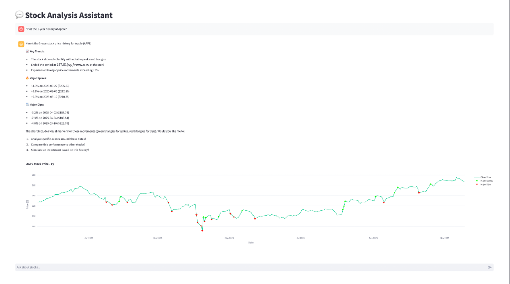

# Stock Analysis Agent

This agent demonstrates how to build an agentic application using Nemotron for financial data analysis. It uses **yfinance** to fetch real-time stock data and **Plotly** for interactive visualizations.

**Key Features:**
- 💰 Get current stock prices
- 🏢 Retrieve company information (sector, industry, business summary)
- 📊 Plot interactive historical price charts with major price movement detection
- 🎯 Simulate "What If?" investment scenarios
- 🔍 Identify significant price spikes and dips automatically



## Overview

The agent uses the `yfinance` library to fetch market data and `Plotly` to generate charts. It leverages the **Nemotron-Nano-9B-v2** model (or other Nemotron variants) to understand user intent and call the appropriate tools.

## Requirements

- Python 3.10+
- NVIDIA API Key (get one at [build.nvidia.com](https://build.nvidia.com/))

## Installation

1.  **Create and activate a virtual environment (Recommended):**
    ```bash
    python3 -m venv venv
    source venv/bin/activate
    ```

2.  **Install dependencies:**
    ```bash
    pip install -r requirements.txt
    ```

3.  **Set your NVIDIA API Key:**
    ```bash
    export NVIDIA_API_KEY="nvapi-..."
    ```

## Usage

Run the Streamlit app:

```bash
streamlit run app.py
```

## Example Queries

Try these questions with the agent:

- "What is the current price of NVDA?"
- "Tell me about Tesla."
- "Plot the 1-year history of Apple."
- "What if I invested $500 in NVDA 1 year ago?"
- "Simulate investing $1000 in Microsoft 2 years ago."
- "Show me the price movements of Google over 6 months."
- "Compare the prices of Google and Amazon."
